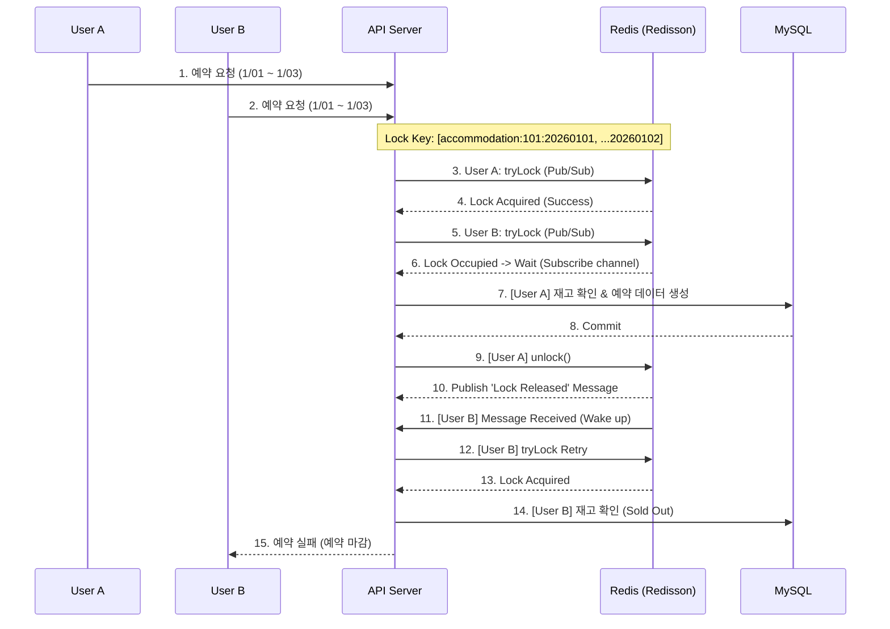
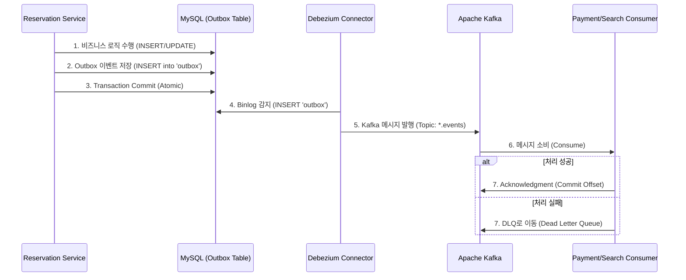
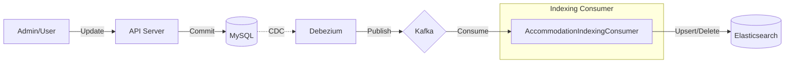

<h1 align="center">$\bf{\large{\color{#6580DD} Codesquad \ - \ Airbob \ Backend \ Server}}$</h1>

## 개발 환경
### Language

### Framework

### Database

### Infra & Messaging

### DevOps & Tools

## Key Dependencies and Features

### 1. Redisson을 통한 동시성 제어
- **Redis 분산 락**을 도입하여 인기 숙소의 동시 예약 요청(Race Condition)을 제어
- **Lock Key 오름차순 정렬** 전략을 적용하여, 다중 리소스 점유 시 발생할 수 있는 **교착 상태의 환형 대기 조건을 차단**
- 스핀 락 대신 **Pub/Sub 방식**을 적용해 Redis 부하 최소화 및 락 획득 대기 효율성 증대
- '숙소 ID + 날짜' 단위의 세분화된 락 키 설계로 동시 처리량 유지하며 **중복 예약 0%** 달성

### 2. Event-Driven Architecture (Kafka)
- 예약과 결제 시스템을 **Kafka** 기반의 비동기 이벤트로 분리하여 강한 결합도 해소
- **Dead Letter Queue (DLQ)** 구축하여 메시지 처리 실패 시 자동 재시도 및 실패 로그 관리
- 외부 결제 시스템(PG) 장애 시에도 데이터 유실 없이 예약 요청을 안전하게 보관하는 회복 탄력성 확보

### 3. Transactional Outbox Pattern
- **Debezium(CDC)과 Outbox 패턴**을 활용해 DB 트랜잭션 커밋과 Kafka 이벤트 발행의 원자성 보장
- 'At-least-once' 전달 보장 및 메시지 중복 처리 방지를 위한 멱등성 고려 설계

### 4. Elasticsearch
- RDB의 `LIKE` 검색 한계를 극복하기 위해 **Elasticsearch** 검색 엔진 도입
- **Kafka Consumer** 기반의 인덱싱 파이프라인을 구축하여, MySQL 데이터 변경 이벤트를 실시간으로 Elasticsearch에 동기화

### 5. 성능 최적화
- **커서 기반 페이지네이션** 구현으로 대용량 데이터 조회 시 일정한 응답 성능(O(1)) 유지

## 아키텍처
### 시스템 아키텍처
### 동시성 제어
인기 숙소 예약 시 발생하는 Race Condition을 해결하기 위해 Redisson 분산 락을 적용했습니다.

`RedissonMultiLock`을 사용하여 다중 락(날짜별)을 원자적으로 획득하며, Pub/Sub 방식으로 Redis 부하를 최소화했습니다.

### Transactional Outbox Pattern & CDC
서비스 간 데이터 정합성을 보장하기 위해 Outbox 패턴과 **Debezium(CDC)을** 도입했습니다.

DB 트랜잭션 내에서 `Outbox` 테이블에 이벤트를 저장하고, Debezium이 이를 감지하여 Kafka로 발행함으로써 'At-least-once' 전달을 보장합니다.

### 검색 데이터 동기화 (Search Indexing Pipeline)
숙소 정보나 예약 상태 변경 시, 실시간으로 Elasticsearch 인덱스를 갱신하는 파이프라인입니다.

Kafka Consumer가 변경 이벤트를 수신하여 ES에 반영함으로써, MySQL과 Elasticsearch 간의 **데이터 최종 일관성(Eventual Consistency)을** 유지합니다.

### ERD

