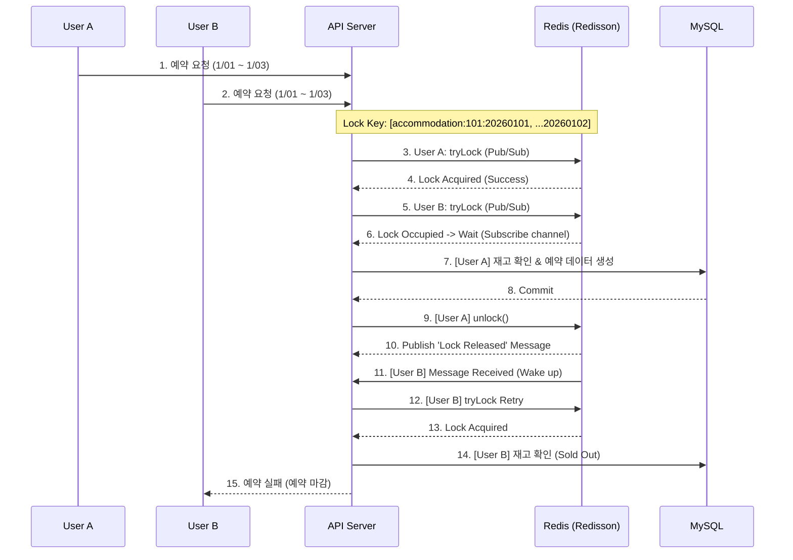
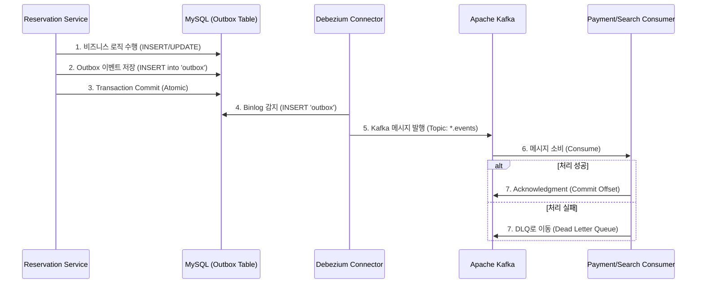
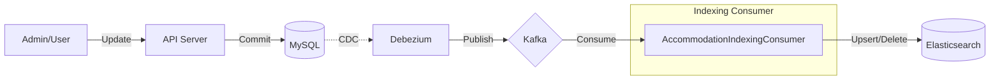
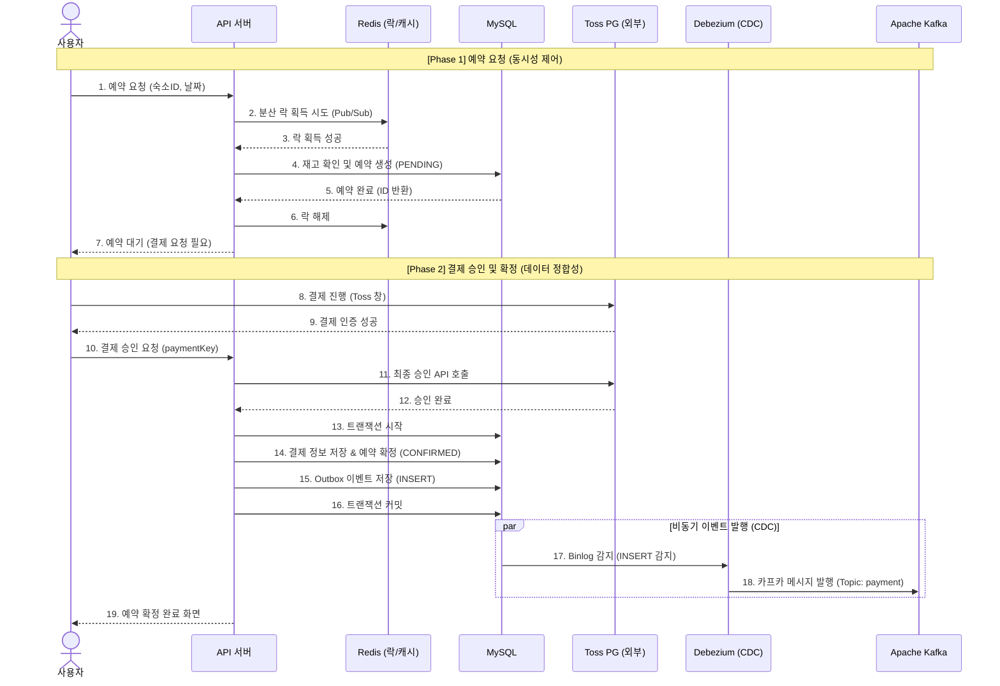

<h1 align="center">$\bf{\large{\color{#6580DD} Codesquad \ - \ Airbob \ Backend \ Server}}$</h1>
 

  🌐 <a href="https://www.airbob.cloud/" target="_blank"><b>https://airbob.cloud</b></a>

 

### TEST 계정 
ID: test@test.com  
PW: 123123123

### 주요 도시 숙소 목록 링크
- [로마](https://www.airbob.cloud/search?destination=%EC%9D%B4%ED%83%88%EB%A6%AC%EC%95%84+%EB%A1%9C%EB%A7%88&lat=41.8967068&lng=12.4822025&topLeftLat=42.05054624539585&topLeftLng=12.34170704408109&bottomRightLat=41.76959604595655&bottomRightLng=12.73028878823088&adultOccupancy=1&childOccupancy=0&infantOccupancy=0&petOccupancy=0)
- [하와이](https://www.airbob.cloud/search?adultOccupancy=1&childOccupancy=0&infantOccupancy=0&petOccupancy=0&destination=%EB%AF%B8%EA%B5%AD+%ED%95%98%EC%99%80%EC%9D%B4&lat=19.8986819&lng=-155.6658568&topLeftLat=22.37&topLeftLng=-160.53&bottomRightLat=18.55&bottomRightLng=-154.48)  
- [그리스](https://www.airbob.cloud/search?adultOccupancy=1&childOccupancy=0&infantOccupancy=0&petOccupancy=0&destination=Crete%2C+%EA%B7%B8%EB%A6%AC%EC%8A%A4&lat=35.240117&lng=24.8092691&topLeftLat=35.69569454391381&topLeftLng=23.51463927121635&bottomRightLat=34.92132439815794&bottomRightLng=26.31895032591595)  
- [싱가폴](https://www.airbob.cloud/search?adultOccupancy=1&childOccupancy=0&infantOccupancy=0&petOccupancy=0&destination=%EC%8B%B1%EA%B0%80%ED%8F%B4&lat=1.352083&lng=103.819836&topLeftLat=1.478400052327221&topLeftLng=103.5940000228498&bottomRightLat=1.149599959992529&bottomRightLng=104.0945000859547)  
- [도쿄](https://www.airbob.cloud/search?adultOccupancy=1&childOccupancy=0&infantOccupancy=0&petOccupancy=0&destination=%EC%9D%BC%EB%B3%B8+%EB%8F%84%EC%BF%84%EB%8F%84&lat=35.6764225&lng=139.650027&topLeftLat=36.4408483&topLeftLng=138.2991098&bottomRightLat=34.5776326&bottomRightLng=141.2405144)  

### 프로젝트 메인 시나리오 시연 영상
- 예약/결제

## 개발 환경
### Language

### Framework

### Database

### Infra & Messaging

### DevOps & Observability

### Build & Testing

## 담당

## 담당

### 프로젝트 기간 중

- **[검색] `LIKE` 검색의 지연·정합성 한계**  
  주소/숙소명을 `LIKE '%키워드%'`로 검색하면서 인덱스 미활용·풀 테이블 스캔 문제 발생
  - **Elasticsearch(Nori 분석기) 기반 위치 검색으로 전환**하고, Spring Event + Kafka Consumer를 통한 **실시간 색인 파이프라인** 구축
  
- **[공통 모듈] offset 페이지네이션의 성능 저하**
  깊은 페이지로 갈수록 `OFFSET N` 비용이 선형 증가, 신규 데이터 삽입 시 중복·누락 발생
  → **커서 기반 페이지네이션 공통 모듈** 설계. `@CursorParam` 어노테이션 + ArgumentResolver로 도메인 무관하게 재사용
  → 페이지 깊이와 무관한 **O(1) 응답 시간** 확보, 리뷰/위시리스트/검색 결과에 공통 적용

- **[리뷰] 평균 별점 실시간 집계의 쓰기 부하**
  숙소 목록·상세 화면이 노출될 때마다 수십만 건 리뷰를 집계 → 조회 지연
  → 별점 합계/개수를 별도 테이블(`accommodation_review_summary`)에 **비정규화 저장**, 리뷰 생성/삭제 시점에 **낙관적 락(`@Version`)으로 증감 갱신**
  → 조회 시 조인·집계 제거, 동시 리뷰 등록 시에도 집계값 정합성 보장

- **[최근 본 숙소] TTL·순서가 필요한 조회 이력**
  "최근 본 N개"를 MySQL로 구현할 경우 매 조회마다 `ORDER BY viewed_at DESC LIMIT N` + 주기적 삭제 배치 필요
  → **Redis Sorted Set** 기반으로 전환, 스코어에 timestamp를 저장해 **삽입·조회·트림**을 모두 O(log N)로 처리

- **[위시리스트]** 기본 CRUD + 커서 페이지네이션 연동

### 프로젝트 종료 후

> "돌아가는 서비스"를 **장애에 견디는 서비스**로 끌어올리는 데 집중했습니다.

- **[동시성] 인기 숙소 중복 예약 Race Condition**
  여러 사용자가 같은 날짜를 동시에 예약할 때 DB에 중복 row 발생, 단일 인스턴스 `synchronized`로는 스케일 아웃 불가
  → **3단계 방어 설계** (Redis Hold → Redisson MultiLock(Pub/Sub) → DB 재검증), Lock Key 오름차순 정렬로 Circular Wait 제거
  → **50 동시 요청 테스트에서 중복 0건**, 다른 숙소·날짜 간 락 경합 없이 동시 처리량 유지

- **[결제 비동기화] PG 외부 IO가 DB 트랜잭션을 점유하는 문제**
  Toss API 호출이 트랜잭션 안에 있으면 네트워크 지연 동안 커넥션·락 점유 → DB 풀 고갈 위험
  → **PG 호출을 별도 워커(`PaymentGatewayWorker`)로 분리**, 요청/성공/실패를 각각 Outbox 이벤트 체인으로 연결
  → DB 트랜잭션 길이를 PG 호출과 독립, 외부 장애가 예약 처리 경로로 전파되지 않음

- **[정합성] DB 커밋과 Kafka 발행의 원자성**
  `@TransactionalEventListener`는 롤백 시 이벤트 유실, 커밋 후 발행 실패 시 이벤트 누락
  → **Transactional Outbox + Debezium CDC**로 "커밋된 변경"만 Kafka에 발행되도록 보장
  → At-least-once 전달 확보, consumer는 `reservation_code`(V29) 기반 멱등 처리

- **[복구] Saga 보상 트랜잭션 + 유령 결제 자동 환불**
  결제는 성공했는데 예약 확정이 실패하는 "유령 결제" 케이스는 수동 개입 없이는 재현·복구 불가
  → DLQ 컨슈머 + `PaymentCompensationService.compensateGhostPayment()`로 **자동 환불 + Slack FATAL 알림**
  → 실패 이벤트가 운영자에게 즉시 통지되고, 복구 흐름이 코드로 문서화됨

- **[운영] 수동 배포·단일 인스턴스 한계**
  → **ALB + ASG 기반 Auto Scaling**으로 전환, **k6**로 스케일 아웃 임계/쿨다운 검증 `[수치 TBD]`
  → **Prometheus + Grafana** 대시보드 구축 (`JVM`, Kafka lag, PG 호출 지연 모니터링)
  → **Docker + 멀티 아키텍처(amd64/arm64) CI/CD** 파이프라인 구축
  → **S3 + CloudFront** 이미지 업로드·CDN 배포

## 핵심 설계와 기술 선택

### 1. 3단계 동시성 제어 (Redis Hold → Redisson Lock → DB 검증)
인기 숙소에 동시 예약 요청이 몰릴 때 발생하는 Race Condition을 **3단계 방어 구조**로 해결했습니다.

| 단계 | 역할 | 기술 |
|------|------|------|
| **1. Redis Hold** | 결제 대기 중인 날짜에 대한 빠른 선차단 (최적화 레이어) | `MGET` 기반 다중 키 조회 |
| **2. Redisson MultiLock** | 동일 자원에 대한 동시 진입 직렬화 (진입 제어 레이어) | Pub/Sub 기반 분산 락 |
| **3. DB 중복 검증** | 최종 방어선 — DB를 진실의 원천으로 삼아 겹치는 예약 여부 재검증 | 트랜잭션 내 날짜 중복 조회 |

🔗 전체 흐름:
[ReservationService.java](src/main/java/kr/kro/airbob/domain/reservation/service/ReservationService.java)

**설계 포인트**
- **Pub/Sub 방식 락 대기**: 스핀 락 대신 Redis 채널 구독으로 락 해제 알림을 수신하여 불필요한 polling과 Redis
  부하를 최소화
- **Lock Key 오름차순 정렬**: 모든 요청이 동일한 순서로 락을 획득하도록 강제해 Circular Wait를 제거하고 데드락을
  구조적으로 방지 🔗
  [DateLockKeyGenerator.java](src/main/java/kr/kro/airbob/domain/reservation/service/DateLockKeyGenerator.java)
- **WatchDog 활성화**: `leaseTime`을 명시하지 않아 Redisson WatchDog이 락 TTL을 자동 갱신하도록 구성 — 장시간
  트랜잭션에서도 락 조기 만료 방지
- **'숙소 ID + 날짜' 단위 세분화 락**: 서로 다른 숙소 또는 날짜 간 불필요한 락 경합 없이 동시 처리량 유지
- **Redis 장애 격리**: Hold 설정/삭제 실패가 예약 트랜잭션에 전파되지 않도록 방어 처리 — Redis Hold 장애 시에도
  Redisson Lock과 DB 재검증으로 최종 정합성 유지

**테스트 검증** 🔗
[ReservationConcurrencyTest.java](src/test/java/kr/kro/airbob/domain/reservation/ReservationConcurrencyTest.java)
- 50개 동시 요청에서 1건만 성공하고 DB에도 1건만 저장됨을 검증
- 분산 락 제거 시 동일 조건에서 중복 예약이 발생함을 대조 실험으로 검증
- 날짜가 겹치는 두 예약의 동시 진행 시 데드락 없이 정상 처리됨을 검증
- 서로 다른 숙소는 같은 날짜여도 동시 예약이 모두 성공함을 통해 락 세분화 검증

### 2. Event-Driven Architecture (Kafka)
- 예약과 결제 시스템을 **Kafka** 기반의 비동기 이벤트로 분리하여 강한 결합도 해소 🔗 [ReservationEventTranslator.java](src/main/java/kr/kro/airbob/kafka/consumer/ReservationEventTranslator.java), [PaymentEventTranslator.java](src/main/java/kr/kro/airbob/kafka/consumer/PaymentEventTranslator.java)
- **Dead Letter Queue (DLQ)** 구축하여 메시지 처리 실패 시 자동 재시도 및 실패 로그 관리 🔗 [DlqConsumer.java](src/main/java/kr/kro/airbob/kafka/consumer/DlqConsumer.java)
- 외부 결제 시스템(PG) 장애 시에도 데이터 유실 없이 예약 요청을 안전하게 보관하는 회복 탄력성 확보

### 3. Transactional Outbox Pattern
- **Debezium(CDC)과 Outbox 패턴**을 활용해 DB 트랜잭션 커밋과 Kafka 이벤트 발행의 원자성 보장 🔗 [OutboxEventPublisher.java](src/main/java/kr/kro/airbob/outbox/OutboxEventPublisher.java)
- 'At-least-once' 전달 보장 및 메시지 중복 처리 방지를 위한 멱등성 고려 설계 🔗 [PaymentEventsConsumer.java](src/main/java/kr/kro/airbob/kafka/consumer/PaymentEventsConsumer.java)

### 4. Elasticsearch
- RDB의 `LIKE` 검색 한계를 극복하기 위해 **Elasticsearch** 검색 엔진 도입 🔗 [ElasticsearchConfig.java](src/main/java/kr/kro/airbob/config/ElasticsearchConfig.java)
- **Kafka Consumer** 기반의 인덱싱 파이프라인을 구축하여, MySQL 데이터 변경 이벤트를 실시간으로 Elasticsearch에 동기화 🔗 [AccommodationIndexingConsumer.java](src/main/java/kr/kro/airbob/kafka/consumer/AccommodationIndexingConsumer.java)

### 5. 성능 최적화
- **커서 기반 페이지네이션** 구현으로 대용량 데이터 조회 시 일정한 응답 성능(O(1)) 유지 🔗 [CursorParamArgumentResolver.java](src/main/java/kr/kro/airbob/cursor/resolver/CursorParamArgumentResolver.java)

## 아키텍처
### 시스템 아키텍처

> AWS Free Tier 크레딧 소진으로 인해  
> 현재는 OCI 단일 서버에서 Docker Compose 기반으로 운영 중입니다.

 

### 동시성 제어
인기 숙소 예약 시 발생하는 Race Condition을 해결하기 위해 날짜 단위 Redisson `MultiLock`을 적용했습니다. 아래는 동일 날짜 예약 요청이 경쟁할 때의 처리 흐름입니다.

```mermaid
sequenceDiagram
    participant UserA as User A
    participant UserB as User B
    participant API as API Server
    participant Redis as Redis (Redisson)
    participant DB as MySQL

    UserA->>API: 1. 예약 요청 (1/01 ~ 1/03)
    UserB->>API: 2. 예약 요청 (1/01 ~ 1/03)
    
    Note over API, Redis: Lock Key: [accommodation:101:20260101, ...20260102]

    API->>Redis: 3. User A: tryLock (Pub/Sub)
    Redis-->>API: 4. Lock Acquired (Success)
    
    API->>Redis: 5. User B: tryLock (Pub/Sub)
    Redis-->>API: 6. Lock Occupied -> Wait (Subscribe channel)

    API->>DB: 7. [User A] 재고 확인 & 예약 데이터 생성
    DB-->>API: 8. Commit
    
    API->>Redis: 9. [User A] unlock()
    Redis-->>API: 10. Publish 'Lock Released' Message

    Redis->>API: 11. [User B] Message Received (Wake up)
    API->>Redis: 12. [User B] tryLock Retry
    Redis-->>API: 13. Lock Acquired
    
    API->>DB: 14. [User B] 재고 확인 (Sold Out)
    API-->>UserB: 15. 예약 실패 (예약 마감)
```
 

### Transactional Outbox Pattern & CDC
서비스 간 데이터 정합성을 보장하기 위해 Outbox 패턴과 **Debezium(CDC)을** 도입했습니다. 

DB 트랜잭션 내에서 `Outbox` 테이블에 이벤트를 저장하고, Debezium이 이를 감지하여 Kafka로 발행함으로써 'At-least-once' 전달을 보장합니다.

```mermaid
sequenceDiagram
    participant Svc as Reservation Service
    participant DB as MySQL (Outbox Table)
    participant CDC as Debezium Connector
    participant Kafka as Apache Kafka
    participant Consumer as Payment/Search Consumer

    Svc->>DB: 1. 비즈니스 로직 수행 (INSERT/UPDATE)
    Svc->>DB: 2. Outbox 이벤트 저장 (INSERT into 'outbox')
    Svc->>DB: 3. Transaction Commit (Atomic)
    
    CDC->>DB: 4. Binlog 감지 (INSERT 'outbox')
    CDC->>Kafka: 5. Kafka 메시지 발행 (Topic: *.events)
    
    Kafka->>Consumer: 6. 메시지 소비 (Consume)
    
    alt 처리 성공
        Consumer->>Kafka: 7. Acknowledgment (Commit Offset)
    else 처리 실패
        Consumer->>Kafka: 7. DLQ로 이동 (Dead Letter Queue)
    end
```
 

### 검색 데이터 동기화 (Search Indexing Pipeline)
숙소 정보나 예약 상태 변경 시, 실시간으로 Elasticsearch 인덱스를 갱신하는 파이프라인입니다. 

Kafka Consumer가 변경 이벤트를 수신하여 ES에 반영함으로써, MySQL과 Elasticsearch 간의 **데이터 최종 일관성(Eventual Consistency)을** 유지합니다.

```mermaid
graph LR
    User[Admin/User] -->|Update| API[API Server]
    API -->|Commit| DB[(MySQL)]
    DB -.->|CDC| Debezium[Debezium]
    Debezium -->|Publish| Kafka{Kafka}
    
    subgraph "Indexing Consumer"
        Consumer[AccommodationIndexingConsumer]
    end
    
    Kafka -->|Consume| Consumer
    Consumer -->|Upsert/Delete| ES[(Elasticsearch)]
```
 

### ERD

## Core Features Scenario
Airbob의 핵심인 **숙소 예약 및 결제 프로세스**입니다.  
**동시성 제어(Redisson)를** 통해 중복 예약을 방지하고, **Outbox 패턴**으로 결제 데이터의 정합성을 보장합니다.

### 예약 및 결제 Sequnce diagram

```mermaid
sequenceDiagram
    actor User as 사용자
    participant API as API 서버
    participant Redis as Redis (락/캐시)
    participant DB as MySQL
    participant PG as Toss PG (외부)
    participant CDC as Debezium (CDC)
    participant Kafka as Apache Kafka

    note over User, Kafka: [Phase 1] 예약 요청 (동시성 제어)
    User->>API: 1. 예약 요청 (숙소ID, 날짜)
    API->>Redis: 2. 분산 락 획득 시도 (Pub/Sub)
    Redis-->>API: 3. 락 획득 성공

    API->>DB: 4. 재고 확인 및 예약 생성 (PENDING)
    DB-->>API: 5. 예약 완료 (ID 반환)
    API->>Redis: 6. 락 해제
    API-->>User: 7. 예약 대기 (결제 요청 필요)

    note over User, Kafka: [Phase 2] 결제 승인 및 확정 (데이터 정합성)
    User->>PG: 8. 결제 진행 (Toss 창)
    PG-->>User: 9. 결제 인증 성공
    User->>API: 10. 결제 승인 요청 (paymentKey)

    API->>PG: 11. 최종 승인 API 호출
    PG-->>API: 12. 승인 완료

    API->>DB: 13. 트랜잭션 시작
    API->>DB: 14. 결제 정보 저장 & 예약 확정 (CONFIRMED)
    API->>DB: 15. Outbox 이벤트 저장 (INSERT)
    API->>DB: 16. 트랜잭션 커밋

    par 비동기 이벤트 발행 (CDC)
        DB->>CDC: 17. Binlog 감지 (INSERT 감지)
        CDC->>Kafka: 18. 카프카 메시지 발행 (Topic: payment)
    end
    
    API-->>User: 19. 예약 확정 완료 화면
```

## API Reference

  🌐 <a href="https://fourth-surprise-78f.notion.site/20dde1bad162819b9b79fa6b322b00a6?v=20dde1bad1628104a934000c7f90b893" target="_blank"><b>Notion API 명세서</b></a>

