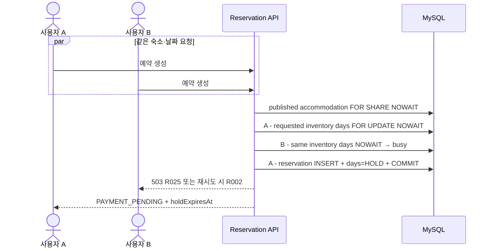
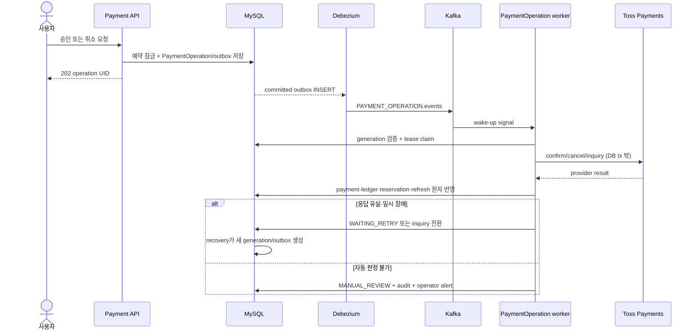
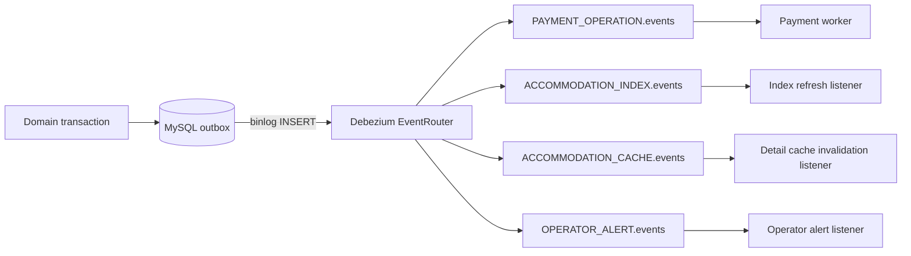
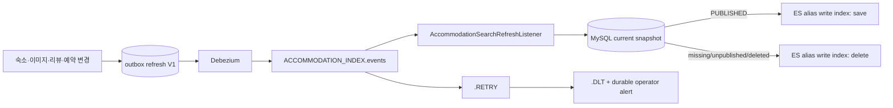

<h1 align="center">Airbob Backend Server</h1>

<p align="center">
  Airbnb형 숙소 예약 서비스를 Spring Boot로 구현하고, 예약·결제·검색 색인을 장애 복구가 가능한 비동기 구조로 발전시킨 프로젝트입니다.
</p>

<p align="center">
  🌐 <a href="https://www.airbob.cloud/" target="_blank"><b>https://airbob.cloud</b></a>
</p>

## Demo

- 테스트 계정: `test@test.com` / `123123123`
- [로마 숙소](https://www.airbob.cloud/search?destination=%EC%9D%B4%ED%83%88%EB%A6%AC%EC%95%84+%EB%A1%9C%EB%A7%88&lat=41.8967068&lng=12.4822025&topLeftLat=42.05054624539585&topLeftLng=12.34170704408109&bottomRightLat=41.76959604595655&bottomRightLng=12.73028878823088&adultOccupancy=1&childOccupancy=0&infantOccupancy=0&petOccupancy=0)
- [하와이 숙소](https://www.airbob.cloud/search?adultOccupancy=1&childOccupancy=0&infantOccupancy=0&petOccupancy=0&destination=%EB%AF%B8%EA%B5%AD+%ED%95%98%EC%99%80%EC%9D%B4&lat=19.8986819&lng=-155.6658568&topLeftLat=22.37&topLeftLng=-160.53&bottomRightLat=18.55&bottomRightLng=-154.48)

예약·결제 시연:


## Tech Stack

- Java 21, Spring Boot 3.5.8, Spring Data JPA, QueryDSL
- MySQL 8, Flyway V1~V27
- Redis: 세션, 최근 본 숙소, 쿠폰 재고, 조회 캐시
- Apache Kafka, Debezium Outbox Event Router
- Elasticsearch, Nori analyzer, versioned index alias
- Testcontainers, Gradle, k6
- Docker Compose, Prometheus, Grafana, AWS S3·CloudFront

## 핵심 문제와 현재 해법

### 예약 중복: 날짜별 MySQL inventory를 단일 진실의 원천으로 사용

검색·요청사항·쿠폰 입력 중에는 재고를 잡지 않습니다. 먼저 5분짜리 quote로 현재 가격과
가능 여부를 확인하고, 사용자가 결제로 이동할 때 멱등 checkout이 예약과 15분 hold를 같은
트랜잭션에서 만듭니다. 응답에는 서버 시각과 절대 만료시각이 포함되므로 클라이언트 타이머가
재고의 권위가 되지 않습니다.

숙박일 `[checkIn, checkOut)`은 `accommodation_inventory_day`의 날짜 행으로 미리 준비합니다.
checkout은 요청한 날짜 행만 PK 순서로 `FOR UPDATE NOWAIT`하고, 모두 사용 가능할 때에만 한
reservation owner에게 원자적으로 할당합니다. 결제 대기는 `HOLD(expiresAt)`, 결제 시작 이후와
확정·취소 처리 중은 `OCCUPIED`입니다. 만료된 HOLD는 새 checkout이 같은 잠금 안에서 인수할 수
있고, 오래된 cleanup은 여전히 자신이 소유한 HOLD만 해제합니다.

`NOWAIT` 잠금 경합은 기다리지 않고 `503/R025`와 `Retry-After`를 반환합니다. 재시도 시 날짜가
이미 할당됐다면 `R002`로 응답합니다. 여러 인스턴스가 실행돼도 최종 판정은 MySQL 날짜 행과
트랜잭션이 담당합니다. Redis는 세션·캐시·쿠폰 같은 별도 용도에 남아 있지만 예약 정합성 락으로
사용하지 않습니다.

- 권위 트랜잭션: [ReservationTransactionService.java](src/main/java/kr/kro/airbob/domain/reservation/service/ReservationTransactionService.java)
- 날짜 inventory 전이: [ReservationInventoryService.java](src/main/java/kr/kro/airbob/domain/reservation/inventory/ReservationInventoryService.java)
- seed·readiness: [AccommodationInventoryStartupBootstrap.java](src/main/java/kr/kro/airbob/domain/reservation/inventory/AccommodationInventoryStartupBootstrap.java)
- 동일 날짜 300개 요청 회귀 테스트: [ReservationConcurrencyTest.java](src/test/java/kr/kro/airbob/domain/reservation/ReservationConcurrencyTest.java)


```mermaid
sequenceDiagram
    actor A as 사용자 A
    actor B as 사용자 B
    participant API as Reservation API
    participant DB as MySQL

    par 같은 숙소·날짜 요청
        A->>API: 예약 생성
        B->>API: 예약 생성
    end
    API->>DB: published accommodation FOR SHARE NOWAIT
    API->>DB: A - requested inventory days FOR UPDATE NOWAIT
    API->>DB: B - same inventory days NOWAIT → busy
    API->>DB: A - reservation INSERT + days=HOLD + COMMIT
    API-->>B: 503 R025 또는 재시도 시 R002
    API-->>A: PAYMENT_PENDING + holdExpiresAt
```

### 결제 승인·취소: 비동기 PaymentOperation 오케스트레이션

승인과 유료 예약 취소는 같은 `PaymentOperation` 상태 머신을 사용합니다. API 트랜잭션은
예약 상태와 작업·outbox 행만 원자적으로 저장하고 HTTP 202를 반환합니다. worker는
operation UID 단위 MySQL 실행 펜스를 획득하고 generation과 lease를 검증해 작업을 claim한
뒤 DB 트랜잭션 밖에서 Toss Payments를 호출하며, 결과를 새 트랜잭션에서 원장·예약·쿠폰·
검색 refresh와 함께 확정한 후 펜스를 반납합니다.

- 명령 생성: [PaymentOperationCommandService.java](src/main/java/kr/kro/airbob/domain/payment/service/PaymentOperationCommandService.java), [PaymentCancellationCommandService.java](src/main/java/kr/kro/airbob/domain/payment/service/PaymentCancellationCommandService.java)
- 외부 호출 실행: [PaymentOperationExecutor.java](src/main/java/kr/kro/airbob/domain/payment/service/PaymentOperationExecutor.java)
- 원자적 결과 반영: [PaymentOperationFinalizer.java](src/main/java/kr/kro/airbob/domain/payment/service/PaymentOperationFinalizer.java)
- lease·generation 복구: [PaymentOperationRecoveryService.java](src/main/java/kr/kro/airbob/domain/payment/service/PaymentOperationRecoveryService.java)
- 관리자 reconciliation: [PaymentOperationAdminController.java](src/main/java/kr/kro/airbob/domain/payment/api/PaymentOperationAdminController.java)
- 운영 절차: [payment-operation-runbook.md](docs/payment-operation-runbook.md)


```mermaid
sequenceDiagram
    actor User as 사용자
    participant API as Payment API
    participant DB as MySQL
    participant CDC as Debezium
    participant Kafka
    participant Worker as PaymentOperation worker
    participant PG as Toss Payments

    User->>API: 승인 또는 취소 요청
    API->>DB: 예약 잠금 + PaymentOperation/outbox 저장
    API-->>User: 202 operation UID
    DB-->>CDC: committed outbox INSERT
    CDC->>Kafka: PAYMENT_OPERATION.events
    Kafka->>Worker: wake-up signal
    Worker->>DB: generation 검증 + lease claim
    Worker->>PG: confirm/cancel/inquiry (DB tx 밖)
    PG-->>Worker: provider result
    Worker->>DB: payment·ledger·reservation·refresh 원자 반영
    alt 응답 유실·일시 장애
        Worker->>DB: WAITING_RETRY 또는 inquiry 전환
        DB->>DB: recovery가 새 generation/outbox 생성
    else 자동 판정 불가
        Worker->>DB: MANUAL_REVIEW + audit + operator alert
    end
```

`QUEUED`, `EXECUTING`, `WAITING_RETRY`, `APPLIED`, `DECLINED`, `MANUAL_REVIEW`가
현재의 durable 상태입니다. Kafka 레코드는 상태 자체가 아니라 작업 실행을 깨우는
신호이며, DLT에서도 동일 generation의 `QUEUED` 작업만 한 번 다음 generation으로
재발행합니다.

### DB 커밋과 메시지 발행: canonical outbox

모든 통합 이벤트는 `messaging.event`의 descriptor/envelope/codec 계약과 canonical outbox
schema를 사용합니다. 일반 도메인 이벤트는 `OutboxWriter` 포트로, 동시 중복 제거가 필요한
운영 알림은 alert 전용 idempotent appender로 같은 outbox에 기록합니다. 비즈니스 변경과
outbox INSERT는 같은 MySQL 트랜잭션에 있고, Debezium EventRouter가 destination·partition
key·headers를 Kafka 레코드로 변환합니다. 전달은 at-least-once이므로 consumer는 중복을
전제로 합니다.
EventRouter는 `TopicNameMatches` predicate로 source outbox topic에만 적용되며 Debezium
heartbeat와 connector metadata 레코드는 transform을 우회합니다.

- 이벤트 계약: [IntegrationEvent.java](src/main/java/kr/kro/airbob/messaging/event/IntegrationEvent.java), [IntegrationEventCodec.java](src/main/java/kr/kro/airbob/messaging/event/IntegrationEventCodec.java)
- outbox writer: [JpaOutboxWriter.java](src/main/java/kr/kro/airbob/messaging/outbox/infrastructure/jpa/JpaOutboxWriter.java)
- Debezium 설정: [outbox-connector.json](debezium-config/outbox-connector.json)
- Connect 기동 검증: [register-connector.sh](docker/debezium/register-connector.sh)
- topic bootstrap: [init-topics.sh](docker/kafka/init-topics.sh)
- OCI 배포는 기존 producer를 닫고 Flyway migration을 먼저 적용한 뒤 새 connector를 등록합니다.


```mermaid
flowchart LR
    S["Domain transaction"] --> O[("MySQL outbox")]
    O -->|binlog INSERT| D["Debezium EventRouter"]
    D --> P["PAYMENT_OPERATION.events"]
    D --> I["ACCOMMODATION_INDEX.events"]
    D --> C["ACCOMMODATION_CACHE.events"]
    D --> A["OPERATOR_ALERT.events"]
    P --> PW["Payment worker"]
    I --> IW["Index refresh listener"]
    C --> CW["Detail cache invalidation listener"]
    A --> AW["Operator alert listener"]
```

운영 topic은 다음 네 스트림 각각의 main, `.RETRY`, `.DLT`로 고정됩니다.

- `PAYMENT_OPERATION.events`
- `ACCOMMODATION_INDEX.events`
- `ACCOMMODATION_CACHE.events`
- `OPERATOR_ALERT.events`

outbox 테이블에는 Kafka 전달 완료 column이 없습니다. 따라서 DB의 행 수·가장 오래된
행은 delivery backlog가 아니라 retention footprint이며, 전달 상태는 Connect task,
Debezium heartbeat, topic 입력과 consumer lag로 판단합니다. 자세한 내용은
[outbox-operations.md](docs/outbox-operations.md)를 참고합니다.

### 검색 색인: 한 가지 refresh 신호와 MySQL snapshot

숙소·이미지·리뷰·예약 변경은 모두 `AccommodationSearchRefreshRequestedV1`로 수렴합니다.
이벤트 payload는 숙소 UID만 전달하고, consumer가 현재 MySQL snapshot을 다시 구성합니다.
현재 상태가 `PUBLISHED`면 문서를 완전히 덮어쓰고, 누락·미게시·삭제 상태면 Elasticsearch
문서를 제거합니다. 과거 이벤트가 늦게 도착해도 이벤트 시점의 데이터를 덮어쓰지 않습니다.

- refresh 이벤트: [AccommodationSearchRefreshRequestedV1.java](src/main/java/kr/kro/airbob/search/messaging/event/AccommodationSearchRefreshRequestedV1.java)
- Kafka listener: [AccommodationSearchRefreshListener.java](src/main/java/kr/kro/airbob/search/messaging/kafka/AccommodationSearchRefreshListener.java)
- MySQL snapshot: [AccommodationSearchSnapshotReader.java](src/main/java/kr/kro/airbob/search/service/AccommodationSearchSnapshotReader.java)
- ES save/delete: [AccommodationIndexingService.java](src/main/java/kr/kro/airbob/search/service/AccommodationIndexingService.java)
- alias bootstrap: [ElasticsearchAccommodationIndexAliasBootstrap.java](src/main/java/kr/kro/airbob/search/infrastructure/elasticsearch/ElasticsearchAccommodationIndexAliasBootstrap.java)
- 운영 절차: [accommodation-indexing-operations.md](docs/accommodation-indexing-operations.md), [logstash-reindex.md](docs/logstash-reindex.md)


```mermaid
flowchart LR
    C["숙소·이미지·리뷰·예약 변경"] --> O[("outbox refresh V1")]
    O --> D["Debezium"]
    D --> K["ACCOMMODATION_INDEX.events"]
    K --> L["AccommodationSearchRefreshListener"]
    L --> M[("MySQL current snapshot")]
    M -->|PUBLISHED| E["ES alias write index: save"]
    M -->|missing/unpublished/deleted| X["ES alias write index: delete"]
    K --> R[".RETRY"]
    R --> Q[".DLT + durable operator alert"]
```

전체 재색인은 live index를 직접 덮지 않습니다. 같은 mapping으로 version index를 만든 뒤
검증하고 alias를 원자 전환하며, bootstrap은 alias가 정확히 하나의 write index를 가리키는지
확인한 뒤 consumer를 시작합니다.

### 숙소 상세 캐시: 커밋 직후 삭제 + durable 재시도

숙소·이미지·리뷰 변경은 `AccommodationDetailCacheInvalidationPublisher` 포트 하나를
호출합니다. outbox adapter가 원본 트랜잭션에 `AccommodationDetailCacheInvalidationRequestedV1`을
기록하고 로컬 after-commit 이벤트도 함께 예약합니다. 정상 경로에서는 커밋 직후 빠르게
삭제하고, Redis 장애나 프로세스 종료로 놓친 삭제는 `ACCOMMODATION_CACHE.events` 전용
consumer가 retry/DLT를 거쳐 다시 수행합니다. 일반 Redis와 상세 캐시 Redis는 별도 연결을
사용합니다.

- application port: [AccommodationDetailCacheInvalidationPublisher.java](src/main/java/kr/kro/airbob/domain/accommodation/cache/invalidation/AccommodationDetailCacheInvalidationPublisher.java)
- outbox adapter: [OutboxAccommodationDetailCacheInvalidationPublisher.java](src/main/java/kr/kro/airbob/domain/accommodation/cache/messaging/outbox/OutboxAccommodationDetailCacheInvalidationPublisher.java)
- Kafka listener: [AccommodationDetailCacheInvalidationKafkaListener.java](src/main/java/kr/kro/airbob/domain/accommodation/cache/messaging/kafka/AccommodationDetailCacheInvalidationKafkaListener.java)

### 운영자 알림도 durable event로 처리

결제 manual review, payment/search/cache DLT 같은 운영 사건은 요청 스레드에서 Slack을 직접
호출하지 않습니다. 원인 트랜잭션과 같은 outbox에 `OperatorAlertRequestedV1`을 기록하고
전용 main/retry/DLT consumer가 전달합니다. 알림에는 닫힌 kind/summary와 안전한 source
좌표만 포함합니다.

- 이벤트와 계약: [OperatorAlertRequestedV1.java](src/main/java/kr/kro/airbob/messaging/alert/event/OperatorAlertRequestedV1.java)
- durable enqueue: [OperatorAlertEnqueueService.java](src/main/java/kr/kro/airbob/messaging/alert/application/OperatorAlertEnqueueService.java)
- Kafka delivery: [OperatorAlertKafkaListener.java](src/main/java/kr/kro/airbob/messaging/alert/infrastructure/kafka/OperatorAlertKafkaListener.java)
- 운영 절차: [operator-alert-operations.md](docs/operator-alert-operations.md)

## 기타 구현·성능 개선

- `@CursorParam`과 ArgumentResolver 기반 커서 페이지네이션
- 리뷰 요약을 별도 테이블에 비정규화하고 원자적 증감으로 목록 집계 제거
- 최근 본 숙소를 Redis Sorted Set으로 저장해 순서·trim·TTL 처리
- 위시리스트 목록의 숙소 정보를 비정규화해 조회 fan-out 축소
- 예약 만료 history의 `IDENTITY` N회 INSERT를 JDBC batch로 전환
  - [reservation-history-jdbc-batch.md](docs/performance/reservation-history-jdbc-batch.md)
- bulk write·cache·쿠폰 발급 비교를 위한 격리 benchmark와 k6 검증
  - [load-test/README.md](load-test/README.md)

## 패키지 구조

```text
kr.kro.airbob
├── common/                 공통 응답·예외·감사·관측성
├── config/                 Web, JPA, Redis, Elasticsearch, scheduling 설정
├── cursor/                 커서 페이지네이션
├── domain/
│   ├── reservation/        DB-authoritative 예약·만료 cleanup
│   ├── payment/            PaymentOperation, gateway, recovery, admin resolution
│   ├── accommodation/      숙소 쓰기 모델과 상세 캐시 invalidation/messaging
│   └── ...                 member, coupon, review, wishlist 등
├── messaging/
│   ├── event/              canonical integration-event 계약
│   ├── outbox/             transactional outbox와 retention monitoring
│   ├── alert/              durable operator-alert pipeline
│   └── infrastructure/     공통 Kafka retry/header 인프라
└── search/                 MySQL snapshot 기반 Elasticsearch 검색·색인
```

## 로컬 실행

```bash
# 외부 인프라 기동 및 topic/connector bootstrap
docker compose up -d

# 컴파일
./gradlew compileJava

# 전체 테스트
./gradlew test

# 애플리케이션 실행
./gradlew bootRun
```

테스트 profile은 Kafka listener 자동 기동과 scheduling을 비활성화합니다. MySQL·Redis·
Elasticsearch 정합성 테스트는 Testcontainers를 사용합니다.

## 운영 문서

- [예약 날짜 inventory 최초 컷오버·readiness](docs/reservation-inventory-cutover.md)
- [결제 작업·수동 해결·롤백](docs/payment-operation-runbook.md)
- [Transactional Outbox 보관·Connect 점검](docs/outbox-operations.md)
- [숙소 색인과 DLT](docs/accommodation-indexing-operations.md)
- [전체 Elasticsearch 재색인](docs/logstash-reindex.md)
- [운영자 알림](docs/operator-alert-operations.md)

## API Reference

<p align="center">
  🌐 <a href="https://fourth-surprise-78f.notion.site/20dde1bad162819b9b79fa6b322b00a6?v=20dde1bad1628104a934000c7f90b893" target="_blank"><b>Notion API 명세서</b></a>
</p>
