<h1 align="center">$\bf{\large{\color{#6580DD} Codesquad \ - \ Airbob \ Backend \ Server}}$</h1>

## 개발 환경
### Language

### Framework

### Database

### Infra & Messaging

### DevOps & Tools

## Key Dependencies and Features

### 1. Redisson을 통한 동시성 제어
- **Redis 분산 락**을 도입하여 인기 숙소의 동시 예약 요청(Race Condition)을 제어 🔗 [ReservationLockManager.java](src/main/java/kr/kro/airbob/domain/reservation/service/ReservationLockManager.java)
- **Lock Key 오름차순 정렬** 전략을 적용하여, 다중 리소스 점유 시 발생할 수 있는 **교착 상태의 환형 대기 조건을 차단** 🔗 [ReservationLockManager.java](src/main/java/kr/kro/airbob/domain/reservation/service/ReservationLockManager.java)
- 스핀 락 대신 **Pub/Sub 방식**을 적용해 Redis 부하 최소화 및 락 획득 대기 효율성 증대
- '숙소 ID + 날짜' 단위의 세분화된 락 키 설계로 동시 처리량 유지하며 **중복 예약 0%** 달성 🔗 [ReservationConcurrencyTest.java](src/test/java/kr/kro/airbob/domain/reservation/ReservationConcurrencyTest.java)

### 2. Event-Driven Architecture (Kafka)
- 예약과 결제 시스템을 **Kafka** 기반의 비동기 이벤트로 분리하여 강한 결합도 해소 🔗 [ReservationEventTranslator.java](src/main/java/kr/kro/airbob/kafka/consumer/ReservationEventTranslator.java), [PaymentEventTranslator.java](src/main/java/kr/kro/airbob/kafka/consumer/PaymentEventTranslator.java)
- **Dead Letter Queue (DLQ)** 구축하여 메시지 처리 실패 시 자동 재시도 및 실패 로그 관리 🔗 [DlqConsumer.java](src/main/java/kr/kro/airbob/kafka/consumer/DlqConsumer.java)
- 외부 결제 시스템(PG) 장애 시에도 데이터 유실 없이 예약 요청을 안전하게 보관하는 회복 탄력성 확보

### 3. Transactional Outbox Pattern
- **Debezium(CDC)과 Outbox 패턴**을 활용해 DB 트랜잭션 커밋과 Kafka 이벤트 발행의 원자성 보장 🔗 [OutboxEventPublisher.java](src/main/java/kr/kro/airbob/outbox/OutboxEventPublisher.java)
- 'At-least-once' 전달 보장 및 메시지 중복 처리 방지를 위한 멱등성 고려 설계 🔗 [PaymentEventsConsumer.java](src/main/java/kr/kro/airbob/kafka/consumer/PaymentEventsConsumer.java)

### 4. Elasticsearch
- RDB의 `LIKE` 검색 한계를 극복하기 위해 **Elasticsearch** 검색 엔진 도입 🔗 [ElasticsearchConfig.java](src/main/java/kr/kro/airbob/config/ElasticsearchConfig.java)
- **Kafka Consumer** 기반의 인덱싱 파이프라인을 구축하여, MySQL 데이터 변경 이벤트를 실시간으로 Elasticsearch에 동기화 🔗 [AccommodationIndexingConsumer.java](src/main/java/kr/kro/airbob/kafka/consumer/AccommodationIndexingConsumer.java)

### 5. 성능 최적화
- **커서 기반 페이지네이션** 구현으로 대용량 데이터 조회 시 일정한 응답 성능(O(1)) 유지 🔗 [CursorParamArgumentResolver.java](src/main/java/kr/kro/airbob/cursor/resolver/CursorParamArgumentResolver.java)

## 아키텍처
### 시스템 아키텍처

```mermaid
graph TD
    %% 사용자 및 외부 진입점
    User[🙋‍♂️ User]
    
    subgraph External_Services [External Services]
        Vercel["▲ Vercel (Frontend)"]
        GH["GitHub Actions (CI/CD)"]
    end

    subgraph AWS_Cloud ["AWS Cloud (ap-northeast-2)"]
        R53["AWS Route 53 (DNS)"]
        ECR[Amazon ECR]

        subgraph VPC [Airbob VPC]
            
            subgraph Public_Subnet [Public Subnet]
                ALB[Application Load Balancer]
                Bastion["Bastion / NAT Instance"]
            end

            subgraph Private_Subnet [Private Subnet]
                subgraph App_Layer [Application Layer]
                    App1[Spring Boot App 1]
                    App2[Spring Boot App 2]
                end

                subgraph Data_Layer [Data & Infra Layer]
                    RDS[("AWS RDS MySQL")]
                    
                    subgraph Infra_Server ["Infra Server (Docker Host)"]
                        Redis[("Redis")]
                        Kafka[Kafka & Zookeeper]
                        ES["Elasticsearch (Nori)"]
                        Connect[Debezium Connector]
                        Kibana[Kibana]
                    end
                end
            end
        end
    end

    %% 트래픽 흐름
    User -->|"https://www.airbob.cloud"| Vercel
    User -->|"https://api.airbob.cloud"| R53
    Vercel -->|API Request| R53
    R53 -->|Alias Record| ALB
    %% [수정된 부분] 소괄호가 포함된 텍스트에 따옴표 추가
    ALB -->|"Round Robin (8080)"| App1 & App2

    %% 내부 통신
    App1 & App2 <-->|JDBC| RDS
    App1 & App2 <-->|Cache/Session| Redis
    App1 & App2 <-->|Produce/Consume| Kafka
    App1 & App2 -->|Search Query| ES

    %% CDC (Debezium) 흐름
    Connect -->|BinLog Monitoring| RDS
    Connect -->|Publish Change Events| Kafka
    
    %% 네트워크 흐름 (NAT)
    App1 & App2 -.->|Outbound Internet| Bastion
    Infra_Server -.->|Outbound Internet| Bastion

    %% CI/CD 흐름
    GH -->|Build & Push| ECR
    GH -->|SSH Deploy via Bastion| App1 & App2
    App1 & App2 -.->|Pull Image| ECR

    %% 스타일링
    classDef aws fill:#FF9900,stroke:#232F3E,stroke-width:2px,color:white;
    classDef db fill:#336791,stroke:#232F3E,stroke-width:2px,color:white;
    classDef app fill:#6DB33F,stroke:#232F3E,stroke-width:2px,color:white;
    classDef external fill:#000000,stroke:#333,stroke-width:2px,color:white;
    
    class R53,ECR,ALB,Bastion aws;
    class RDS,Redis,ES,Kafka,Connect,Kibana db;
    class App1,App2 app;
    class Vercel,GH external;
```

 

### 동시성 제어
인기 숙소 예약 시 발생하는 Race Condition을 해결하기 위해 Redisson 분산 락을 적용했습니다. 

`RedissonMultiLock`을 사용하여 다중 락(날짜별)을 원자적으로 획득하며, Pub/Sub 방식으로 Redis 부하를 최소화했습니다.

```mermaid
sequenceDiagram
    participant UserA as User A
    participant UserB as User B
    participant API as API Server
    participant Redis as Redis (Redisson)
    participant DB as MySQL

    UserA->>API: 1. 예약 요청 (1/01 ~ 1/03)
    UserB->>API: 2. 예약 요청 (1/01 ~ 1/03)
    
    Note over API, Redis: Lock Key: [accommodation:101:20260101, ...20260102]

    API->>Redis: 3. User A: tryLock (Pub/Sub)
    Redis-->>API: 4. Lock Acquired (Success)
    
    API->>Redis: 5. User B: tryLock (Pub/Sub)
    Redis-->>API: 6. Lock Occupied -> Wait (Subscribe channel)

    API->>DB: 7. [User A] 재고 확인 & 예약 데이터 생성
    DB-->>API: 8. Commit
    
    API->>Redis: 9. [User A] unlock()
    Redis-->>API: 10. Publish 'Lock Released' Message

    Redis->>API: 11. [User B] Message Received (Wake up)
    API->>Redis: 12. [User B] tryLock Retry
    Redis-->>API: 13. Lock Acquired
    
    API->>DB: 14. [User B] 재고 확인 (Sold Out)
    API-->>UserB: 15. 예약 실패 (예약 마감)
```

 

### Transactional Outbox Pattern & CDC
서비스 간 데이터 정합성을 보장하기 위해 Outbox 패턴과 **Debezium(CDC)을** 도입했습니다. 

DB 트랜잭션 내에서 `Outbox` 테이블에 이벤트를 저장하고, Debezium이 이를 감지하여 Kafka로 발행함으로써 'At-least-once' 전달을 보장합니다.

```mermaid
sequenceDiagram
    participant Svc as Reservation Service
    participant DB as MySQL (Outbox Table)
    participant CDC as Debezium Connector
    participant Kafka as Apache Kafka
    participant Consumer as Payment/Search Consumer

    Svc->>DB: 1. 비즈니스 로직 수행 (INSERT/UPDATE)
    Svc->>DB: 2. Outbox 이벤트 저장 (INSERT into 'outbox')
    Svc->>DB: 3. Transaction Commit (Atomic)
    
    CDC->>DB: 4. Binlog 감지 (INSERT 'outbox')
    CDC->>Kafka: 5. Kafka 메시지 발행 (Topic: *.events)
    
    Kafka->>Consumer: 6. 메시지 소비 (Consume)
    
    alt 처리 성공
        Consumer->>Kafka: 7. Acknowledgment (Commit Offset)
    else 처리 실패
        Consumer->>Kafka: 7. DLQ로 이동 (Dead Letter Queue)
    end
```

 

### 검색 데이터 동기화 (Search Indexing Pipeline)
숙소 정보나 예약 상태 변경 시, 실시간으로 Elasticsearch 인덱스를 갱신하는 파이프라인입니다. 

Kafka Consumer가 변경 이벤트를 수신하여 ES에 반영함으로써, MySQL과 Elasticsearch 간의 **데이터 최종 일관성(Eventual Consistency)을** 유지합니다.

 

### ERD

## Core Features Scenario
Airbob의 핵심인 **숙소 예약 및 결제 프로세스**입니다.  
**동시성 제어(Redisson)**를 통해 중복 예약을 방지하고, **Outbox 패턴**으로 결제 데이터의 정합성을 보장합니다.

### 예약 및 결제 Sequnce diagram

```mermaid
sequenceDiagram
    actor User as 사용자
    participant API as API 서버
    participant Redis as Redis (락/캐시)
    participant DB as MySQL
    participant PG as Toss PG (외부)
    participant CDC as Debezium (CDC)
    participant Kafka as Apache Kafka

    note over User, Kafka: [Phase 1] 예약 요청 (동시성 제어)
    User->>API: 1. 예약 요청 (숙소ID, 날짜)
    API->>Redis: 2. 분산 락 획득 시도 (Pub/Sub)
    Redis-->>API: 3. 락 획득 성공

    API->>DB: 4. 재고 확인 및 예약 생성 (PENDING)
    DB-->>API: 5. 예약 완료 (ID 반환)
    API->>Redis: 6. 락 해제
    API-->>User: 7. 예약 대기 (결제 요청 필요)

    note over User, Kafka: [Phase 2] 결제 승인 및 확정 (데이터 정합성)
    User->>PG: 8. 결제 진행 (Toss 창)
    PG-->>User: 9. 결제 인증 성공
    User->>API: 10. 결제 승인 요청 (paymentKey)

    API->>PG: 11. 최종 승인 API 호출
    PG-->>API: 12. 승인 완료

    API->>DB: 13. 트랜잭션 시작
    API->>DB: 14. 결제 정보 저장 & 예약 확정 (CONFIRMED)
    API->>DB: 15. Outbox 이벤트 저장 (INSERT)
    API->>DB: 16. 트랜잭션 커밋

    par 비동기 이벤트 발행 (CDC)
        DB->>CDC: 17. Binlog 감지 (INSERT 감지)
        CDC->>Kafka: 18. 카프카 메시지 발행 (Topic: payment)
    end
    
    API-->>User: 19. 예약 확정 완료 화면
```

### 시나리오 시연

## API Reference

