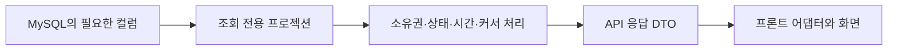

# 비 ES 조회 리팩터링 종합 보고서

작성일: 2026-09-09

## 1. 결론

이번 작업은 **프론트가 사용하는 응답의 의미를 먼저 바로잡고, 그 계약에 필요한 데이터만
읽도록 백엔드 조회를 바꾼 작업**이다. 엔티티 조회를 스칼라 프로젝션으로 전환한 것이
큰 부분을 차지하지만, 그 외에도 잘못된 상태·날짜·정책 처리를 수정했고, 반복 HTTP 요청과
불필요한 SQL을 제거했으며, 행이 늘어나지 않는 관계만 합쳤다.

주요 성과는 다음과 같다.

- 기존 GET 14개 경로의 조회를 필요한 컬럼 중심으로 정리했다. 해당 경로의 검증 fixture에서
  엔티티 로딩 0개를 확인했다. 애플리케이션의 모든 조회가 엔티티를 사용하지 않는다는 뜻은 아니다.
- 결제 작업 상태는 SQL 2→1회, 결제 있는 게스트 상세는 3→1회, 호스트 상세는 단계적으로
  3→2→1회, 대표 숙소가 있는 위시리스트 목록은 일반 2→1회·선택 모달 3→1회로 줄었다.
- 위시리스트 제목·저장 여부를 찾기 위한 목록 페이지 순회를 제거했다. 상세 응답에 이름을
  포함하고, 저장 여부는 전용 API가 한 번에 반환한다.
- 이미지·편의시설처럼 여러 행인 관계, 개인별 찜 상태와 공통 캐시, 제목·소유권과 항목 페이지는
  목적에 맞게 분리했다. 모든 조회를 SQL 한 번으로 만드는 방식은 선택하지 않았다.
- 인덱스와 스키마는 변경하지 않았다. 확인한 것은 반환 계약·조회 수·선택 컬럼·엔티티 로딩이며,
  운영 응답 시간과 처리량의 개선율은 아직 측정하지 않았다.

[기존 최종 점검표](non-es-read-final-audit-2026-09-09.md)는 **남은 조회의 처리 방향**을 정리한
문서다. 이 보고서는 **완료한 변경 전체, 구현 방식, 판단 근거와 검증 결과**를 설명한다.
개별 작업 문서는 당시 변경 전후의 상세 증거로 남겨 두며, 이후 작업으로 바뀐 현재 상태는
이 보고서와 현재 코드를 기준으로 읽는다.

## 2. 조사한 코드 범위

| 구분 | 기준 |
|---|---|
| 백엔드 구현 범위 | `cd6e3bbe`부터 `29550b11`까지 25개 커밋 |
| 보고서 작성 시 백엔드 HEAD | `fd26e747` — 마지막 구현 후 최종 점검 문서 커밋 |
| 운영 코드 변경 | 위 범위의 `src/main` Java 파일 61개, 마이그레이션 변경 없음 |
| 프론트 작업트리 | `codex/editable-booking-review`, HEAD `b1248724` |
| 최신 원격 main 확인 | `f80bc095`, 지정 작업트리에 이미 포함됨. 이번 fetch의 추가 변경 없음 |
| 전수 분류 | 비 ES·비 benchmark 운영 GET 29개, 현재 프론트 연결 17개 |
| 이번 재확인 | 커밋 diff·현재 서비스/저장소/DTO·프론트 어댑터/화면·공유 계약 및 관련 테스트 |

병행 작업 중인 MySQL 업그레이드·AWS 실험·인프라 수정은 이 리팩터링의 구현 성과에
포함하지 않았다. 재검증은 현재 작업트리 환경에서 수행했으며 운영 배포를 검증한 것은 아니다.
프론트 원격 병합에 포함된 별도 UI 변경도 이 작업의 성과로 집계하지 않았다.

## 3. “프로젝션으로 바로 조회하고 반환했나?”에 대한 정확한 설명

**DB에서 필요한 값을 바로 조회한다는 이해는 맞다. 대부분의 경로에서는 그 결과를
그대로 HTTP 응답으로 내보내지 않고 서비스·응답 DTO에서 한 번 더 처리한다.**

기존의 대표적인 흐름은 엔티티와 연관 엔티티를 읽고 getter로 필요한 값만 꺼내 DTO를
만드는 방식이었다. fetch join이 있어 SQL이 한 번이어도 사용하지 않는 컬럼과 엔티티는
함께 읽었다. DTO를 조회하더라도 생성자 인자로 엔티티 전체를 전달하면 이 비용은 남는다.
실제로 이전 공개 상세는 `AccommodationDetailProjection`이라는 이름 안에
`Accommodation` 엔티티를 담고 있었다.

현재 흐름은 다음과 같다.



### 3.1 실제 구현: 엔티티 인자 대신 컬럼 인자

공개 숙소 상세의 핵심 변경을 줄여 쓰면 다음과 같다. 나머지 필드는 설명을 위해 생략했다.

```java
// 이전: 프로젝션 안에 엔티티를 넣으므로 엔티티 전체 조회 비용이 남는다.
.select(new QAccommodationDetailProjection(accommodation, reviewCount, averageRating))
.leftJoin(accommodation.address, address).fetchJoin()

// 현재: 필요한 컬럼으로만 조회 전용 record를 구성한다.
.select(new QPublicAccommodationDetailProjection(
    accommodation.id, accommodation.name, /* 나머지 필요한 컬럼 */
    reviewCount, averageRating))
.leftJoin(accommodation.address, address)
```

핵심은 `record`라는 문법이나 DTO라는 이름이 아니라 **SELECT에 엔티티 대신 어떤 컬럼을
넣는가**다. 현재 QueryDSL 생성자 프로젝션은 `@QueryProjection`으로 생성한 Q 타입을
사용하고, 회원·쿠폰 등은 JPQL 생성자 조회를 사용한다. 위시리스트 membership은
EXISTS 결과를 받는 인터페이스 프로젝션이다. JPA·QueryDSL과 같은 DB를 계속 사용한다.

### 3.2 조회 결과와 HTTP 응답을 구분한 이유

예를 들어 보유 쿠폰 조회 결과에는 `used`, `active`, 사용 시작·종료 시각이 있다.
서버는 공통 `MemberCouponStatus.resolve`로 상태를 계산한 뒤 응답에는 `status`를 담는다.
게스트 예약 조회는 만료 시각·총액·저장 상태를 읽어 유효 상태와 결제 가능 여부를 계산한다.
내부 ID는 커서 생성에 필요하지만 응답하지 않는 경우도 있다.

| 경로 | 조회 결과 뒤에서 하는 일 |
|---|---|
| 공개 상세 | 기본 프로젝션+이미지+편의시설을 공통 캐시 snapshot으로 조립하고, 회원별 찜 상태를 붙임 |
| 게스트 상세 | 공개 숙소·예약 상태·체크아웃 조건으로 후기 자격 확인, 필요한 경우에만 후기 EXISTS 실행 |
| 예약 목록 | 유효 상태·시간대 응답 변환, size+1과 생성 시각/ID로 커서 생성 |
| 쿠폰 목록 | 같은 기준 시각으로 발급·사용 상태 계산, 기존 응답으로 변환 |
| 위시리스트 상세 | 이름·소유자 조회 후 권한 검사, 그다음 항목 조회 |
| 위시리스트 membership | 숫자형 EXISTS 결과를 boolean/null 응답 의미로 변환 |

예외적으로 위시리스트 상세 항목은 기존 구조를 따라 QueryDSL에서 응답 DTO를 직접
생성한다. 다만 그 생성자도 엔티티를 받던 방식에서 12개 스칼라 값으로 바뀌었다.
즉 모든 경로에 동일한 계층을 억지로 추가하거나 없앤 것은 아니다.

조회용 프로젝션은 영속 엔티티처럼 수정 후 자동 저장되지 않는다. 숙소·예약·결제 등의
쓰기에는 기존 엔티티, 잠금, 변경 감지, 이력·이벤트 처리를 유지한다. 읽기와 쓰기의
데이터 사용 방식을 나눈 것이며, 별도 DB를 둔 전면적인 CQRS 전환은 아니다.

근거: [숙소 조회 저장소](../../src/main/java/kr/kro/airbob/domain/accommodation/repository/querydsl/AccommodationRepositoryImpl.java),
[상세 조립](../../src/main/java/kr/kro/airbob/domain/accommodation/service/AccommodationDetailReader.java),
[예약 서비스](../../src/main/java/kr/kro/airbob/domain/reservation/service/ReservationTransactionService.java),
[보유 쿠폰 조회](../../src/main/java/kr/kro/airbob/domain/coupon/repository/MemberCouponRepository.java),
[쿠폰 응답 변환](../../src/main/java/kr/kro/airbob/domain/coupon/dto/CouponResponse.java).

## 4. 조회 경로별 실제 변경과 측정

아래 컬럼 수는 **각 프로젝션 변경 직전과 변경 후의 SELECT 항목 수**다. 여러 단계로
수정한 경로의 최초 상태와 혼동하지 않도록 이전 단계 효과는 별도 열에 적었다.
응답 JSON 필드 수나 전송 바이트 수가 아니다. SQL 수는 인증·Redis를 제외한 해당
서비스 읽기 기준이며 조건별 차이가 있다. 현재 표의 14개 경로는 fixture에서 엔티티
로딩 0개를 검증했다.

| 조회 경로 | 컬럼: 직전 → 최종 | SQL: 해당 단계 | 구현 및 이전 단계 효과 |
|---|---|---|---|
| 공개 숙소 상세 | 기본 52→23, 편의시설 8→2, 이미지 7→2 | 공통 상세 3→3 | to-one 기본 정보는 합치고 두 다건 목록은 분리. 로그인 찜은 별도 |
| 호스트 숙소 목록 | 32→10 | 1→1 | 숙소·주소 엔티티 대신 목록용 값, 주소 LEFT JOIN·커서 유지 |
| 호스트 편집 상세 | 기본 39→19, 자식 조회 각 2 유지 | 3→3 | 앞 단계에서 미사용 후기 조회·호스트 조인을 제거해 4→3회. 편집 정책·주소 보존 |
| 게스트 예약 목록 | 44→11 | 1→1 | 앞 단계에서 미사용 주소를 제거해 57→44. 만료 상태·커서 입력 유지 |
| 호스트 예약 목록 | 55→17 | 1→1 | 예약·숙소·게스트의 목록용 값만 선택. 필터 생략 오류도 수정 |
| 게스트 예약 상세 | 본문 68+결제 14+취소 24→32 | 결제 있고 후기 확인 불필요 시 3→1 | 결제 to-one 통합, 상세에서 미사용 취소 내역 제거. 후기 자격 확인이 필요하면 추가 1회 |
| 호스트 예약 상세 | 본문 68+금액 1→23 | 2→1 | 앞 단계에서 결제 DTO를 금액 하나로 줄이고 취소 조회를 제거해 3→2회 |
| 본인 회원정보 | 11→3 | 1→1 | id·email·nickname만 읽음. 미사용 본인 프로필 이미지 계약 제거 |
| 결제 작업 상태 | 작업 30+예약 25→11 | 2→1 | 작업과 예약을 한 번에 읽어 polling 응답 조립 |
| 최근 본 숙소 | 카드 34→9, 찜 1 유지 | 2→2 | 앞 단계의 후기 요약 LEFT JOIN으로 정상 목록 3→2회. Redis 순서 유지 |
| 보유 쿠폰 목록 | 29→11 | 1→1 | MemberCoupon·Coupon 엔티티 대신 응답 및 상태 계산 입력 조회 |
| 발급 캠페인 목록 | 19→13 | 1→1 | 발급 기간·수량·할인·사용 기간과 상태 계산 입력 조회 |
| 위시리스트 상세 | 이름/소유자 10→2, 항목 37→12 | 2→2 | 이름·소유권 선확인과 공개 항목 페이지 분리 유지 |
| 위시리스트 목록 | 목록 10/사진 2/선택 관계 2→통합 6 | 일반 2→1, 선택 3→1 | 대표 사진은 PK, 선택 관계는 UNIQUE로 행 증가 없이 통합 |

측정 해석의 세부 조건:

- 공개 상세는 공통 cache miss 때 3회다. cache hit 때 공통 조회는 0회이며 로그인 찜 조회는
  별도 1회다. 따라서 모든 상세 요청이 항상 3회인 것은 아니다.
- 위시리스트 일반 목록의 SELECT 6개는 실제 필드 5개+관계 ID 자리의 SQL null이다.
  선택 모달은 실제 필드 6개다. 이전 정상 목록 2/3회는 대표 숙소가 있는 fixture 기준이다.
- 게스트 상세는 결제 없고 후기 확인 불필요 시 2→1회, 결제 없고 후기 확인 필요 시 3→2회였다.
  미지원 가상계좌 원장 조회 제거도 이보다 앞선 단계에서 적용했다.
- 최근 본 목록은 유효한 숙소가 없으면 1회, Redis 기록 자체가 없으면 0회다.
- 각 단계에서 같은 데이터로 before/after를 비교했다. 과거 일부는 MySQL 8.0.33,
  이후 단계는 8.4.11에서 수행했다. 서로 다른 단계의 지연시간을 연결한 성능 개선율은 없다.

### 새 전용 조회와 반복 요청 제거

위시리스트 상세 화면은 이름 하나를 찾으려고 일반 위시리스트 목록을 여러 페이지 조회했다.
이미 상세의 소유권 확인 때 위시리스트를 읽으므로 상세 응답에 `wishlist_name`을 포함했다.
항목이 0개여도 이름을 제공하고, 프론트는 상세 직접 진입 때 목록 요청을 하지 않는다.

찜 상태 역시 일반 목록을 순회하지 않고 `GET /members/wishlists/membership`으로 조회한다.
새 응답은 전체 활성 목록 중 포함 여부, 지정 대상의 유효성, 지정 대상 포함 여부를 구분한다.
당시 3페이지·SQL 9회였던 fixture가 1회가 됐다. 이후 일반 목록도 최적화되었으므로
현재 비교는 **일반 목록 3페이지·3회 대 전용 상태 조회 1회**다.

## 5. 프로젝션 외에 수정한 응답·업무 로직

| 문제 | 이전 동작 | 수정한 동작과 이유 |
|---|---|---|
| 위시리스트 평점 없음 | 0건인데 평균 null, 프론트 숫자 포맷에서 실패 | 기존 요약 변환을 재사용해 0건·0점. 카드에서는 후기 0건의 평점을 숨김 |
| 발급 캠페인과 보유 쿠폰 혼동 | 발급 목록을 곧바로 사용 가능한 쿠폰으로 취급 | 별도 조회/캐시 후 보유 쿠폰 우선 결합. 발급 상태와 사용 상태를 각각 소비 |
| 이미 발급 오류 CP003 | 사용 가능한 보유 쿠폰이라고 단정할 수 있었음 | 보유 상태를 다시 읽어 사용 가능 여부 확인. 이미 사용·만료된 쿠폰 적용 차단 |
| 후기 작성 가능 여부 | 프론트가 서버 true를 예약 상태와 기기 시각으로 다시 제한 | 서버 boolean 사용. 서버도 공개 숙소·체크아웃 조건을 실제 작성 정책과 맞춤 |
| 기존 인원 정책 수정 | 정책이 있으면 수정 요청을 무시 | 기존 정책 행을 변경 감지로 갱신. 잠금·이력·캐시/검색 갱신 흐름 유지 |
| 편집 정책의 null·수량 | 필드별 null을 놓치고, 기존 유아/반려동물 수량을 1로 덮을 수 있었음 | 누락 필드만 기본값 보완, 변경하지 않은 양수 수량 보존 |
| 호스트 숙박 박수 | 경과 시간을 24시간으로 나눠 DST·늦은 체크아웃에서 과대 계산 | 숙소 현지 날짜 차이로 박수 계산 |
| 호스트 결제 금액 표시 | 할인 후 총액을 나눠 단가·정산금처럼 표현 | 추정 단가를 제거하고 “최초 결제 금액”과 숙박 기간 표시 |
| 호스트 목록 정렬 | 일부 페이지의 체크인 정렬을 전체 정렬처럼 이해할 수 있었음 | 현재 불러온 예약 안에서 정렬한다는 범위 명시 |
| 예약 목록 선택 필터 | 생략 가능한 filter가 null이면 switch 실패 가능 | null이면 추가 필터 없이 전체 허용 범위 조회. 기존 소유권·상태 조건 유지 |
| 미지원 가상계좌 | 발급 서비스·예약 상세 원장 분기·입금 안내가 남아 있음 | 운영 호출/지원 흐름을 확인해 전용 경로와 안내 제거. 과거 원장·enum·컬럼 보존 |

쿠폰과 예약 프로젝션 전환 중에는 엔티티의 상태 판단을 복사해 별도 로직으로 만들지 않았다.
`CouponIssuanceStatus.resolve`, `MemberCouponStatus.resolve`,
`Reservation.effectiveStatus`·`isPaymentAllowedAt`을 공유해 기존 엔티티 경로와 읽기 경로의
판정이 갈라지지 않게 했다. 기준 시각과 시작 포함/종료 제외 경계도 검증했다.

위시리스트 쿼리의 별칭은 처음 감사에서 의심했지만 실제 Hibernate 실행 오류는 재현되지
않았다. 관계 경로를 명시한 정리는 했으나, 이를 쿼리 장애 수정이나 SQL 감소 성과로 세지 않았다.

## 6. 실제로 줄인 HTTP 응답과 프론트 변경

**DB 컬럼을 줄이는 것과 API 필드를 삭제하는 것은 다른 결정**이다. 대부분은 기존 응답을
유지한 채 DB에서 읽는 값만 줄였다. 아래 항목만 소비 근거를 확인해 계약을 바꾸거나 확장했다.

| 계약 | 변경 | 프론트 처리 |
|---|---|---|
| 호스트 편집 상세 | 미사용 후기 요약·호스트·좌표 제거 | 기존 운영 mapper가 버리던 필드라 운영 로직 변경 없이 축소 응답 검증 강화 |
| `/auth/me` | 본인 프로필 이미지 제거, id/email/nickname 유지 | wire·mapper·AuthViewer 정리. 세션 식별·결제 고객 정보 소비 유지 |
| 호스트 예약 `payment` | `total_amount` 또는 null인 전용 DTO | 최초 금액 표시 모델로 분리. 0원 결제와 결제 없음 구분 |
| 게스트 예약 `payment` | 수단·최초 금액·상태·승인 시각의 4필드 DTO | 미사용 주문번호·잔액·요청 시각·취소 내역 모델 제거. 기존 상세·복구 동작 검증 |
| 가상계좌 표시 | 전용 모델·은행 매핑·입금 안내 제거 | 카드 결제·결제 없음 화면 유지, 관련 화면 스냅샷 갱신 |
| 위시리스트 상세 | `wishlist_name` 추가 | 제목을 찾기 위한 목록 페이지 요청 제거 |
| 위시리스트 membership | 전용 GET와 상태 계약 추가 | 기존 목록 순회를 전용 요청으로 대체 |
| 쿠폰·후기·정책·호스트 날짜 | 기존 응답을 올바르게 소비하도록 변경 | 앞 절의 상태·편집·표시 로직 반영 |

결제 단독 `/payments/{paymentKey}`, `/payments/orders/{orderId}`의 취소 내역 계약은
예약 화면의 축소 DTO와 구분해 유지했다. 호스트/리뷰 작성자 이미지도 본인 `/auth/me`의
이미지와 다른 소비가 있어 유지했다. 쿠폰 description, 호스트 편집 시간대 등 현재 카드가
직접 표시하지 않더라도 모델·기존 메타데이터 계약으로 보존한 값도 있다.

## 7. 합친 조회와 분리한 조회의 판단 기준

| 판단 대상 | 결정 | 근거 |
|---|---|---|
| 예약과 결제 | 필요한 값만 LEFT JOIN | `payment.reservation_id` UNIQUE로 예약당 최대 1개. 결제 없는 예약도 유지 |
| 최근 본 숙소와 후기 요약 | LEFT JOIN | 요약의 accommodation_id가 PK. 행 수 증가 없이 누락 요약 표현 가능 |
| 위시리스트와 대표 사진 | LEFT JOIN | 대표 숙소 PK 연결. 대표 없음·사라진 ID도 목록 유지 |
| 위시리스트와 선택 숙소의 저장 관계 | accommodationId가 있을 때만 LEFT JOIN | `(wishlist_id, accommodation_id)` UNIQUE. 일반 목록에서는 상태 null 계약 유지 |
| 숙소 이미지와 편의시설 | 서로 별도 조회 | 이미지 5개×편의시설 10개를 함께 JOIN하면 50행으로 늘 수 있음. 각각 필요한 컬럼만 읽음 |
| 후기 페이지와 이미지 | 페이지 후 이미지 IN batch 유지 | 다건 JOIN의 행 중복과 페이지 왜곡 방지. 이미 N+1이 아닌 구조 |
| 최근 본 카드와 회원의 찜 여부 | 찜 ID 집합 조회 분리 | 한 숙소를 여러 목록에 저장할 수 있어 단순 JOIN하면 카드가 중복될 수 있음 |
| 공통 상세 캐시와 찜 | 분리 | 공통 캐시에 개인 상태가 섞이지 않도록 유지 |
| 위시리스트 이름/소유권과 항목 | 2회 유지 | 빈 목록의 이름·미존재/타인 오류가 항목 유무와 독립적 |
| 발급 캠페인과 보유 쿠폰 | 별도 API 유지 | 캠페인이 종료돼도 이미 가진 쿠폰이 사용 가능할 수 있음 |

JOIN이 가능한지는 관계 이름만으로 판단하지 않고 실제 PK·UNIQUE와 필터를 확인했다.
분리가 항상 더 빠르다는 주장은 아니다. 이후 실행계획에서 비용이 확인되면 결과 의미와
페이지를 보존하는 다른 형태를 비교할 수 있다.

쓰기의 소유권 검사·예약→날짜 잠금 순서·결제 실행 fence·멱등성·이력은 조회 수를 줄인다는
이유로 제거하지 않았다. 비교 실험의 before 전용 경로도 기준을 보존했다.

## 8. 검증 방법과 이번 재실행 결과

기존 각 단계에서는 먼저 같은 fixture로 변경 전 응답과 SQL을 확인하고, 변경 후 다음을
검증했다. 이번에는 해당 변경 테스트와 공유 쓰기 회귀를 묶어 현재 코드로 다시 실행했다.

1. MySQL Testcontainers에서 실제 서비스·저장소를 호출한다. 조회 전 영속성 컨텍스트와
   Hibernate 통계를 초기화해 같은 테스트 트랜잭션의 캐시가 조회 감소처럼 보이지 않게 한다.
2. SQL 수·선택 컬럼·추가 JOIN·엔티티 로딩과 응답 값을 함께 확인한다.
3. nullable 관계·0원/결제 없음·후기 없음·권한 거부·빈 페이지·같은 생성 시각의 커서·
   상태 경계·변경 후 재조회·롤백 등 영향을 받는 동작을 검증한다.
4. 실제 백엔드 직렬화와 프론트 어댑터/화면이 같은 JSON fixture를 사용한다.
5. 브라우저에서는 프로덕션 빌드에 합성 API 응답을 연결해 화면 이동·편집·쿠폰·결제 복구를 검증한다.

현재 코드로 다시 실행한 최종 결과는 다음과 같다.

| 검증 | 결과 |
|---|---|
| 백엔드 | 선택한 최상위 테스트 클래스 42개, 중첩 suite 포함 43개 결과 파일, **383개 통과**. 실패·오류·skip 0 |
| 프론트 관련 단위·컴포넌트 | 106개 파일, 787개 통과 |
| 브라우저 | 관련 spec 8개, Chromium **63개 통과** |
| 프론트 앱·테스트·E2E 타입 검사 | 통과 |
| 백엔드/프론트 공유 JSON | 17개 모두 내용 일치 |

선정한 테스트·커밋·fixture 목록과 suite별 결과는 [검증 증거 JSON](non-es-read-refactoring-report-2026-09-09-evidence.json)에 남겼다. 단계별 테스트 수는
같은 회귀 검사를 여러 번 포함하므로 합산해 “총 테스트 수”로 보고하지 않는다.
브라우저 검증은 실제 백엔드와 연결한 HTTP E2E나 실제 결제 승인을 뜻하지 않는다.
전체 서버 테스트·부하 테스트·운영 배포 확인을 이번 재실행 결과로 주장하지 않는다.

브라우저 기본 포트가 사용 중이어서 첫 시도는 테스트 시작 전 종료됐다. 기존 서버는
유지하고 별도 loopback 포트를 쓰는 임시 설정으로 63개를 실행했다. 기존 모의 API,
reporter와 artifact 검사는 그대로 사용했으며 임시 설정은 실행 후 제거했다.

백엔드 재검증은 변경한 현재 테스트 38개 클래스에 위시리스트 쓰기·비교실험·UTC 응답
회귀 4개를 더한 것이다. 증거 파일의 목록으로 같은 선택 범위를 재실행할 수 있다.

```bash
python3 - <<'PY'
import json
import subprocess
from pathlib import Path
evidence = json.loads(Path(
    'docs/performance/non-es-read-refactoring-report-2026-09-09-evidence.json'
).read_text())
args = ['./gradlew', 'test']
for name in evidence['backend']['selectedClasses']:
    args += ['--tests', name]
subprocess.run(args, check=True)
PY
```

프론트 단위·컴포넌트 재검증 선택 범위:

```bash
npm run test:ci -- src/features/accommodations src/features/auth \
  src/features/reservations src/features/profile src/features/reviews src/features/wishlist \
  src/screens/reservation-detail src/screens/profile src/screens/wishlist \
  src/screens/accommodation-detail src/workflows/wishlist-membership
npm run typecheck
npm run typecheck:e2e
```

브라우저는 증거 파일의 `frontend.browserSpecFiles` 8개를
`npm run test:e2e:characterization --` 뒤에 파일 경로로 지정했다.

## 9. 완료 범위, 남은 일, 평가

현재 프론트에 연결된 주요 조회는 더 잘게 프로젝션을 쪼개기보다 성능 측정으로 넘어갈
상태다. 다음은 공개 숙소 상세·가용성·결제 polling을 시작으로 데이터 크기·요청 빈도·
rows examined·DB 실행시간·p95를 수집하는 단계다. SQL 한 번이어도 많은 행을 읽으면
느릴 수 있으므로, 이 보고서만으로 필요한 인덱스나 처리량 개선율을 확정하지 않는다.

최종 감사에서 **29개 중 17개 측정 진행, 11개 현재 계약 유지, 정산 상세 1개 정확성 수정**으로
분류했다. 정산 상세는 저장된 총액 130,000원과 지연 취소 반영 후 상세 합계 128,000원의
불일치를 실제 MySQL로 재현했다. 지급 완료 후 재집계해도 차이가 남아 동일 시점의 내역
저장과 조정 정책이 필요하다. 이 결함은 발견·분류했고 아직 수정하지 않았다.

프로젝션에는 비용도 있다. 화면별 조회 필드와 매핑이 늘어나며, 응답 변경 시 저장소와
계약 테스트를 함께 수정해야 한다. 그래서 단순 조회에는 프로젝션, 상태 전이에는
엔티티를 유지했고, 공통 상태 판정을 공유했다. 현재 사용되지 않는 API까지 같은 형태로
일괄 전환하거나 모든 to-many 조회를 합치는 작업은 하지 않았다.

## 10. 변경 커밋 및 상세 근거

아래 표는 구현 범위의 백엔드 25개 커밋을 모두 포함한다. 프론트 열은 관련 계약 수정·
검증 커밋이며, “운영 변경 없음”인 단계에도 프론트 테스트 보강이 포함될 수 있다.

| 변경 | 백엔드 커밋 | 관련 프론트 커밋 | 상세 근거 |
|---|---|---|---|
| 위시리스트 빈 후기 정상화 | `cd6e3bbe` | `1d1a10cd` | [정확성](wishlist-detail-read-correctness-2026-09-08.md) |
| 쿠폰 캠페인/보유 계약 | `5bb1ea30` | `39a34343`, `b1b3bb04` | [쿠폰 계약](coupon-read-contract-alignment-2026-09-08.md) |
| 후기 작성 권한 | `b8c98c4b` | `8e95f313` | [후기 권한](review-eligibility-contract-alignment-2026-09-08.md) |
| 숙소 정책 조회/저장 | `63f44567` | `5058cd14` | [정책 계약](host-policy-contract-alignment-2026-09-08.md) |
| 호스트 편집 미사용 조회 제거 | `5076071b` | `c237888e` | [편집 조회](host-editor-read-reduction-2026-09-08.md) |
| 게스트 목록 주소 제거 | `934f7ccf` | 운영 변경 없음 | [주소 제거](guest-reservation-list-read-reduction-2026-09-08.md) |
| 최근 본 요약 통합 | `2b7e611c` | `ef0dfec4` | [요약 통합](recently-viewed-read-consolidation-2026-09-08.md) |
| 호스트 숙소 목록 projection | `777864c1` | `aaab8bf5` | [목록 조회](host-accommodation-list-projection-2026-09-08.md) |
| 호스트 박수/금액/정렬 | `016589bc` | `621ab9d6` | [표시 계약](host-reservation-display-contract-2026-09-08.md) |
| 찜 제목·membership 전용 조회 | `19185c41` | `a0ba3e0c` | [반복 요청 제거](wishlist-metadata-membership-read-reduction-2026-09-08.md) |
| 결제 작업 상태 통합 | `96fa676c` | `71ca0aff` | [상태 조회](payment-operation-read-consolidation-2026-09-08.md) |
| 미지원 가상계좌 제거 | `b2d1275e` | `9d3d2f4a` | [가상계좌 정리](unsupported-virtual-account-cleanup-2026-09-09.md) |
| 호스트 상세 결제 축소·통합 | `8d4e5ee3`, `e921af7c` | `29a42cbb` | [호스트 상세](host-reservation-payment-read-reduction-2026-09-09.md) |
| 호스트 예약 목록 projection | `3d757b49` | `0d9d5fb8` | [호스트 예약 목록](host-reservation-list-projection-2026-09-09.md) |
| 게스트 예약 목록 projection | `735e8386` | `35069063` | [게스트 예약 목록](guest-reservation-list-projection-2026-09-09.md) |
| 본인 회원정보 projection | `f203c0b9` | `f8752cc5` | [회원정보](member-profile-read-reduction-2026-09-09.md) |
| 게스트 상세·결제 통합 | `d695ebce` | `009a350f` | [게스트 상세](guest-reservation-detail-projection-2026-09-09.md) |
| 공개 숙소 상세 projection | `87b29da0` | `06906dae` | [공개 상세](public-accommodation-detail-projection-2026-09-09.md) |
| 호스트 편집 상세 projection | `aefd7387` | `6542dd7a` | [편집 상세](host-editor-detail-projection-2026-09-09.md) |
| 최근 본 카드 projection | `12465b12` | 운영 변경 없음 | [최근 본 카드](recently-viewed-card-projection-2026-09-09.md) |
| 보유 쿠폰 projection | `ba183b47` | 운영 변경 없음 | [보유 쿠폰](member-coupon-read-projection-2026-09-09.md) |
| 발급 캠페인 projection | `a7847467` | 운영 변경 없음 | [발급 캠페인](coupon-campaign-read-projection-2026-09-09.md) |
| 위시리스트 상세 projection | `d45f1f31` | 운영 변경 없음 | [찜 상세](wishlist-detail-read-projection-2026-09-09.md) |
| 위시리스트 목록 통합 | `29550b11` | `b1248724` | [찜 목록](wishlist-list-read-consolidation-2026-09-09.md) |

남은 조회 29개 전체 목록과 정산 재현 기록은 [최종 점검표](non-es-read-final-audit-2026-09-09.md)를 참조한다.
