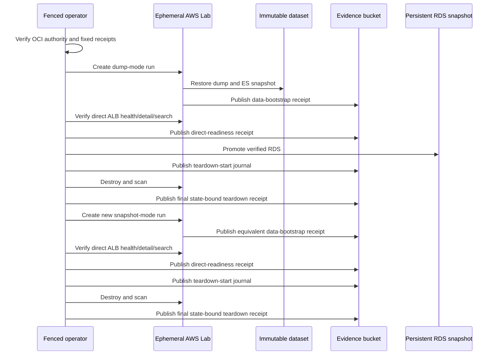
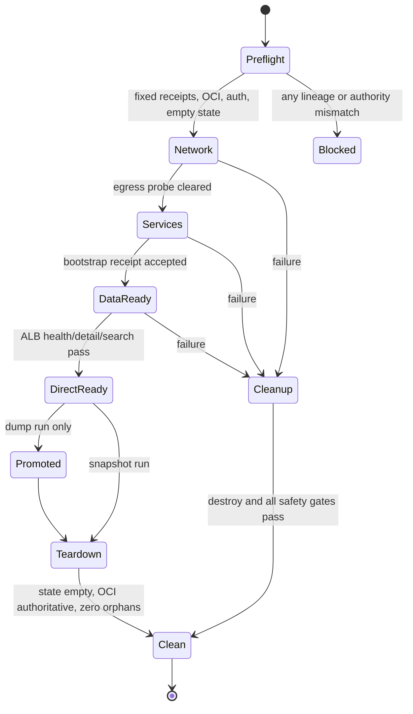

# chore: Prove low-cost AWS lab repeatability

> Archived on 2026-09-08: work is paused at the user's request. Code changes through
> [PR #121](https://github.com/eeoos/airbob/pull/121) are merged into `main` at
> `94477de9397d74367dc64140a19877e04aee395f`. This document preserves the original
> 2026-09-01 plan; its resource sizing, deadlines, pending implementation steps, and
> starting-state observations are historical, not current execution instructions.
> Later fixes supersede those details. This archive does not claim successful dump
> qualification, snapshot promotion/replay, or a completed readiness verdict.
> See the [evidence record](../performance/aws-lab-repeatability-evidence.md) and
> [operator runbook](../performance/aws-performance-lab.md) before any user-requested resumption.

## Summary

Qualify the final search-enabled Airbob dataset through one dump-mode AWS Lab and one promoted-snapshot replay, using the same immutable runtime inputs and full cross-store readiness gates. Keep public DNS and OCI unchanged, remove each ephemeral Lab promptly, and stop after issuing a repeatability and cost-readiness verdict; no performance experiment is in scope.

---

## Problem Frame

The repository contains a fail-closed Lab and data bootstrap, but its status prose predates the final S3 release and its supported operator always switches public DNS after direct smoke. The operator also cannot safely reuse the fixed Terraform backend after a successful destroy, and it does not publish immutable direct-readiness or teardown timing evidence. Running it unchanged would either exceed the OCI/DNS boundary or prevent the required second run.

The authoritative starting state is live evidence, not stale status text: AWS has no active Lab state, tagged Lab resources, RDS instance, or promoted dataset snapshot; the local Docker MySQL alone is running. Local verification reconfirmed 32 exact table counts against the final manifest, Flyway V27, empty `outbox` and `accommodation_inventory_day`, migration checksum `84418ae0...73b8`, and schema fingerprint `49c5326a...e1b2`.

---

## Requirements

### Immutable lineage

- R1. Freeze the exact code, dataset completion marker, native Elasticsearch snapshot, app/infra image releases, and service bundle receipts before creating billable resources.
- R2. Use the existing final release without regenerating data, rerunning ETL, relabeling the release, or modifying its S3/native snapshot objects.
- R3. Keep the dump canonical; treat the promoted RDS snapshot only as a lineage-bound rebuild cache.

### Safe Lab lifecycle

- R4. Support a fenced direct-only operator mode that never plans, applies, stages, or removes public DNS and proves OCI remains authoritative before creation, after direct smoke, and before destroy.
- R5. Permit a second run against the fixed backend only when Terraform state is empty and one immutable, state-version-addressed teardown receipt proves OCI authority and a zero-orphan teardown; a failed final publication must be recoverable without another apply or destroy.
- R6. Publish create-only, read-back-verified direct-readiness and final teardown receipts with comparable phase timestamps, immutable input identities, and a versioned canonical comparison projection.
- R7. Use the minimum implemented topology: `performance`, `integrated-smoke`, load generator disabled, Single-AZ `db.t3.micro`, one app instance, operator-CIDR-only ALB ingress, and immediate normal teardown. Use a five-hour failure backstop for dump mode and two hours for snapshot mode; forced cleanup is eligible at the declared expiry.

### Dump and snapshot qualification

- R8. The dump-mode run must pass manifest validation, RDS restore, Flyway/rows/fingerprints/outbox gates, Elasticsearch restore/alias/fingerprints, both Redis resets, 12 Kafka topics, Debezium `no_data` with one RUNNING task, data-ready, and direct ALB health/detail/search smoke.
- R9. Promote the verified dump-run RDS to an encrypted persistent snapshot whose tags bind the dataset tuple, source Lab run, source RDS resource ID, and promotion schema before destroying the source RDS.
- R10. The snapshot-mode run must use a new run ID and the same dataset, images, bundle, AMI, MySQL patch, mode, policy, cache setting, topology, and smoke inputs; only the required run/fencing identity, bootstrap mode, and promoted snapshot identifier may differ.
- R11. Each teardown must retain only the pre-existing immutable S3 dataset/native snapshot, the promoted RDS snapshot, and required summary evidence receipts; it must leave no run-bound ephemeral infrastructure.

### Completion boundary

- R12. Report paired operational preparation times, cost drivers, actual resource lifetimes where available, and limitations of an `n=1` mode comparison.
- R13. Declare “반복 가능한 저비용 AWS 실험 환경 준비 완료” only if both readiness receipts have the same canonical comparison-projection hash, both teardown receipts are clean, dump mode remains within five hours, snapshot mode remains within two hours, and the topology never exceeds the fixed minimum footprint.
- R14. Stop at that verdict. Do not run or change EXPLAIN, index A/B, cache, N+1, denormalization, bulk, coupon, Kafka/outbox performance, k6, or any other performance experiment.

---

## Fixed Immutable Receipt

| Artifact | Fixed identity |
|---|---|
| Execution-code base | `5681847ab10dc2069f2462b9e190bd2d144aba78` (PR #97 merge) |
| Final operator code | Pending one reviewed full commit and allowlisted operator-tree SHA-256 after U2 |
| Runtime commit | `1537e845b2b6f3cda915dfaf202a1592db7d73cf` |
| Dataset | `production-seed-20260830t223254z-search-rehearsal-r3` |
| Dataset completion marker | `s3://airbob-performance-lab-dataset-942632789808/datasets/production-seed-20260830t223254z-search-rehearsal-r3/manifest.json`, VersionId `jpC16KgrDUiHLRePM9pyRz5451.WnHTj`, SHA-256 `149f950df4d96ad8db7acadf243c16b01c03e76d8abc85c744a550385a9f1c91` |
| MySQL dump | SHA-256 `46e75f72cca35426e5a705e7afb759526160328a83ff3773b25d1552761d816d`, Flyway V27 |
| Native ES snapshot | `airbob-production-seed-20260830t223254z-search-rehearsal-r3`, reference SHA-256 `e382dbc633140bd00a3553681c8be9f1723b78c1150fb45e8e400e474b54fc5c`, seal SHA-256 `3ff0083516e56a093f9c331d07be4bafc46bc07aec0ee14f6e586fadd36c6776` |
| App image receipt | GitHub run `33467484602`, artifact `9785387916`, receipt SHA-256 `07b871388ea75c5a30eeeefa5736dcf968ecdd2ceb91146048cd8418470333b1` |
| App image | `airbob-repo@sha256:5bfb76de29b9e1a3f58abad51326791471fb73e58649a55146da600b13312a55` |
| Infra image receipt | GitHub run `33467660204`, artifact `9785472569`, receipt SHA-256 `c6647fcb7e11934d8afdb3ef6612d385cce6ea191318bd7bd2660699ac3cfc26` |
| Service bundle | commit `1537e845...d73cf`, manifest VersionId `a1Up1NszNzbfO7T8fFQJFQ9CjVrmplho`, manifest SHA-256 `35f92fbf1bed7ff107785708f53f045e48cafcca514a2da013f99b55494c3048`, archive SHA-256 `471316f3914567440b88326d402de3bf2422c46ff145b3aab21a2c40393781e2` |

The infra image receipt fixes Redis `sha256:734bdb0cff0be2a04518e00aa4a57a4a90d2d88643a352168d1dc45726b83cfd`, Redis exporter `sha256:7356a9e34d57b46d948f62e35b0aba1356b118baaf4f18bd9dc6dc2a121f9786`, node exporter `sha256:d8474f9994a47ba181719ba3f3ddc7a0841334fad060d96e3e881dac77eeca52`, Kafka `sha256:affd2f43f7cd3dc105e8ae2ac8fa23f5ada9be44a2898c248eb87a539bb3d96b`, Debezium `sha256:44a2638911224743bea5dd513443dba8db2ab00d5f2e85a9d6ed8bd23cff01ad`, Elasticsearch `sha256:3cfcf40b100763afba50c1671c4353ee767d19523dc30d97e6134e8e763d7da7`, Elasticsearch exporter `sha256:7dba0bd60bdffe2c41a7f7b3a331dc82f1aba28a2bb3873a61864d1d269377cd`, Prometheus `sha256:412b011cead731e4e8292b6dd4ea384cae4b61adbd63a44b0ad263a80dd6c2fc`, and Grafana `sha256:0b53e158ea5e52f70ba7ba9373969f4c1173014972f79ae6f2fdfe78bb2fe302`.

---

## Key Technical Decisions

- KTD1. **Live receipts override status prose:** the final release is absent from Git history, while its S3 marker has one version, no delete marker, and lands after all 11 payload objects.
- KTD2. **Direct-only is the default for this work:** DNS cutover remains an explicit compatibility mode, but both qualification runs persist direct-only mode and reject later `switch` attempts.
- KTD3. **Use the Lab role, not low-level Terraform:** lease, fencing, plan inspection, ordered transitions, failure cleanup, and orphan checks remain in the supported operator path.
- KTD4. **Reuse only attested empty state:** a state object is not deleted. Down first publishes a teardown-start journal while active state binds the old run, then destroys and publishes one create-only final teardown receipt addressed by the exact post-destroy state VersionId digest. A retry with the explicit old run ID may revalidate empty state, OCI, and orphans and finish that publication without another apply or destroy.
- KTD5. **Record readiness before any optional DNS work:** the direct-readiness receipt captures resource-start, data-ready, and direct-smoke times and binds the data-bootstrap receipt plus the exact runtime tuple. Its versioned comparison projection includes fixed lineage, runtime, topology, smoke inputs, and outcomes, while excluding run/fence identity, bootstrap source, AWS-generated coordinates, and timing observations.
- KTD6. **Keep Debezium RUNNING:** `integrated-smoke` is used rather than `isolated-read`, which would pause the connector after bootstrap.
- KTD7. **Minimize cost without changing the topology under test:** disable the `c6i.xlarge` load generator, retain the required five service hosts and monitoring, limit direct-only HTTPS ingress to one preflighted operator CIDR, make forced cleanup eligible at the declared five-hour dump/two-hour snapshot expiry, and call normal teardown immediately after evidence or promotion.
- KTD8. **Separate authorities:** the MFA-trusted `dev-eeoos` path or protected GitHub OIDC assumes `airbob-lab-operator`; snapshot promotion uses an explicit admin/promoter identity and never grants persistence authority to the Lab role.

---

## High-Level Technical Design

### Qualification sequence

### Lab lifecycle

### Fixed versus changed inputs

| Dimension | Dump run | Snapshot run |
|---|---|---|
| Run/fencing identity | Fresh | Fresh and different |
| Database bootstrap | `dump` | `snapshot` |
| RDS source | S3 dump | Promoted snapshot |
| Dataset/image/bundle/AMI/MySQL patch | Fixed | Identical |
| Mode/policy/cache/capacity/load generator | Fixed | Identical |
| Direct smoke inputs | Manifest accommodation detail and exact `search-narrow` target | Identical |
| Public DNS/OCI | Observed only | Observed only |

---

## Implementation Units

### U1. Freeze and publish the audit baseline

- **Goal:** Preserve the external artifact tuple, local verification, clean AWS starting state, stale-doc caveats, and current IAM trust boundary in the durable repeatability evidence; the final operator identity is frozen after U2.
- **Requirements:** R1-R3, R12.
- **Dependencies:** None.
- **Files:** Create `docs/performance/aws-lab-repeatability-evidence.md`.
- **Approach:** Record only non-sensitive IDs, hashes, VersionIds, timestamps, and verification outcomes. Treat the S3 marker and release artifacts as authority.
- **Patterns to follow:** `docs/performance/mysql-baseline-evidence.md`, `infra/aws/datasets/README.md`.
- **Test scenarios:** Verify every receipt hash is canonical, the dataset prefix has exactly 12 latest objects with the completion marker last, and the evidence omits credentials and raw payloads.
- **Verification:** A future reader can reconstruct the exact dataset/image/bundle tuple without accessing local temporary files.

### U2. Add direct-only, reusable-state, and immutable evidence contracts

- **Goal:** Make the supported operator safe for two no-DNS qualification runs and publish durable readiness/teardown evidence.
- **Requirements:** R4-R7, R11-R12.
- **Dependencies:** U1.
- **Files:** Modify `Makefile`, `.github/workflows/aws-performance-lab.yml`, `infra/aws/scripts/aws-lab.sh`, `infra/aws/scripts/cleanup-expired-lab.sh`, `infra/aws/scripts/scan-lab-orphans.sh`, `infra/aws/foundation/iam.tf`, `infra/aws/foundation/tests/foundation.tftest.hcl`, `infra/aws/lab/security.tf`, `infra/aws/lab/variables.tf`, `infra/aws/lab/modules/security/main.tf`, `infra/aws/lab/modules/security/variables.tf`, relevant Lab Terraform tests, `infra/aws/tests/aws-lab-operator-test.sh`, `infra/aws/tests/aws-dns-cutover-test.sh`, `docs/performance/aws-performance-lab.md`, and `infra/aws/lab/README.md`.
- **Approach:** Persist an explicit DNS mode; restrict direct-only ALB HTTPS to an exact preflighted operator CIDR while preserving public ingress only for explicit cutover mode; verify OCI and the exact Route 53 OCI-only record with read-only Lab-role calls; bind the supplied app digest to the runtime commit tag; grant the Lab role exact read access to network receipt, clearance, and data-bootstrap prefixes; enforce `If-None-Match: *` on authoritative receipt writes; publish a teardown-start journal before destroy and one state-addressed final teardown receipt after destroy; support lease-fenced finalization recovery; allow an existing backend only when it is empty and that receipt validates; emit a versioned readiness comparison projection and hash; extend run-bound orphan scans; make expiry cleanup eligible at the declared TTL.
- **Execution note:** Add failing shell contract scenarios before changing the operator.
- **Patterns to follow:** `infra/aws/scripts/bootstrap-data.sh` create-only receipt publication, `infra/aws/scripts/aws-dns-controller.sh` origin probes, `infra/aws/scripts/aws-lab.sh` fencing checks.
- **Test scenarios:**
  - Direct-only up performs no DNS-controller invocation and rejects a non-OCI Route 53 posture before infrastructure creation.
  - Direct-only plans reject public ALB ingress and accept only the exact operator CIDR; cutover plans retain public ingress.
  - Direct-only success verifies direct health/detail/search, publishes a create-only receipt, and reports OCI as the public target.
  - A direct-only run rejects `switch` and down verifies OCI without writing DNS.
  - A non-empty state or an empty state without the exact final teardown receipt blocks replacement; an empty state with the matching receipt permits a fresh run.
  - A crash after destroy can resume finalization with the explicit old run ID, but only after rechecking the exact empty-state VersionId, OCI, and zero orphans.
  - Duplicate readiness/teardown keys succeed only for byte-identical content and fail on drift; authoritative writes without `If-None-Match: *` are denied.
  - Cutover mode retains its existing stage/switch/public-smoke/remove behavior.
  - The supplied app digest must equal the ECR digest tagged by the fixed runtime commit.
  - The Lab role can read only the exact receipt prefixes consumed by Terraform/operator validation.
  - The comparison projection includes every fixed common field and excludes only enumerated run/mode/timing fields.
  - Forced cleanup is eligible at expiry and completes within one scheduled-workflow interval.
  - Orphan checks cover the run's compute, networking, load-balancing, launch, secret, and control-plane resources.
- **Verification:** Shell contract tests and Terraform static tests pass, and no test path requires live AWS.

### U3. Clear the live preflight and cost gate

- **Goal:** Prove the exact operator/promoter authorities, toolchain, AMI, MySQL patch, quotas, clean state, and minimum-cost inputs before creating a resource.
- **Requirements:** R1, R7, R10.
- **Dependencies:** U2.
- **Files:** Modify `docs/performance/aws-lab-repeatability-evidence.md`.
- **Approach:** Use the MFA-trusted local Lab principal or protected GitHub OIDC, keep the admin promoter separate, apply only the reviewed Lab-role receipt-read/write policy delta, pin AL2023 `ami-00b5b2470beafd65f` and orderable MySQL `8.0.46`, freeze the reviewed U2 changes as one clean execution commit plus allowlisted tree digest, and record the fixed input matrix. Do not proceed if credentials, role trust, quotas, OCI authority, Compose `2.40.2`, operator code identity, or policy apply fail.
- **Test scenarios:** Lab role can read contracts plus the exact network/data receipt prefixes and acquire no mutation lease during status; promoter is allowed to create/tag/describe a manual snapshot; no active Lab resources or backend conflict exist; both modes resolve the same 100-GiB RDS shape; the fixed execution commit/tree digest and exact app runtime tag/digest match; expected resource lifetime is at most five hours for dump and two hours for snapshot, with no overlap.
- **Verification:** A redacted preflight table records pass/fail for every gate and lists the billable footprint before apply.

### U4. Qualify the dump-mode Lab

- **Goal:** Create the first Lab from the canonical S3 dump and reach immutable direct readiness without DNS changes.
- **Requirements:** R7-R8.
- **Dependencies:** U3.
- **Files:** Modify `docs/performance/aws-lab-repeatability-evidence.md`.
- **Approach:** Run with a fresh ID, `performance`, `integrated-smoke`, cache enabled, load generator disabled, direct-only DNS mode, and the fixed tuple. Preserve operator, network-clearance, data-bootstrap, policy, Terraform-output, and direct-readiness evidence.
- **Test scenarios:** Validate MySQL engine/Flyway/32 exact counts/fingerprints/outbox; ES version/plugins/document count/mapping/IDs/pairs/content/alias; both Redis databases; all 12 Kafka topics and zero offsets; Debezium `no_data` and one RUNNING task; data-ready binding; direct ALB health, manifest accommodation detail, and exact search target.
- **Verification:** The create-only data-bootstrap and direct-readiness receipts pass independent field comparison against the fixed tuple.

### U5. Promote the RDS cache and clean the first Lab

- **Goal:** Preserve the verified database as a persistent, dataset-bound snapshot and then remove every ephemeral first-run resource.
- **Requirements:** R3, R9, R11.
- **Dependencies:** U4.
- **Files:** Modify `docs/performance/aws-lab-repeatability-evidence.md`.
- **Approach:** Use a shortened digest-bound snapshot identifier, validate the source RDS resource ID and full promotion tags, retain the local promotion receipt hash plus live snapshot tag view, verify its KMS key and private/no-shared restore posture, verify OCI authority, publish the teardown-start journal, destroy normally, and publish the final state-bound teardown receipt.
- **Test scenarios:** Snapshot is available, encrypted, private and unshared, Single-AZ MySQL with the exact source resource and promotion tags; persistent snapshot is absent from the Lab destroy plan; post-destroy Terraform state is empty; all run-bound orphan scans are empty; immutable dataset/native snapshot, summary evidence, and promoted RDS snapshot remain.
- **Verification:** The first Lab cannot be found by state or explicit scans, while the promoted snapshot remains available and eligible for snapshot mode.

### U6. Replay and clean the snapshot-mode Lab

- **Goal:** Recreate the Lab with a new run ID from the promoted RDS snapshot and pass the same readiness contract.
- **Requirements:** R10-R11.
- **Dependencies:** U5.
- **Files:** Modify `docs/performance/aws-lab-repeatability-evidence.md`.
- **Approach:** Change only run/fencing identity, bootstrap mode, and snapshot identifier. Re-run the complete semantic/search/Redis/Kafka/Debezium/app verification and normal direct-only teardown.
- **Test scenarios:** Snapshot eligibility tags match; actual RDS class, engine, storage, AZ, parameter group, encryption, and Multi-AZ settings match the dump run; the versioned comparison-projection hashes match; OCI remains authoritative; zero orphans remain.
- **Verification:** The second readiness and teardown receipts validate and the persistent snapshot remains.

### U7. Issue the repeatability and cost-readiness verdict

- **Goal:** Compare the two operational observations and stop at the environment-readiness boundary.
- **Requirements:** R12-R14.
- **Dependencies:** U6.
- **Files:** Modify `docs/performance/aws-lab-repeatability-evidence.md` and the current-status sections of `docs/performance/aws-performance-lab.md`.
- **Approach:** Use S3 server timestamps for network-clearance to data-bootstrap, direct-readiness timestamps for total resource-start to smoke, and actual create/delete times for resource lifetimes. Separate transient Lab cost drivers from retained S3/RDS snapshot storage, compute a conservative cost from recorded lifetimes and official billing dimensions, and label the comparison `n=1` cross-mode operational evidence rather than same-mode reliability proof.
- **Test scenarios:** Verdict fails if a projection hash differs, a teardown is not clean, DNS changed, dump exceeds five hours, snapshot exceeds two hours, resources overlap or exceed the fixed topology, or a forbidden performance command/artifact appears; otherwise it states “반복 가능한 저비용 AWS 실험 환경 준비 완료” with the scope qualification above.
- **Verification:** The evidence document contains exact durations, resource lifetimes, cost-minimization choices, residual retained resources, limitations, and an explicit stop statement.

---

## System-Wide Impact

- The change affects only the Lab operator, its safety evidence, and operational documentation; application behavior and immutable runtime images remain fixed at the published commit.
- Public Route 53 and OCI deployment/data are observed but never mutated in direct-only mode.
- The persistent boundary gains the promoted RDS snapshot and required summary evidence receipts; all run-bound infrastructure is ephemeral and must be absent after each teardown.
- The evidence bucket receives summary-retention receipts; credentials, secret ARNs with values, raw database data, and response payloads are excluded.

---

## Risks and Mitigations

- **Local Lab authentication is not configured:** live trust permits only `dev-eeoos` with MFA or the protected GitHub environment. Stop before apply until one path is authenticated; do not widen the trust policy to `admin-eeoos` or the Terraform user.
- **Local Compose is below contract:** use an exact checksum-verified temporary `2.40.2` plugin or upgrade the host before the final bundle-contract run; do not weaken the bundle parser test.
- **Receipt permissions are incomplete in the live role:** apply only the reviewed exact-prefix IAM delta before Lab creation and verify it with the assumed role.
- **Promotion authority is ambient:** preflight the exact admin/promoter permission and caller identity; do not grant snapshot creation to the Lab role.
- **Dump import may approach the operator deadline:** budget the two-hour SSM gate together with up to one hour of bounded pre-bootstrap work and 40 minutes of post-bootstrap/app work inside a dump-specific four-hour operator/lease deadline. A 270-minute workflow, 18,000-second credentials, and a five-hour TTL leave separate teardown and credential reserves. Snapshot/down retain the 90-minute operator deadline and two-hour credential/TTL envelope. Monitor without starting a second operator and tear down immediately after success or bounded failure.
- **Snapshot storage can confound comparison:** require the promoted snapshot to restore the same 100-GiB gp3, `db.t3.micro`, Single-AZ shape and record actual attributes.
- **Empty backend can hide external orphans:** require both empty Terraform state and the exact state-addressed final teardown receipt produced only after expanded explicit scans.
- **Final receipt publication can fail after destroy:** preserve the teardown-start journal and allow only lease-fenced, explicit-run recovery that repeats OCI, state-version, and orphan gates.
- **Direct ALB remains an attack surface without DNS:** direct-only mode permits only the preflighted operator CIDR; cutover mode is the sole public-ingress compatibility path.
- **Cost data arrives late:** report resource lifetimes and official billing dimensions immediately; label Cost Explorer amounts provisional until posted.

---

## Documentation and Operational Notes

EC2 On-Demand instances are billed per second with a 60-second minimum, RDS per second with a 10-minute minimum after a billable state change, and gp3 storage per second with a 60-second minimum. The Lab therefore uses On-Demand capacity, disables the load generator, avoids Multi-AZ and NAT Gateway, and destroys promptly instead of buying commitments. The retained manual RDS snapshot continues to incur backup-storage cost after both Labs are gone.

Primary external references: [EC2 On-Demand billing](https://docs.aws.amazon.com/AWSEC2/latest/UserGuide/ec2-on-demand-instances.html), [RDS for MySQL pricing](https://aws.amazon.com/rds/mysql/pricing/), [EBS pricing](https://aws.amazon.com/ebs/pricing/), and [Elastic Load Balancing billing dimensions](https://docs.aws.amazon.com/elasticloadbalancing/latest/userguide/load-balancer-billing-usage-reports.html).

Performance experiments are deferred by explicit user instruction and are not follow-up work in this plan.
