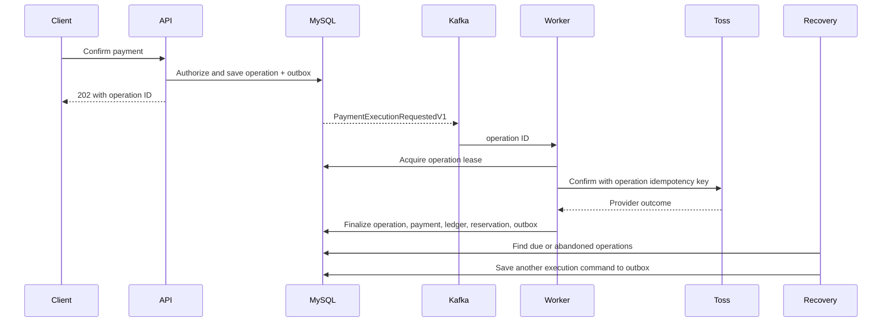
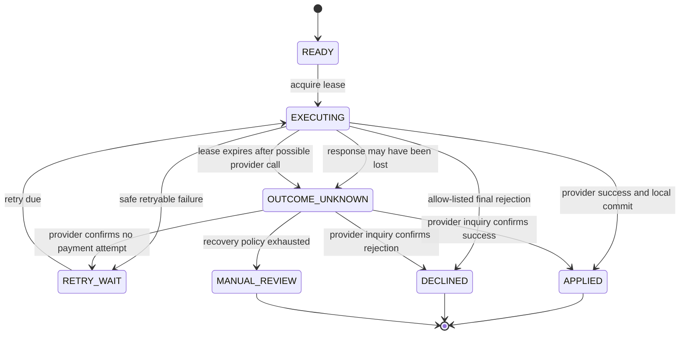

# Async Payment Orchestration Design

## Status

Approved on 2026-08-14 for implementation on `refactor/payment-orchestration-foundation`.

This design assumes there is no existing reservation, payment, outbox, or Kafka backlog that must be migrated. The application may therefore replace the legacy payment-confirmation path directly. It does not require data backfill, dual publication, versioned readers, or a feature-flagged rollout.

## Context

Airbob currently coordinates payment confirmation through a choreography of Kafka messages:

```text
PAYMENT_CONFIRM_REQUESTED
-> PG_CALL_REQUESTED
-> PG_CALL_SUCCEEDED or PG_CALL_FAILED
-> PAYMENT_COMPLETED or PAYMENT_FAILED
-> RESERVATION_CONFIRM_REQUESTED or RESERVATION_EXPIRE_REQUESTED
```

The database persists reservation and payment state, but Kafka retry and DLT handling implicitly own workflow progress. If a message is lost, parked, malformed, or acknowledged after failed compensation, the database has no durable record describing the next required action.

The replacement uses asynchronous orchestration. A durable `PaymentOperation` is the workflow authority, Kafka is an execution signal, and a recovery scheduler guarantees progress independently of Kafka redelivery.

## Goals

- Accept payment confirmation asynchronously and continue returning HTTP `202 Accepted`.
- Authorize the caller against the reservation before creating asynchronous work.
- Persist workflow status before publishing a Kafka command.
- Make duplicate API requests and Kafka deliveries converge on one provider operation and one local result.
- Call Toss outside database transactions with a stable, operation-scoped idempotency key.
- Atomically apply `Payment`, `PaymentTransaction`, `Reservation`, `PaymentOperation`, history, and final outbox changes.
- Distinguish final provider rejection from retryable and outcome-unknown failures.
- Recover after worker crashes, Kafka parking, response loss, and lease expiration.
- Expose an authenticated operation-status API suitable for client polling.
- Remove the legacy payment-confirmation event chain after the new path is verified.

## Non-goals

- Payment cancellation and refund operations.
- Reservation nightly inventory claims.
- Elasticsearch projection redesign.
- A generic consumer inbox or repository-wide per-consumer DLT redesign. The new payment-operation consumer still receives its own dedicated DLT.
- A general outbox schema redesign.
- Zero-price reservation confirmation.
- Migration or compatibility for existing payment data or Kafka backlog.
- Introducing Temporal or another workflow engine.

## Decision

### Considered approaches

1. **Saga coordinator over the existing event chain.** This centralizes routing but retains multiple result and translation events. Workflow progress would remain difficult to query and recover.
2. **Durable payment operation with a Kafka execution command.** This stores progress in MySQL, preserves asynchronous execution, and allows Kafka messages to be duplicated or parked without losing the required work.
3. **External workflow engine.** This provides timers and retries but adds infrastructure and an operational model that the current modular monolith does not need.

The selected approach is a durable payment operation with a Kafka execution command.

## Architecture



Kafka commands carry identifiers, not sensitive payment details. MySQL remains the source of truth for the request and workflow state.

## API Contract

### Request confirmation

```http
POST /api/v1/payments/confirm
```

The request continues to contain the Toss payment key, reservation UID as order ID, and amount. The application resolves the authenticated member and validates ownership, amount, status, and payment deadline while holding the reservation lock.

Successful acceptance returns:

```http
HTTP/1.1 202 Accepted
```

```json
{
  "data": {
    "operation_id": "0a649f58-25c2-4a3f-bd48-8f8cf824e2a1",
    "status": "PENDING",
    "status_url": "/api/v1/payment-operations/0a649f58-25c2-4a3f-bd48-8f8cf824e2a1"
  }
}
```

### Query operation status

```http
GET /api/v1/payment-operations/{operationId}
```

Only the reservation guest may read the operation. The response does not expose the payment key or raw provider error.

```json
{
  "data": {
    "operation_id": "0a649f58-25c2-4a3f-bd48-8f8cf824e2a1",
    "order_id": "3a8bce77-adf6-49ce-bd57-d6d1d41bcb63",
    "status": "PROCESSING",
    "failure_code": null,
    "updated_at": "2026-08-14T12:00:00Z"
  }
}
```

Internal states map to the API as follows:

| Internal state | API state |
|---|---|
| `READY`, `RETRY_WAIT` | `PENDING` |
| `EXECUTING`, `OUTCOME_UNKNOWN` | `PROCESSING` |
| `APPLIED` | `SUCCEEDED` |
| `DECLINED` | `FAILED` |
| `MANUAL_REVIEW` | `REQUIRES_REVIEW` |

## PaymentOperation Model

Migration `V17__add_payment_operation.sql` adds one table with the following logical fields:

| Field | Purpose |
|---|---|
| `id` | Internal numeric primary key |
| `operation_uid` | Public UUID and unique workflow identity |
| `reservation_id` | Required reservation foreign key |
| `requester_member_id` | Audit identity of the initiating member |
| `operation_type` | `CONFIRM` in this slice |
| `status` | Durable workflow state |
| `payment_key` | Provider secret, stored only in MySQL |
| `expected_amount` | Server-validated confirmation amount |
| `provider_idempotency_key` | Unique Toss idempotency key derived from operation UID |
| `deduplication_key` | Unique server key `CONFIRM:{reservationUid}` |
| `attempt_count` | Number of claimed execution attempts |
| `next_attempt_at` | Earliest recovery time |
| `last_enqueued_at` | Last time an execution command was written, used to rate-limit recovery publication |
| `lease_owner` | Worker currently executing the operation |
| `lease_expires_at` | Crash-recovery deadline |
| `failure_code` | Bounded normalized provider or application code |
| `failure_message` | Bounded internal diagnostic message |
| `version` | Optimistic-lock version |
| `completed_at` | Terminal completion time |
| audit timestamps | Creation and update times |

Indexes and constraints:

- Unique `operation_uid`.
- Unique `provider_idempotency_key`.
- Unique `deduplication_key`.
- Index `(status, next_attempt_at, last_enqueued_at)` for due-work and stale-command scans.
- Index `lease_expires_at` for abandoned execution scans.
- Foreign keys to reservation and requesting member.

V17 also adds nullable `payment_operation_id` to `payment_transaction`, with a foreign key to `payment_operation` and a unique constraint. New confirmation success and failure ledger rows must reference their operation. This makes repeated local finalization a database-level no-op or uniqueness conflict instead of a duplicate append. The existing unique `payment.reservation_id` constraint remains the final guard against two successful payments for one reservation.

The complete Toss response and virtual-account customer data are not stored on the operation or placed in Kafka.

## State Machine



`APPLIED`, `DECLINED`, and `MANUAL_REVIEW` are terminal for automatic execution. A manual-review operation may later be resolved through an explicit administrative capability, which is outside this slice.

## Component Boundaries

### PaymentOperationCommandService

- Resolves and pessimistically locks the reservation.
- Verifies the authenticated member owns it.
- Verifies order ID, amount, reservation state, and deadline.
- Returns the existing operation for an identical duplicate request.
- Rejects a conflicting duplicate request after comparing reservation UID, expected amount, and payment key with the existing operation.
- Changes the reservation from `PAYMENT_PENDING` to `PAYMENT_PROCESSING` for compatibility with current reservation behavior.
- Saves `PaymentOperation` and `PaymentExecutionRequestedV1` outbox data in one transaction.

### PaymentExecutionConsumer

- Reads `PaymentExecutionRequestedV1` from the payment-operation command topic.
- Delegates to the executor.
- Acknowledges only after the executor either reaches a terminal state or durably records the next recovery state.
- Propagates failures when no durable recovery state was saved.

### PaymentOperationExecutor

- Acquires a short-lived execution lease in a database transaction.
- Does not hold a database transaction or lock during Toss I/O.
- Calls Toss with the stable operation-scoped idempotency key.
- Classifies the provider outcome.
- Delegates all local result changes to the finalizer.
- Treats expired `EXECUTING` work as outcome-unknown until provider state is established.
- Calls confirmation only for `READY` or `RETRY_WAIT`; it performs provider inquiry first for `OUTCOME_UNKNOWN` or lease-expired `EXECUTING`.

### PaymentOperationFinalizer

In one local transaction it locks the operation and reservation and applies one of two final results:

- Success: create or validate `Payment`, append one confirmation ledger entry, confirm the reservation, mark the operation `APPLIED`, write history, and write final outbox facts.
- Final decline: append one failure ledger entry, expire the reservation, restore its coupon according to policy, mark the operation `DECLINED`, write history, and write final outbox facts used for derived cache cleanup.

The operation foreign key is persisted on each new ledger effect and is unique, so repeated finalization cannot append duplicate rows.

### PaymentOperationRecoveryScheduler

- Pages through stale `READY`, due `RETRY_WAIT`, due `OUTCOME_UNKNOWN`, and lease-expired `EXECUTING` operations.
- Uses database locking so multiple scheduler instances cannot claim the same recovery item simultaneously.
- Converts lease-expired `EXECUTING` work to `OUTCOME_UNKNOWN` before enqueueing recovery.
- Writes another `PaymentExecutionRequestedV1` outbox command rather than invoking Toss directly.
- Advances `last_enqueued_at` in the same transaction so an unconsumed command is republished only after the configured recovery-publication interval.
- Moves exhausted ambiguous work to `MANUAL_REVIEW` and emits an alert.

### TossPaymentGateway

- Exposes normalized confirmation and inquiry operations.
- Accepts an explicit provider idempotency key.
- Returns typed outcomes rather than throwing one undifferentiated exception for every HTTP error.
- Applies explicit connection and response deadlines.

## Kafka and Outbox Contract

The command payload is intentionally small:

```text
PaymentExecutionRequestedV1(
    operationUid,
    reservationUid
)
```

The Kafka partition key is the reservation UID so future confirmation and cancellation operations for the same reservation remain ordered.

With the current Debezium route-by-aggregate convention, the outbox aggregate type is `PAYMENT_OPERATION`, the topic is `PAYMENT_OPERATION.events`, and the consumer group is `payment-operation-execution-group`. Its dedicated quarantine topic is `PAYMENT_OPERATION.events.DLT`; the existing payment and accommodation DLT configuration is not redesigned in this slice.

The command may be delivered more than once. Correctness depends on operation state, database constraints, execution lease, provider idempotency, and finalizer idempotency. It does not depend on exactly-once Kafka delivery.

The payment-operation DLT handler retains the original topic, partition, offset, and operation UID when the envelope is parseable, alerts operators, and quarantines the record. It does not perform payment compensation. The recovery scheduler continues to make progress even if the Kafka record remains parked.

Default execution policy is configurable but starts with a 30-second lease, a scheduler interval of 10 seconds, and a batch size of 100. Toss connect and response deadlines must be shorter than the lease. Retryable execution uses exponential backoff and moves unresolved work to `MANUAL_REVIEW` after five automatic attempts; outcome-unknown work always performs inquiry before another confirmation call.

## Error Classification

| Provider or system outcome | Durable state | Next action |
|---|---|---|
| Confirmed response | `APPLIED` after local commit | None |
| Allow-listed final decline | `DECLINED` after local commit | None |
| Failure before a request can be transmitted | `RETRY_WAIT` | Re-enqueue after delay |
| Read timeout or response loss | `OUTCOME_UNKNOWN` | Inquire before deciding |
| Already processed response | `OUTCOME_UNKNOWN` | Inquire and correlate |
| Unknown provider code | `OUTCOME_UNKNOWN` | Inquire, then manual review if unresolved |
| Database failure after provider success | Existing `EXECUTING` lease | Redelivery or lease recovery with same idempotency key |

Only explicitly mapped provider codes are final declines. An unrecognized 4xx response is not automatically terminal.

## Reservation Compatibility

This slice preserves existing reservation status semantics:

- Operation creation moves `PAYMENT_PENDING` to `PAYMENT_PROCESSING`.
- Success moves `PAYMENT_PROCESSING` to `CONFIRMED`.
- The payment deadline is checked when the operation is accepted. Once accepted, a correlated Toss approval remains valid even if provider latency puts `approvedAt` after the reservation deadline; inventory stays held until the operation resolves.
- Final decline moves `PAYMENT_PROCESSING` to `EXPIRED`.
- `RETRY_WAIT` and `OUTCOME_UNKNOWN` remain `PAYMENT_PROCESSING` and are owned by the recovery scheduler.
- `MANUAL_REVIEW` keeps inventory occupied until money state is resolved.

Removing workflow states from `Reservation` belongs to a later reservation refactor. The new scheduler removes the current permanent-stuck-state failure mode before that cleanup.

## Security and Privacy

- The current member ID is mandatory when creating or reading an operation.
- Ownership is checked while the reservation is locked and before asynchronous work is saved.
- Payment keys and full Toss responses do not appear in Kafka messages, DLT alerts, Slack messages, or operation-status responses.
- Logs use operation UID and reservation UID as correlation identifiers.
- Provider error messages are bounded and sanitized before persistence.
- Raw provider DTOs remain inside the gateway boundary.

## Clean Cutover

Because there is no existing data or Kafka backlog, deployment is a direct replacement:

1. Apply V17 and provision the payment-operation command topic.
2. Deploy the operation API, consumer, executor, finalizer, and scheduler together.
3. Route `/api/v1/payments/confirm` exclusively through `PaymentOperationCommandService`.
4. Remove legacy confirmation event translation and PG-confirm handlers after the new tests pass.
5. Retain legacy cancellation behavior until its separate refactor.

There is no dual publication or backfill. Before the new endpoint accepts traffic, application rollback is safe. After any operation is accepted, rollback must first stop new confirmation requests and drain or explicitly resolve nonterminal operations; an older binary must not silently ignore them.

## Testing Strategy

### Domain tests

- Every allowed and rejected state transition.
- Terminal-state no-op behavior.
- Lease acquisition and expiration.
- Provider outcome classification.
- Internal-to-API status mapping.

### MySQL integration tests

- Atomic operation and outbox creation.
- Deduplication and provider-idempotency constraints.
- Concurrent confirmation requests produce one operation and one command.
- Success atomically updates payment, ledger, reservation, operation, history, and outbox.
- Final decline atomically updates failure ledger, reservation expiry, coupon restoration, operation, history, and outbox.
- Injected failures roll back every local effect.
- Multiple schedulers cannot claim the same due operation.

### Kafka consumer tests

- Duplicate delivery produces one provider operation and one local result.
- A valid lease prevents a second worker from executing.
- A failure before durable recovery state does not acknowledge.
- Persisted `RETRY_WAIT` or `OUTCOME_UNKNOWN` allows acknowledgment.
- Scheduler re-enqueue and delayed original delivery converge safely.

### API tests

- Confirmation returns `202`, operation ID, and polling URL.
- Non-owners receive `403` with no operation or outbox writes.
- Mismatched amount and order ID are rejected.
- Identical request replay returns the existing operation.
- Operation reads require ownership.
- Status responses do not expose payment keys or raw provider messages.

### Required failure points

| Failure point | Expected convergence |
|---|---|
| Before operation commit | No operation or command |
| After operation commit, before CDC publication | Debezium later publishes the committed outbox row |
| After lease, before Toss call | Lease expiration schedules execution |
| After Toss success, before local finalization | Same idempotency key recovers the result and applies it once |
| After local finalization, before Kafka acknowledgment | Redelivery observes `APPLIED` and performs no side effect |
| Toss read timeout | Persist `OUTCOME_UNKNOWN`; do not expire reservation |
| Toss success-response parsing failure | Persist `OUTCOME_UNKNOWN`; inquire before deciding |
| Recovery command races with delayed original | Lease and terminal guards allow one effective execution |

## Completion Criteria

- V17 migration is covered by a migration test.
- Confirmation and operation-status APIs are implemented and authorized.
- Confirmation executes through Kafka and a durable payment operation.
- Worker crash, duplicate delivery, timeout, and response-loss tests converge.
- Recovery scheduler handles retryable, outcome-unknown, and expired-lease work.
- One reservation can create at most one confirmation operation, payment, confirmation ledger effect, and final outbox fact.
- Legacy confirmation event translation and handler paths are removed.
- Existing cancellation tests continue to pass.
- Targeted tests and the full Gradle test suite pass.
- No payment key or full Toss response is published to Kafka or returned by the operation API.

## Follow-up Projects

1. Payment cancellation and refund operations using the same operation model.
2. Reservation nightly inventory claims with database uniqueness.
3. Generic event inbox and per-consumer retry/quarantine infrastructure.
4. Versioned search projection reconciliation and alias-based index rebuild.
5. Reservation-state simplification and removal of Redis correctness responsibilities.
