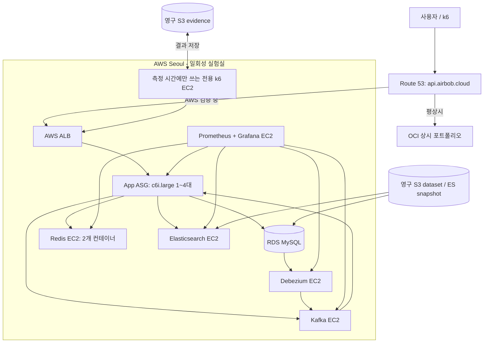
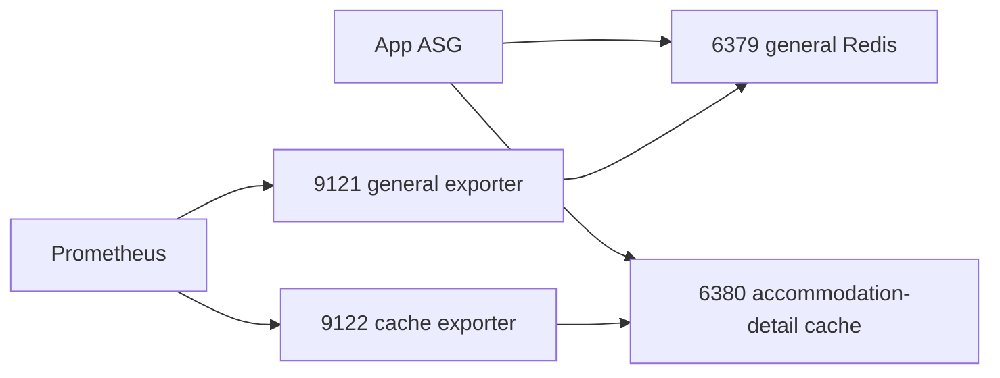
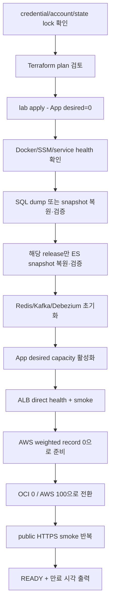

# 일회성 AWS 성능 실험실 및 Redis 2분리 설계

## 결론

OCI는 `api.airbob.cloud`의 상시 포트폴리오 환경으로 계속 실행한다. AWS는 성능 개선 검증이나 스케일아웃 실험이 필요할 때만 Terraform으로 생성하고, 검증을 마치면 다시 제거한다.

AWS는 모든 구성요소를 한 인스턴스에 합치지 않는다. 기존 인프라의 서비스 경계를 유지하되 Redis는 전용 EC2 한 대 안에 현재와 같은 범용 Redis와 숙소 상세 캐시 Redis 두 컨테이너로 실행한다.

- 애플리케이션: `c6i.large` Auto Scaling Group
- Redis: `t3.small` EC2 한 대, Redis 2개와 exporter 2개
- Kafka: `t3.medium` EC2 한 대
- Debezium: `t3.medium` EC2 한 대
- Elasticsearch: `t3.medium` EC2 한 대
- Prometheus/Grafana: `t3.small` EC2 한 대
- MySQL: Single-AZ `db.t3.micro` RDS
- NAT: `t3.micro` NAT instance

이는 다중 AZ 고가용성을 갖춘 실제 운영 인프라가 아니라, 운영과 비슷한 서비스 경계에서 병목과 스케일링을 관찰하기 위한 **일회성 production-shaped performance lab**이다. 단일 노드 상태 저장 서비스의 장애 대응이나 무중단 운영 능력을 주장하지 않는다.

이 문서는 구현 기준과 진행 상태를 함께 기록한다. Phase 0의 애플리케이션 계약과 여섯 service-host의 Compose/config 계약, Debezium worker/connector template, Prometheus AWS target 정의 및 검증된 로컬 bundle packaging까지 구현되었다. Immutable image 생성·발행과 runtime smoke, bundle upload 및 repository-s3 검증, SSM bootstrap/sysctl 적용, Terraform, DNS 이전·전환, AWS 자원 생성과 성능 증거 수집은 아직 진행 전이다.

## 배경

현재 OCI는 비용을 거의 발생시키지 않으면서 포트폴리오를 계속 보여 주는 역할에 적합하다. 반면 AWS의 ALB, RDS, 여러 EC2와 EBS를 상시 유지하면 실제 사용자가 없는 프로젝트에 불필요한 비용이 든다. 기존에는 GitHub Actions가 ECR 이미지만 갱신하고 AWS 자원은 콘솔에서 직접 켜고 껐기 때문에 다음 문제가 있었다.

- 구성 재현이 어렵고 콘솔 설정 누락 여부를 확인하기 어렵다.
- 중지해도 ALB, EBS, RDS 스토리지와 공인 IPv4 같은 비용이 남는다.
- 로컬에서 실험하고 싶을 때 GitHub Actions 실행 여부와 무관하게 같은 절차를 재사용하기 어렵다.
- 성능 모드와 스케일링 모드의 ASG 설정을 매번 수동으로 바꿔야 한다.
- DB와 Elasticsearch 데이터 초기 상태가 실행마다 달라질 수 있다.
- T3 계열 의존 서비스의 CPU credit, JVM heap과 백그라운드 작업이 결과를 오염시킬 수 있다.

따라서 작은 영구 기반만 남기고 실행 자원은 매번 생성·복원·검증·삭제한다. 로컬 명령과 GitHub Actions 수동 실행은 동일한 Terraform과 동일한 스크립트를 호출한다.

## 목표

- 로컬과 GitHub Actions 어디서든 같은 명령 계약으로 AWS 실험실을 생성하고 제거한다.
- OCI를 끄지 않은 채 AWS가 정상일 때만 `api.airbob.cloud` 트래픽을 AWS로 전환한다.
- 응답 성능 비교에서는 앱 인스턴스를 정확히 한 대로 고정한다.
- 스케일아웃 실험에서는 앱 ASG를 `min=1`, `desired=1`, `max=4`로 전환한다.
- 앱·Kafka·Debezium·Elasticsearch·Redis·RDS·모니터링의 서비스 경계를 보존한다.
- Redis는 한 EC2에서 범용 데이터와 숙소 상세 캐시의 persistence, eviction과 지표를 분리한다.
- SQL dump와 Elasticsearch snapshot으로 동일한 합성 데이터를 재현한다.
- 이미지 digest, 데이터 release, JVM 옵션과 실험 조건을 artifact에 남긴다.
- 실행 실패나 사용 후 방치로 생기는 비용과 DNS 장애를 줄인다.

## 비목표

- Multi-AZ RDS, Redis Cluster/Sentinel, Kafka cluster, Elasticsearch cluster를 구성하지 않는다.
- ElastiCache, MSK, OpenSearch, ECS 또는 EKS로 이전하지 않는다.
- OCI와 AWS를 동시에 사용자 트래픽에 제공하거나 active-active로 운영하지 않는다.
- 새 도메인을 구매하거나 도메인 등록기관을 가비아에서 옮기지 않는다. DNS hosting만 `airbob.cloud` 전체를 Route 53으로 이전한다.
- Redis를 인증·락·쿠폰 등으로 더 세분화하지 않는다. OCI와 AWS 모두 현재의 범용 Redis와 숙소 상세 캐시 Redis 두 개를 유지한다.
- 실제 고객 데이터나 운영 트래픽을 재현한다고 주장하지 않는다.
- 첫 버전에서 백그라운드 스케줄러의 다중 인스턴스 ownership 문제를 해결하지 않는다.
- 내부 Kafka, Redis, Elasticsearch 통신에 TLS를 새로 도입하지 않는다. 합성 데이터만 사용하는 private VPC 실험실이라는 경계를 명시한다.
- AWS 자원을 단순히 `stop` 상태로 장기 보관하지 않는다. 실험 자원은 기본적으로 destroy한다.

## 검토한 대안

### 1. 중지된 AWS 자원을 계속 보관

시작은 빠르지만 ALB, EBS, RDS 스토리지와 공인 IPv4 비용이 계속 남고 구성 drift도 해결하지 못한다. RDS와 각 EC2를 서로 다른 순서로 다시 켜야 하는 번거로움도 유지되므로 채택하지 않는다.

### 2. 모든 의존 서비스를 큰 EC2 한 대에 통합

가장 저렴하지만 Kafka, Elasticsearch, Redis와 모니터링이 CPU·메모리·디스크를 서로 빼앗는다. 앱 변경 전후의 응답시간이나 ASG 효과를 설명할 때 의존 서비스의 noisy-neighbor 영향을 분리하기 어려워 채택하지 않는다.

### 3. 관리형 서비스를 사용

ElastiCache, MSK와 OpenSearch는 운영 관점에서는 자연스럽지만 포트폴리오 실험실의 상시·기동 비용이 커진다. 관리형 서비스 운영이 이번 성능 실험의 학습 목표도 아니므로 채택하지 않는다.

### 4. 서비스별 EC2를 유지하고 Redis만 한 호스트에서 2분리

기존 아키텍처를 보여 주고 각 서비스 지표를 분리하면서도 Redis EC2 수는 한 대만 사용한다. Redis 내부 구성도 현재 구현된 범용/숙소 상세 캐시 경계를 그대로 사용한다. 현재 프로젝트 규모와 비용 목표에 가장 적합하므로 이 방식을 채택한다.

## 선행 조건: `airbob.cloud` 권한 DNS를 Route 53으로 이전

현재 저장소의 OCI 인증서 스크립트는 `api.airbob.cloud`를 Oracle VM IP로 향하는 A record로 안내하고 있으며, `airbob.cloud`의 authoritative DNS는 Route 53이 아니라 가비아다. 따라서 기존 Route 53 hosted zone을 import한다는 전제로는 public DNS 전환과 ACM 자동 검증이 작동하지 않는다.

사용자 결정에 따라 등록기관과 도메인 갱신은 가비아에 그대로 두고 DNS hosting만 Route 53으로 이전한다. 다음 1회 절차를 따른다.

1. 가비아 DNS 관리 화면에서 현재 zone의 A/AAAA/CNAME/TXT/MX/CAA와 Vercel·인증 record를 export하거나 검토 가능한 목록으로 보존한다. public DNS 조회만으로 전체 record를 추정하지 않는다.
2. Route 53에 `airbob.cloud` public hosted zone을 만든다.
3. Route 53이 자동 생성한 NS/SOA를 제외하고 기존 record를 먼저 그대로 복제한다. apex/`www`의 Vercel 연결과 `api`의 OCI IP를 반드시 포함한다.
4. `api.airbob.cloud`는 OCI weighted A record(weight 100, TTL 60)로 준비하고 AWS record는 아직 만들지 않는다.
5. DNSSEC/DS 사용 여부를 확인하고, 사용 중이면 AWS의 공식 migration 절차에 맞춰 전환 중 validation failure가 없게 처리한다.
6. Route 53이 부여한 네 name server에 직접 질의해 apex, `www`, `api`, TXT/MX 등 보존 대상 응답과 OCI HTTPS가 모두 맞는지 확인한다.
7. 이 시점에 네 Route 53 name server 값을 사용자에게 전달한다. 사용자가 가비아 등록기관 화면에서 `airbob.cloud`의 authoritative name server를 그 네 값으로 변경한다.
8. 이전 authoritative NS의 TTL과 registry 전파가 끝날 때까지 여러 public resolver에서 새 Route 53 NS와 기존 서비스 응답을 확인한다. 가비아 DNS zone은 rollback을 위해 최소 48시간 보존한다.
9. Route 53 zone 안에 ACM DNS validation CNAME을 만들고 서울 region 인증서가 `ISSUED`인지 확인한다.

이전은 foundation의 1회 수동 승인 단계다. Terraform이 hosted zone과 record 복제를 준비하고 검증 결과를 출력한 뒤, 실제 가비아 name server 변경만 사용자가 수행한다. 이후 OCI A record와 AWS ALB alias의 weighted 전환은 Terraform이 Route 53 안에서 관리한다. 이전 완료 전에는 `aws-switch TARGET=aws`를 허용하지 않는다. 새 도메인 구매나 등록기관 이전은 없고 Route 53 public hosted-zone 비용만 추가된다.

API의 두 origin record는 이름과 type을 `api.airbob.cloud` A로 통일한다. OCI는 일반 weighted A, AWS는 weighted ALB alias를 사용하고 OCI TTL은 ALB alias와 맞춘 60초로 고정한다. 모든 origin probe는 `--resolve`/`--connect-to`처럼 SNI와 Host를 `api.airbob.cloud`로 유지한다.

## 전체 구조



OCI와 AWS는 데이터를 공유하지 않는다. DNS를 AWS로 전환하면 기존 OCI 세션은 AWS에서 유효하지 않으므로 다시 로그인해야 한다. 이는 합성 데이터 실험 환경에서 의도한 격리다.

## 수명 주기 경계

### 영구 기반

다음 자원은 실험을 내릴 때 삭제하지 않는다.

| 자원 | 역할 | 비용 관리 |
|---|---|---|
| S3 Terraform state bucket | 원격 state와 lock file | versioning, encryption, public access 차단 |
| S3 dataset bucket/prefix | SQL dump, ES snapshot, manifest | 활성 release만 유지 |
| S3 evidence bucket/prefix | k6·Prometheus·CloudWatch 결과 | lifecycle로 오래된 raw artifact 정리 |
| 기존 application object S3 | 숙소 이미지 등 앱 객체 | lab에서 생성·삭제하지 않고 isolated 실험은 쓰기 차단 |
| ECR repositories | 앱과 인프라 이미지 | untagged/오래된 image lifecycle 적용 |
| GitHub OIDC IAM roles | 수동·예약 workflow 인증 | static AWS access key 금지, foundation/lab 권한 분리 |
| ACM certificate | ALB의 `api.airbob.cloud` TLS | Route 53 zone으로 DNS 검증 |
| Route 53 public hosted zone | `airbob.cloud` 권한 DNS | 가비아는 등록기관으로 유지, `prevent_destroy` |
| DNS 전환 state | `api`의 OCI/AWS weighted record 관리 | apex/`www` 정적 record와 분리, AWS가 없을 때 OCI만 유지 |
| DynamoDB orchestration lease | 여러 state에 걸친 up/down 상호 배제 | on-demand, lock row 1개 |
| 선택적 RDS dataset snapshot | dump에서 검증된 빠른 복원본 | 현재 dataset release만 유지 |

기존 자원은 무조건 새로 만들지 않고 먼저 import 또는 data source 대상으로 분류한다. hosted zone처럼 실수로 삭제하면 안 되는 자원은 lab state에 넣지 않는다.

### 일회성 실험실

다음 자원은 `aws up`에서 만들고 `aws down`에서 제거한다.

- VPC, public/private subnet, route table, Internet Gateway
- NAT instance와 임시 Elastic IP
- ALB, listener, target group
- App launch template와 ASG
- RDS instance와 lab용 subnet/parameter group
- Redis, Kafka, Debezium, Elasticsearch, monitoring EC2와 EBS
- 선택적 load-generator EC2
- lab 전용 IAM instance profile, security group, private DNS record
- AWS 쪽 weighted public DNS record

모든 일회성 자원에는 `Project=airbob`, `Environment=performance-lab`, `ManagedBy=terraform`, `ExpiresAt` 태그를 붙인다.

## 인스턴스와 컨테이너 기준

| 구성요소 | 기본 크기 | 실행 내용 | 설계 의도 |
|---|---:|---|---|
| App ASG | `c6i.large` | 노드당 앱 컨테이너 1개 | CPU credit이 없는 x86 고정 성능 측정 대상 |
| Redis | `t3.small` | 범용/cache Redis 2개 + exporter 2개 | 한 장애 도메인 안에서 데이터 성격과 지표만 분리 |
| Kafka | `t3.medium` | Kafka + JMX exporter | 단일 broker, 합성 이벤트 처리 |
| Debezium | `t3.medium` | Connect/Debezium + exporter | RDS binlog → Kafka CDC |
| Elasticsearch | `t3.medium` | ES 8.18.8 + Nori + exporter | 단일 node 검색 실험 |
| Monitoring | `t3.small` | Prometheus + Grafana | private 관측 환경 |
| RDS | `db.t3.micro` | MySQL 8, Single-AZ, gp3 | 합성 데이터 기준 DB |
| NAT | `t3.micro` | NAT 기능만 | NAT Gateway 상시 비용 회피 |
| Load generator | 측정 시 `c6i.xlarge` | k6, 결과 수집 도구 | 기록용 부하의 client bottleneck 방지 |

앱 컨테이너는 초깃값으로 CPU 2개, memory 3GiB를 제한하고 JVM은 `-Xms1536m -Xmx1536m -XX:+UseG1GC`로 고정한다. 변경 전후 실험은 선언한 독립 변수 외에는 같은 AMI, launch template, JVM과 dependency 조건을 사용한다. 코드 변경 실험에서는 image digest가 달라지는 것이 정상이며 baseline/candidate digest를 모두 기록한다.

Elasticsearch heap은 1GiB, Kafka heap은 1GiB, Debezium heap은 512MiB를 초깃값으로 고정한다. 실제 실험에서 조정하면 해당 값도 evidence manifest에 기록하고 다른 값의 결과를 같은 비교 집합에 섞지 않는다.

T3 계열은 비용 절약을 위해 의존 서비스에만 사용한다. EC2 T3는 빠른 bootstrap을 위해 `unlimited`를 명시하고, RDS T3도 Unlimited 동작임을 비용 계산에 포함한다. 새 T3에 launch credit이 있다고 가정하지 않는다. 서비스 준비 후 최초 credit/surplus 상태를 기록하고, 측정 전 idle-control에서 surplus가 해소되고 사전에 정한 최소 credit·CPU·I/O gate를 통과할 때까지 기다린다. `CPUCreditBalance`, `CPUSurplusCreditBalance`, `CPUSurplusCreditsCharged`, CPU와 load를 모든 실행에서 기록한다.

의존 서비스가 credit 또는 CPU·heap·I/O 한계에 닿거나 baseline/candidate 사이 credit 시작 상태가 gate를 벗어난 실행은 앱 응답 성능의 증거로 채택하지 않는다. 정해진 준비 시간 안에 gate를 통과하지 못하거나 특정 의존 서비스가 반복적으로 병목이면 실행을 중단하고 지표와 병목 증거를 사용자에게 보고한다. fixed-performance 또는 상위 instance type으로 바꾸는 재실행은 사용자 승인 뒤 별도 조건으로 수행한다.

## 네트워크와 보안

### Subnet 배치

- 두 Availability Zone에 public subnet과 private subnet을 각각 둔다.
- ALB와 NAT instance, 측정 시간의 load generator만 public subnet에 둔다.
- App ASG, Redis, Kafka, Debezium, Elasticsearch와 monitoring은 private subnet에 둔다.
- 기록용 load generator는 통제된 public subnet에 임시 public IPv4와 함께 둔다. inbound를 열지 않고 SSM만 사용하며, public ALB 요청이 `t3.micro` NAT를 통과하지 않게 한다.
- Redis, Kafka, Debezium, Elasticsearch, monitoring과 Single-AZ RDS는 기록된 `primary_az`에 고정한다. RDS DB subnet group은 두 private subnet을 사용하되 실제 instance AZ는 `primary_az`다.
- `performance`의 App ASG는 `primary_az` private subnet 하나만 사용해 instance refresh 사이의 AZ latency를 고정한다. `scaling`에서만 두 private subnet을 사용하고 target별 AZ 및 cross-AZ 배치를 artifact에 기록한다.
- NAT instance는 한 AZ에만 존재한다. 장애 시 다른 AZ의 egress도 끊기는 비용 절감형 단일 장애점임을 명시한다.
- NAT instance는 `source_dest_check=false`, IP forwarding과 masquerade, 부팅 후 egress health marker를 갖는다. network/NAT 단계에는 private subnet의 disposable `t3.nano` egress probe도 함께 만든다. probe가 S3 gateway와 NAT 경유 ECR·SSM·Secrets Manager 연결을 시험하고 success tag/console marker를 남기면 이를 종료한 뒤에만 private service EC2를 만든다. probe 자체의 SSM 연결 성공에만 판정을 의존하지 않는다.
- 무료 S3 Gateway Endpoint를 사용해 dataset/artifact 트래픽이 NAT를 우회하게 한다.

### Security group 계약

| 대상 | 허용 source | 포트 |
|---|---|---|
| ALB | Internet | 443 |
| App | ALB SG, monitoring SG | 8080 |
| RDS | App SG, Debezium SG, 승인된 load-generator SG | 3306 |
| Redis | App SG | 6379, 6380 |
| Redis exporters | monitoring SG | 9121, 9122 |
| Kafka | App SG, Debezium SG | 9092 |
| Kafka JMX exporter | monitoring SG | 7071 |
| Debezium admin/API | SSM을 통한 localhost 접근 | 8083을 외부 SG에 열지 않음 |
| Debezium JMX exporter | monitoring SG | 9404 |
| Elasticsearch | App SG, Debezium SG, load-generator SG | 9200 |
| Elasticsearch exporter | monitoring SG | 9114 |
| 각 EC2 node exporter | monitoring SG | 9100 |
| Prometheus/Grafana | SSM port forwarding | public ingress 없음 |

IP CIDR 전체 허용 대신 security-group-to-security-group 참조를 사용한다. SSH 22번은 열지 않고 SSM Session Manager와 SSM Run Command를 사용한다. EC2는 IMDSv2 token을 강제하고 Docker 안의 AWS SDK가 instance role credential을 받을 수 있도록 response hop limit을 2로 명시한다. root EBS는 암호화하며 `delete_on_termination=true`로 둔다.

RDS master credential은 RDS가 관리하는 Secrets Manager secret을 사용한다. Redis와 애플리케이션 secret도 런타임에 SSM/Secrets Manager에서 읽으며 Terraform variable, state, user-data 출력과 GitHub log에 평문 값을 남기지 않는다. EC2가 내려받은 환경 파일은 root 전용 권한으로 저장한다.

GitHub OIDC 권한도 수명 주기 경계와 맞춘다. 일반 `lab-operator`/만료 cleanup role은 lab tag가 붙은 자원과 `api.airbob.cloud`의 제한된 record만 변경할 수 있고 foundation 삭제 권한을 갖지 않는다. ECR/OIDC/S3 같은 영구 기반을 변경하는 `foundation-admin`은 별도 승인 경로에서만 사용한다. scheduled cleanup이 foundation state에 접근하거나 destroy할 수 없어야 한다.

합성 데이터 실험실의 Kafka, Redis와 Elasticsearch 내부 연결은 private subnet과 SG로 격리하되 v1에서는 TLS를 추가하지 않는다. 외부 진입점인 ALB는 ACM 인증서로 HTTPS만 제공한다.

## Private DNS와 Docker 연결

AWS의 각 EC2는 동일 Docker bridge에 있지 않으므로 OCI의 `redis`, `kafka`, `mysql` 같은 Compose 서비스명을 그대로 사용할 수 없다. Route 53 private hosted zone `lab.airbob.internal`에 다음 이름을 만든다.

- `redis-general.lab.airbob.internal`
- `redis-cache.lab.airbob.internal`
- `kafka.lab.airbob.internal`
- `connect.lab.airbob.internal`
- `elasticsearch.lab.airbob.internal`
- `monitoring.lab.airbob.internal`

`redis-general.lab.airbob.internal`과 `redis-cache.lab.airbob.internal`은 같은 Redis EC2 private IP를 가리킨다. 범용 Redis는 host port 6379, 숙소 상세 캐시는 host port 6380을 사용한다. 애플리케이션에는 두 endpoint를 명시적으로 주입한다.

Kafka는 container 내부 listener와 EC2 간 listener를 분리한다.

- Docker 내부: `kafka:19092`
- VPC 내부 advertised listener: `kafka.lab.airbob.internal:9092`

Debezium connector도 Docker 이름이 아니라 RDS endpoint와 VPC Kafka 이름을 사용한다. connector JSON만 바꾸면 충분하지 않다. 현재 worker 설정도 `kafka:9092`를 사용하므로 AWS 전용 distributed-worker template에서 `bootstrap.servers`, internal config/offset/status topic, producer/consumer bootstrap을 모두 `kafka.lab.airbob.internal:9092`로 지정한다. REST advertised host도 다른 EC2에서 해석 가능한 `connect.lab.airbob.internal`로 둔다. 현재 하드코딩된 OCI worker/connector 설정을 AWS에서 그대로 재사용하지 않는다.

별도 bootstrap EC2를 상시 추가하지 않는다. 의존 서비스 초기화 구간에는 아직 connector를 시작하지 않은 Debezium EC2가 SSM bootstrap runner 역할을 맡아 SQL dump import, Elasticsearch restore API 호출, Kafka topic과 connector 준비를 수행한다. 이 임시 책임은 측정 전에 끝나며 bootstrap 도구와 로그가 백그라운드 프로세스로 남지 않았는지 확인한다. 기록용 k6 EC2는 실제 측정 직전에 만들고 evidence 업로드 직후 제거할 수 있다.

## 단일 Redis EC2의 2컨테이너 설계

현재 저장소는 범용 `redis`와 숙소 상세 전용 `redis-cache`의 두 프로세스를 갖는다. AWS도 이 경계를 그대로 유지하며 인증·락·쿠폰·최근 본 숙소를 추가로 분리하지 않는다.



| 컨테이너 | 주요 키/사용처 | persistence | eviction | 현재 기준 memory budget |
|---|---|---|---|---:|
| `redis` | 세션, 예약 hold/락, 정산 락, 쿠폰 stock/issued와 비교용 락, 최근 본 숙소 | AOF `everysec` | `noeviction` | maxmemory 512MiB, container 640MiB |
| `redis-cache` | 숙소 상세 positive/negative cache, stampede lock, load permit | 없음 | `allkeys-lru` | maxmemory 256MiB, container 320MiB |

현재와 같이 `redis-exporter-general`, `redis-exporter-cache`를 하나씩 두고 각 memory limit은 64MiB로 시작한다. Prometheus label도 기존 `namespace=general|cache`, `instance=redis-general|redis-cache`를 유지한다. 다음 bootstrap gate를 모두 통과해야 한다.

- Redis 2개, exporter 2개와 node agent 기동 후 host `MemAvailable >= 512MiB`
- swap in/out 0, host와 cgroup OOM event 0
- 각 container peak memory가 hard limit의 80% 미만
- 범용 Redis의 시험 `BGREWRITEAOF`가 성공하고 그 peak에도 `MemAvailable >= 256MiB`
- Redis fragmentation, fork failure와 exporter scrape failure 없음

하나라도 실패하면 DNS 전환과 성능 측정을 중단하고 관측값을 사용자에게 보고한다. `t3.medium`으로 변경하거나 memory budget을 조정하는 선택은 사용자 승인 없이 적용하지 않는다. 측정 중 gate가 깨진 실행도 무효로 표시하고 다음 조치를 묻는다.

두 프로세스가 한 EC2에 있으므로 host 장애, EBS 장애와 CPU·network contention은 공유한다. 이 설계는 HA가 아니라 다음만 보장한다.

- 숙소 상세 cache eviction이 범용 Redis의 세션·락·쿠폰 데이터를 지우지 않는다.
- cache flush와 persistence/maxmemory 정책의 영향 범위를 두 데이터 성격으로 나눈다.
- 범용 Redis와 숙소 상세 cache 지표를 분리한다.
- 기존 OCI와 로컬 환경에서 검증한 Redis 경계를 AWS에서도 재사용한다.

### 애플리케이션 연결 계약

현재 코드는 이미 범용 Spring Redis/Redisson과 숙소 상세 전용 Lettuce/Redisson client를 갖는다. 새 역할별 client를 추가하지 않는다.

- `spring.data.redis`는 `redis-general.lab.airbob.internal:6379`를 사용한다.
- `accommodation.detail-cache.redis`는 같은 EC2의 `redis-cache.lab.airbob.internal:6380`을 사용한다.
- 인증, 예약·정산, 쿠폰과 최근 본 숙소 코드는 현재처럼 범용 client를 사용한다.
- 숙소 상세 cache와 cache lock/load permit은 현재처럼 전용 client를 사용한다.
- AWS/lab profile에서는 두 endpoint를 모두 명시하고 서로 같은 host/port 조합이면 시작에 실패한다. 현재 AWS 설정의 cache→범용 endpoint fallback을 lab에서 허용하지 않는다.
- OCI는 기존 `REDIS_HOST=redis`, `ACCOMMODATION_DETAIL_CACHE_REDIS_HOST=redis-cache` 구성을 유지한다.

통합 테스트는 실제 Redis 컨테이너 두 개를 띄워 범용 키와 숙소 상세 cache 키가 각각 기대 서버에만 생성되는지 확인한다. 기존 도메인 코드의 Redis 역할을 더 세분화하는 리팩터링은 이 계획의 범위가 아니다.

## Terraform 용량 모드

사용자가 고르는 모드는 ASG 용량과 scaling policy만 바꾼다.

| `mode` | ASG min | desired | max | scaling policy | 용도 |
|---|---:|---:|---:|---|---|
| `performance` | 1 | 1 | 1 | 생성하지 않음 | 코드·쿼리·캐시 변경 전후 응답 성능 비교 |
| `scaling` | 1 | 1 | 4 | target tracking 활성화 | scale-out/in과 응답 안정성 점검 |

데이터 복원 중 사용하는 `app_enabled=false`는 사용자가 고르는 세 번째 mode가 아니라 내부 bootstrap phase다. 이 첫 apply에서는 ASG를 `min=0`, `desired=0`, `max=0`으로 만들고 scaling policy도 생성하지 않는다. 모든 의존 서비스와 데이터 검증이 끝난 뒤 두 번째 apply에서 `app_enabled=true`와 선택한 mode의 최종 capacity를 적용한다. `desired=0`을 `min=1` ASG에 적용하지 않는다.

`performance`에서는 같은 실험 세션 안에서 baseline과 candidate를 번갈아 배포하고 instance refresh로 새 JVM을 띄운다. 동일 dataset, AMI, instance type, JVM, dependency 상태, 요청률과 warm-up을 유지하되 실험 유형이 선언한 한 차원만 바꾼다.

인스턴스별 Caffeine cache도 새 JVM과 함께 초기화된다. 고정 1대 비교에서는 매 라운드 같은 warm-up을 적용하고, scaling에서는 새 target의 cold-start/cache warm-up 시간을 scale-out 결과의 일부로 기록한다. ALB stickiness는 사용하지 않으며 Redis 세션으로 요청 상태를 외부화한다.

### 실험 유형별 통제 변수

| 실험 유형 | 바뀌는 값 | 고정하는 값 | reset 기준 |
|---|---|---|---|
| 코드/쿼리 개선 | baseline/candidate app image digest | DB schema·dataset, Redis 정책, capacity, JVM | 새 JVM + 같은 cache warm-up |
| MySQL index A/B | candidate의 index schema fingerprint만 | app binary digest, snapshot, workload, JVM | 같은 canonical snapshot에서 baseline/candidate RDS clone |
| Redis cache A/B | 명시적 cache enabled/policy만 | app image, DB schema·dataset, capacity | cache flush + 동일 warm-up |
| scale-out | ASG in-service capacity만 부하에 따라 변화 | app image, DB/Redis/ES dataset, policy, workload | 실행마다 전체 dependency 상태 확인 |

서로 다른 유형의 결과를 한 A/B 집합으로 섞지 않는다. index 실험은 하나의 RDS를 그대로 둔 채 Redis만 초기화하지 않고, 같은 canonical snapshot에서 복원한 baseline/candidate DB 또는 라운드별 snapshot reset을 사용한다. 최종 채택 migration 검증은 기존 AWS traffic/index benchmark 계획의 paired A/A·A/B 계약을 따른다.

`scaling`에서는 다음 지표를 함께 사용한다.

- `ALBRequestCountPerTarget`: 단일 인스턴스의 안전 처리량을 먼저 측정한 뒤 `safe_rps × 60 × 0.7`을 초깃값으로 사용한다.
- `ASGAverageCPUUtilization`: 초깃값 50%를 보조 target tracking policy로 사용한다.

여러 target tracking policy를 사용할 때 scale-out과 scale-in 조건을 별도로 관찰한다. 상세 모니터링 1분 주기, default instance warm-up 180초, ALB health check와 deregistration delay를 고정한다. 정확한 request target은 코드 상수가 아니라 검증된 baseline artifact에서 입력한다.

단일 인스턴스 refresh는 provider 기본 timeout/health percentage에 맡기지 않는다. `performance`에서는 public traffic을 먼저 OCI로 돌리고 min healthy 0/max healthy 100의 replace 순서, 15분 bounded timeout, health alarm과 이전 launch-template 자동 rollback을 명시한다. 새 target이 healthy하기 전에는 AWS로 다시 전환하지 않는다. `scaling` refresh는 가용 target을 유지하는 별도 min/max healthy 설정과 checkpoint를 사용한다. 두 경우 모두 refresh 실패가 한 시간 방치되거나 unhealthy image가 DNS 대상이 되지 않아야 한다.

## 측정 정책과 백그라운드 작업

Terraform의 `performance/scaling`은 인프라 용량 모드이고, 앱의 백그라운드 동작 여부는 별도 측정 정책이다. 둘을 한 이름으로 섞지 않는다.

| 측정 정책 | 허용 용량 모드 | scheduler | Debezium/consumer | 결과 용도 |
|---|---|---|---|---|
| `integrated-smoke` | `performance`만 | 켬 | 켬 | 전체 이벤트 흐름과 기능 확인 |
| `isolated-read` | `performance`, `scaling` | 끔 | connector pause, consumer 끔 | 응답 성능과 web scale 증거 |

현재 스케줄러는 각 앱 인스턴스에서 실행되므로 ASG가 2대 이상이면 같은 작업이 중복 실행될 수 있다. v1의 scaling 실험은 scheduler가 꺼진 web request path만 대상으로 한다. 향후 ShedLock 또는 singleton worker ownership을 도입하기 전에는 “백그라운드 작업까지 포함한 운영형 다중화”를 주장하지 않는다.

`isolated-read`의 `traffic-benchmark` application profile은 Phase 0에서 구현되었다. 이 profile은 group으로 `performance-lab`을 포함하고 다음 애플리케이션 동작을 명시적으로 비활성화한다.

- Spring scheduled task
- Kafka listener
- 외부 알림과 실제 결제/S3 쓰기

Debezium connector pause는 Spring profile이 수행하지 않는다. `isolated-read`를 시작하기 전 AWS orchestration이 connector를 pause하고, idle-control 구간에서 DB/Kafka 지표가 움직이지 않는지 별도로 검증해야 한다.

현재 AWS 설정에는 실제 Toss endpoint와 Slack 전송 설정이 있으므로 기존 `application-aws.yaml`만으로 lab을 시작하지 않는다. 모든 lab 정책은 실제 Toss 결제, Slack webhook, Google API와 일반 application S3 prefix에 대한 외부 부작용을 stub 또는 disable한다. 업로드 자체를 검증해야 하면 별도 lab prefix와 synthetic object allowlist만 사용하고 down에서 정리한다. `integrated-smoke`는 Kafka/Debezium 내부 흐름을 켠다는 뜻이지 실제 외부 결제·알림을 호출한다는 뜻이 아니다.

숙소 상세 Redis cache는 Phase 0에서 `accommodation.detail-cache.enabled` toggle을 추가했다. 동일 app image에서 이 값만 바꿔 cache A/B를 통제하며, disabled일 때 cache client를 호출하지 않는다. Redis topology는 범용과 숙소 상세 cache의 두 endpoint를 유지한다.

## Dataset release와 복원

### 공통 manifest

영구 S3 dataset prefix에 다음 release를 둔다.

```text
datasets/<dataset-release>/
├── manifest.json
├── mysql/
│   ├── airbob.sql.zst
│   └── sha256.txt
└── elasticsearch/                 # evidence 또는 search-enabled일 때만
    └── snapshot-reference.json
```

모든 `manifest.json`이 공통으로 요구하는 값은 다음뿐이다.

- `releaseKind`, `datasetRelease`, `datasetRunId`, ETL commit과 seed/profile
- 원본 ETL manifest version과 canonical payload digest
- SQL dump SHA-256, Flyway version/checksum, schema fingerprint
- timezone, evaluation time과 데이터 유효 기한
- bootstrap의 outbox 처리 정책과 선택적 coupon 준비 대상

secret과 사용자 세션은 manifest에 넣지 않는다.

두 release kind를 구분한다.

| `releaseKind` | 원본 계약 | 용도 | 주장 제한 |
|---|---|---|---|
| `pipeline-rehearsal` | 현재의 변경 없는 `nplus1-v1` | Terraform up/down, guest vertical slice와 수집 경로 검증 | 대표 성능·index 근거로 사용 금지, ES 데이터는 선택 사항 |
| `evidence` | 후속 `traffic-v1` | 역할별 응답 성능, SQL/index A/B와 scaling 증거 | 아래 causal publish/fingerprint 필수 |

따라서 이 인프라를 처음 검증하기 위해 `traffic-v1` 구현을 기다릴 필요는 없다. 기존 `nplus1-v1` dump/manifest를 secret 없는 lab wrapper로 감싸 `pipeline-rehearsal`을 만들고, 결과에 pipeline-only 표시를 강제한다. Elasticsearch 검색을 포함하지 않는 rehearsal에서는 ES를 빈 검증 index로 시작하거나 검색을 비활성화할 수 있으며 이를 성능 artifact로 보존하지 않는다.

`pipeline-rehearsal` validator는 현재 `nplus1-v1`에 없는 traffic account capacity, ES snapshot과 Kafka causal fence를 요구하지 않는다. 반대로 `evidence` validator는 다음을 모두 추가로 요구한다.

- `traffic-v1` account/target capacity와 핵심 target fingerprint
- manifest digest, release metadata, DB fingerprint, `SHA256SUMS`와 선택적 RDS snapshot tag로 구성한 immutable release tuple
- outbox high-watermark와 초기 상태
- Elasticsearch `8.18.8`, custom image digest, Nori 요구사항과 snapshot reference
- index 목록/document count와 DB↔ES accommodation ID/count/content fingerprint
- Kafka topic/partition 설정과 consumer가 처리 완료한 causal fence
- coupon 준비 대상과 기대 수량 등 workload-specific invariant

`evidence` dataset release는 단순히 같은 label을 붙이는 것으로 만들지 않는다. 별도 `dataset publish` 절차가 다음 순서를 보장한다.

1. deterministic ETL과 `traffic-v1` manifest를 생성하고 release metadata, DB fingerprint와 `SHA256SUMS`를 고정한다. service DB에 별도 release marker를 추가하지 않는다.
2. ETL dump 자체에는 outbox event가 없으므로 기존 one-shot Logstash bulk reindex로 Elasticsearch의 최초 accommodation index를 만든다.
3. producer를 quiesce하고 그 이후 발생한 outbox high-watermark를 고정한다.
4. Debezium/consumer가 high-watermark까지 후속 delta를 처리해 Elasticsearch target fingerprint가 DB와 맞을 때까지 drain한다.
5. connector/consumer를 멈추고 이전 outbox를 release 계약에 따라 제외 또는 정리한다.
6. transaction-consistent SQL dump와 Elasticsearch snapshot을 생성한다.
7. dump를 임시 DB에 복원해 Flyway lineage/target fingerprint를 다시 확인하고 snapshot도 별도 restore 검증한다.
8. 각 artifact와 checksum을 먼저 올린 뒤 모든 검증을 통과한 `manifest.json`을 마지막에 기록해 release를 atomic하게 공개한다.

Snapshot을 쓰는 producer environment의 S3 repository만 read-write다. 일회성 lab은 read-only repository로 restore만 한다. 오래된 snapshot과 repository blob 회전도 producer의 Elasticsearch Snapshot API에서 수행한다.

Logstash는 dataset publication의 deterministic initial indexer로만 사용한다. 이미 published snapshot이 있는 lab restore 실패를 조용히 재색인으로 대체하지 않는다.

### MySQL

SQL dump를 canonical source로 사용한다. 처음 보는 release는 빈 RDS에 dump를 import하고 schema, row count와 checksum을 검증한다. 검증된 결과로 선택적 manual RDS snapshot을 한 번 만들 수 있으며, 같은 release의 다음 `aws up`은 이를 빠른 복원본으로 사용할 수 있다.

`aws up`은 plan 전에 `database_bootstrap=dump|snapshot`을 결정한다. `snapshot`이면 manifest/inventory의 snapshot ID와 tag를 먼저 검증하고 Terraform `snapshot_identifier` 입력으로 전달해 RDS를 처음부터 snapshot-backed instance로 생성한다. 이미 생성한 RDS 위에 snapshot을 덮어쓰는 절차는 없다. `dump`이면 Terraform이 새 빈 RDS를 만든 뒤 bootstrap runner가 dump를 import한다.

- dump는 항상 원본이며 snapshot은 파생 cache다.
- snapshot tag의 release tuple이 manifest와 다르면 사용하지 않는다.
- snapshot은 일반 `aws up`이 암묵적으로 영구화하지 않는다. 별도 dataset promotion 명령이 검증 결과를 확인한 뒤 persistent dataset inventory에 snapshot ID를 등록한다.
- 등록된 snapshot은 lab state가 아니라 foundation/dataset lifecycle이 소유한다. 활성 release 한 개만 영구 보존하고 나머지는 명시적으로 회전한다.
- DB schema가 바뀌지 않는 코드/cache 읽기 비교는 같은 RDS를 유지하고 Redis/cache 상태만 라운드별로 초기화한다. MySQL index/schema A/B에는 이 규칙을 적용하지 않고 canonical snapshot clone/reset을 사용한다.
- 쓰기 비교는 baseline snapshot에서 새 RDS를 복원하거나 독립 target pool을 사용한다.
- lab RDS는 비운영 데이터이므로 destroy 시 자동 final snapshot을 만들지 않는다.

dump에는 과거 outbox event를 포함하지 않거나 import 직후 allowlist로 outbox를 비운다. 그렇지 않으면 새 Debezium offset에서 과거 이벤트가 다시 발행돼 ES와 Kafka 상태를 오염시킬 수 있다.

RDS와 bootstrap은 CDC 및 SQL evidence에 필요한 다음 값을 명시적으로 검증한다.

- `backup_retention_period >= 1`로 binary logging 활성화
- parameter group의 `binlog_format=ROW`, `binlog_row_image=FULL`
- bootstrap에서 필요한 binlog retention hours 적용
- 현재 local init과 동등한 최소 권한 Debezium user 생성
- `performance_schema=ON`과 statement digest에 필요한 instrument/consumer 활성화
- MySQL engine/parameter-group/storage version, timezone과 Flyway lineage 기록

parameter 적용과 reboot 완료, master credential 조회를 확인한 뒤에만 connector를 등록한다. snapshot에서 복원한 경우에도 secret 연결과 credential rotation 상태를 다시 확인한다. `db.t3.micro`의 free memory, CPU credit 또는 connection limit 때문에 Performance Schema 자체가 병목이면 해당 실행을 무효화하고 지표를 사용자에게 보고한다. RDS 크기를 바꾼 재실행은 사용자 승인 뒤 별도 조건으로 수행한다.

### Elasticsearch

EBS snapshot이 아니라 Elasticsearch native Snapshot API와 S3 repository를 사용한다.

- 현재 앱과 동일한 ES `8.18.8` 및 Nori가 설치된 immutable image digest로 시작한다.
- Elasticsearch Compose를 시작하기 전에 trusted SSM bootstrap이 호스트의 `vm.max_map_count=1048576`을 적용하고 같은 값을 다시 읽어 검증한다. 적용·검증 결과를 evidence에 남기며 실패하면 서비스를 시작하지 않는다. 이를 우회하려고 privileged helper container를 추가하거나 `node.store.allow_mmap=false`로 mmap을 끄지 않는다.
- S3 repository를 read-only로 등록한다.
- `accommodations` index만 복원하고 `include_global_state=false`를 사용한다.
- 단일 node이므로 restore 시 `index.number_of_replicas=0`을 강제한다.
- document count, mapping/analyzer와 cluster health가 기대값과 일치해야 한다.
- repository 내부 blob에는 일반 객체 lifecycle 삭제를 적용하지 않고 snapshot 삭제는 ES API로 수행한다.

`evidence` 또는 search-enabled release에서 snapshot이 없거나 호환되지 않으면 DNS를 AWS로 바꾸지 않는다. `pipeline-rehearsal`이 검색을 명시적으로 제외한 경우에만 ES 데이터 검증을 생략할 수 있다. snapshot을 다시 만들어야 하면 dataset publisher에서 Logstash 초기화부터 새 release를 발행하며 lab 안에서 자동 fallback하지 않는다.

### Redis, Kafka와 Debezium

- 범용 `redis`와 숙소 상세용 `redis-cache`는 모두 빈 상태로 시작한다.
- 범용 Redis의 session, hold/lock과 recently-viewed 상태는 비워 두고, coupon만 manifest의 ID와 수량으로 prepare한 뒤 release tuple/DB fingerprint와 Redis count를 함께 검증한다.
- 숙소 상세 Redis는 실험 유형에 맞춰 비운 상태 또는 선언된 동일 warm-up 상태로 맞춘다.
- Kafka topic은 빈 상태로 생성하며 retention과 partition 수를 manifest 또는 infra release에 고정한다.
- Debezium은 DB import와 outbox 정리 후 connector를 등록한다.
- 새 release bootstrap에서는 `snapshot.mode=no_data`처럼 기존 row를 이벤트로 재발행하지 않는 connector 설정을 사용한다.
- integrated smoke가 끝난 뒤 isolated 측정에 들어갈 때 connector를 pause하고 consumer를 중지한다.

## 이미지와 부팅 계약

- 앱과 모든 인프라 이미지는 `latest`가 아니라 commit 기반 tag와 digest로 고정한다.
- 앱 `c6i` 노드는 amd64 manifest가 있는지 `aws up` 전에 확인한다.
- Elasticsearch custom image는 ES 버전과 Nori 설치를 digest로 고정한다.
- Kafka, Redis, Prometheus, Grafana와 exporter도 ECR에 mirror하거나 digest를 직접 고정한다.
- Compose/config bundle은 versioned S3 artifact로 올리고 EC2 user-data는 bundle SHA-256을 검증한 뒤 실행한다.
- 현재 로컬 packager는 archive member의 regular-file type과 bytes를 지정된 현재 `HEAD` blob에 대조한다. aggregate validator, child verifier, manifest와 image/runtime fixture도 같은 commit에서 private staging으로 materialize하여 mutable working-tree validator가 해당 commit의 bundle을 대신 승인할 수 없게 한다. caller-owned mode-0700 output과 신뢰할 수 있는 `PATH`/toolchain을 전제로 하며, SHA-256은 생성된 archive의 무결성 정보이지 서명된 진본성 증명이 아니다.
- archive, checksum, release manifest의 세 파일은 하나의 filesystem transaction으로 동시에 공개되지 않는다. 소비자는 마지막 release manifest를 완료 marker로 삼고 commit, archive 이름, SHA-256과 정확한 파일 목록을 모두 검증한 뒤에만 archive를 사용한다.
- 고정 19개 path에서 runtime env와 열거된 secret-bearing path family를 제외하고, password/passwd/secret/credential/token/API·access·private key/service account/private-key marker family는 경로와 전체 line이 고정된 여섯 placeholder/guard만 각각 정확히 한 번 허용한다. 이는 무해해 보이는 key 아래의 임의 secret 부재까지 증명하지 않으므로 repository secret scan과 사람의 검토를 계속 요구한다.
- 현재 19개 승인 파일에는 hexadecimal character escape나 비-LF line break가 필요하지 않으므로 `\xNN`, `\uXXXX`, `\UXXXXXXXX`, physical line 끝의 `\`, raw CR/NEL/LS/PS byte를 위치와 용도에 관계없이 거부한다. Java Properties worker 파일은 승인 형태에 backslash가 전혀 필요 없으므로 모든 backslash byte를 추가로 거부한다. 정상 UTF-8과 Properties 밖의 기존 JMX regex `\\w`는 계속 허용한다.
- 각 Compose bundle은 `COMPOSE_PROFILES`가 비어 있는 default view와 모든 profile을 활성화한 view에서 exact service allowlist와 17개 service→resolved image digest association을 모두 검증한다. image fixture는 shell source/eval 없이 정확히 열 개의 unique/non-colliding image 변수와 두 runtime-env 보조 변수로 해석한다. canonical service-level `scale`/`deploy` 선언은 금지하여 bundle-declared cardinality를 service당 1로 고정하고 앱 scale-out은 ASG가 담당한다. 이는 실제 container 개수·health, CLI override나 runtime 동작을 증명하지 않으며 이후 SSM smoke가 그 경계를 담당한다.
- user-data는 Docker 설치, bundle/secret 조회와 SSM agent 준비까지만 담당한다.
- Terraform `remote-exec`과 SSH provisioner는 사용하지 않는다.
- 서비스 준비 상태와 connector 등록은 SSM Run Command를 통해 실행하고 command result를 artifact로 남긴다.

## 모니터링과 성능 증거

Prometheus는 다음 대상을 수집한다.

- App ASG: EC2 service discovery와 tag relabeling으로 `/actuator/prometheus` 수집
- Redis: 범용/cache exporter 2개
- Kafka/Debezium/Elasticsearch: 각 서비스 exporter/JMX metric
- 모든 EC2: node exporter, 필요한 경우 cAdvisor

Grafana는 Prometheus datasource와 CloudWatch datasource를 사용한다. CloudWatch 권한은 monitoring instance role에 read-only로 부여한다. Grafana와 Prometheus는 public ingress 없이 SSM port forwarding으로 접근한다.

기록해야 할 최소 지표는 다음과 같다.

- 앱: request rate, error rate, p50/p95/p99, JVM heap/GC, thread, Hikari pool
- ALB/ASG: target response time, request count/target, healthy host, desired/in-service capacity, scale activity
- RDS: CPU, connection, free memory, read/write latency, IOPS, Performance Schema digest delta
- Redis: 범용/cache별 memory, ops, latency, hit/miss, key count, expired/evicted, blocked client
- Kafka/Debezium: consumer lag, producer/consumer rate, connector state와 restart count
- Elasticsearch: heap, GC, search/index latency, thread pool reject, document count
- T3 host: CPU credit balance/surplus와 network/disk saturation
- load generator: CPU, dropped iteration, achieved arrival rate와 network error

기록용 성능·스케일링 실행은 AWS public subnet의 전용 k6 EC2를 사용한다. 이 인스턴스의 public route로 internet-facing ALB를 호출해 NAT instance가 측정 경로에 들어오지 않게 한다. 단순 인프라 확인이나 integrated smoke만 할 때는 이를 만들지 않아도 되지만, 비교 수치나 스케일링 증거를 남기는 실행에서는 필수다. 로컬과 GitHub-hosted runner는 orchestration과 smoke에만 사용한다. load generator CPU가 70%를 지속적으로 넘거나 dropped iteration이 발생하면 서버 성능 결과를 무효화한다.

결과는 다음 경로에 저장한다.

```text
evidence/<dataset-release>/<experiment-id>/<timestamp>/
├── run-manifest.json
├── terraform-outputs.redacted.json
├── k6/
├── prometheus/
├── cloudwatch/
├── mysql-digests/
└── logs/
```

`run-manifest.json`에는 experiment type, mode, measurement policy, ASG capacity, instance/AZ topology, baseline/candidate app digest와 schema fingerprint, JVM 옵션, Terraform commit, dataset release, warm-up, request rate, duration과 run order를 기록한다. RDS engine/parameter-group/storage 설정과 Performance Schema instrument/consumer 상태도 포함한다.

## 동일한 로컬·GitHub 조작 계약

로컬과 GitHub Actions는 Terraform 명령을 각각 다시 구현하지 않고 같은 저장소 스크립트를 호출한다.

```text
make aws-up MODE=performance POLICY=isolated-read IMAGE_DIGEST=... DATASET_RELEASE=...
make aws-up MODE=scaling POLICY=isolated-read IMAGE_DIGEST=... DATASET_RELEASE=... REQUEST_TARGET=...
make aws-status
make aws-switch TARGET=aws
make aws-switch TARGET=oci
make aws-down
```

GitHub Actions는 `workflow_dispatch` 입력으로 같은 값을 받고 내부에서 같은 `make` target 또는 script를 호출한다.

- `action`: `up`, `status`, `switch`, `down`
- `mode`: `performance`, `scaling`
- `policy`: `integrated-smoke`, `isolated-read`
- `app_image_digest`
- `dataset_release`
- `request_target`: scaling에서만 필수
- `ttl_hours`: 기본 6, 최대 24
- `keep_on_failure`: 기본 false

코드 수정이 없더라도 기존 image digest를 지정해 로컬에서 `aws-up`을 실행할 수 있다. 반대로 GitHub UI에서는 수동 버튼으로 같은 작업을 실행할 수 있다. CD workflow가 ECR에 image를 push하는 일과 AWS lab을 생성하는 일은 분리한다. `integrated-smoke`는 `performance`에서만 허용하고, DB/Redis/Kafka/ES를 바꾼 smoke 뒤에는 dataset reset을 통과해야만 `isolated-read`로 전환한다.

GitHub는 OIDC로 AWS role을 assume하고 static access key를 저장하지 않는다. 로컬은 AWS SSO/profile 등 표준 credential chain을 사용한다. GitHub workflow에는 `concurrency: aws-performance-lab`과 `cancel-in-progress: false`를 두지만 이는 로컬 실행을 막지 못하므로 보조 장치일 뿐이다.

이는 새 lab workflow만의 목표가 아니다. 현재 앱 ECR publish workflow가 사용하는 `AWS_ACCESS_KEY_ID`/`AWS_SECRET_ACCESS_KEY` secret도 Phase 1에서 OIDC로 이관하고 정적 key를 제거한다. 기존 앱 multi-arch ECR/GHCR build는 재사용하며, infra image workflow의 `latest` 발행은 immutable commit tag와 digest 출력으로 바꾼다.

모든 mutating command인 `up`, `switch`, `down`, dataset promotion은 Terraform 실행 전 하나의 DynamoDB orchestration lease를 조건부 획득하고 전체 작업이 끝날 때까지 heartbeat한다. lease에는 단조 증가하는 fencing token, owner, run ID, command, acquired/heartbeat/expires 시각을 기록한다. 다른 실행은 만료되지 않은 lease가 있으면 실패한다.

wrapper는 각 apply/DNS/destroy 단계 직전에 token ownership을 다시 확인하고 모든 생성 자원/run manifest에도 token을 기록한다. mutating command는 최대 90분의 hard deadline을 가지며, refresh되지 않는 최대 2시간의 전용 STS `lab-operator` session credential만 사용한다. 사용자의 장기 local credential이나 자동 refresh credential로 Terraform을 직접 실행하지 못하게 한다. 이로써 멈춘 로컬 프로세스가 TTL 이후 다시 살아나도 AWS를 바꿀 자격 증명이 남지 않는다.

정상적인 강제 회수는 heartbeat와 command deadline을 모두 넘었을 때만 token을 원자적으로 증가시킨다. post-grace cleanup도 먼저 token을 증가시켜 새 owner가 된 뒤 각 mutation 전에 확인한다. 이전 token의 wrapper는 즉시 중단되고, 만료된 STS session은 직접 AWS mutation을 재개할 수 없다. read-only `status`는 lease 없이 실행할 수 있다.

## Terraform state와 디렉터리 경계

```text
infra/aws/
├── bootstrap/          # S3 backend 최초 1회 생성·state 이관
├── foundation/         # ECR, OIDC, dataset/evidence, ACM 등 영구 기반
├── dns/                # OCI/AWS public traffic record
├── lab/                # 생성·삭제되는 실험실 root module
│   └── modules/
│       ├── network/
│       ├── security/
│       ├── nat-instance/
│       ├── service-ec2/
│       ├── rds/
│       ├── app-asg/
│       ├── alb/
│       └── monitoring/
└── scripts/            # up/down/status/switch/bootstrap/verify/evidence
```

`foundation`, `dns`, `lab`은 서로 다른 state key를 사용한다. 각 state는 S3 backend의 native lock file과 bucket versioning을 사용한다. 이 lock은 해당 state key 하나만 보호하므로 전체 `lab → dns` 순서를 보호하는 것으로 오해하지 않는다. 별도의 작은 DynamoDB table은 Terraform backend locking이 아니라 여러 state에 걸친 orchestration lease 전용이다. bootstrap의 local state는 backend가 생긴 직후 같은 S3 bucket의 별도 key로 이관한다.

Terraform, AWS provider와 AWS CLI의 지원 version 범위를 저장소에서 pin하고 lock file을 commit한다. 로컬과 GitHub는 같은 toolchain version 검사를 통과해야 하며 version이 다르면 apply를 거부한다.

lab root만 `terraform destroy` 대상이다. `aws-down`은 foundation이나 hosted zone에 destroy를 실행할 수 없다. account ID, region `ap-northeast-2`, state key와 필수 tag를 preflight에서 검증해 다른 환경을 지우지 않게 한다.

## AWS Up 절차



세부 순서는 다음과 같다.

1. AWS account, region, OIDC/local credential과 입력을 검증하고 전역 orchestration lease를 획득한다.
2. app/infra image digest와 dataset manifest를 검증한다.
3. DB bootstrap source를 결정한다. snapshot이면 ID/tag를 plan 전에 검증하고, dump이면 새 DB import 경로를 선택한다.
4. Terraform plan에 허용되지 않은 persistent resource delete가 없는지 검사한다.
5. network와 NAT만 먼저 apply하고 NAT forwarding/egress를 능동 검증한다.
6. 의존 서비스, RDS, monitoring과 ALB를 apply한다. ASG는 내부 bootstrap phase `0/0/0`으로 둔다.
7. SSM에서 각 Compose service와 exporter health를 확인한다.
8. dump mode이면 SQL을 import하고, 어느 mode든 DB release tuple을 attest한다. `evidence` 또는 search-enabled release일 때만 Elasticsearch snapshot을 복원·검증한다.
9. Redis와 Kafka 상태를 초기화하고 필요할 때 Debezium connector를 등록한다.
10. 두 번째 apply로 선택한 mode의 ASG capacity를 적용하고 target healthy를 기다린다.
11. `curl --connect-to` 또는 동등한 SNI 보존 방식으로 `api.airbob.cloud` 요청을 ALB DNS에 직접 연결해 TLS/API smoke를 수행한다.
12. AWS weighted record를 weight 0으로 먼저 만들고 한 번 더 검증한다.
13. OCI 0, AWS 100으로 weight를 바꾼 뒤 authoritative/public resolver와 public URL을 반복 검증한다.
14. 성공하면 run manifest, 만료 시각과 접속 방법을 출력하고 lease를 해제한다.

DNS가 전환되기 전 어느 단계에서든 실패하면 로그를 evidence S3에 저장하고 기본적으로 lab을 destroy한다. `keep_on_failure=true`일 때만 TTL까지 남긴다. DNS 전환 뒤 smoke가 실패하면 먼저 OCI로 rollback한 후 lab을 정리한다.

## AWS Down 절차

1. SNI를 보존해 OCI origin을 직접 호출하고 HTTPS/API health를 확인한다.
2. public DNS weight를 OCI 100, AWS 0으로 바꾼다.
3. Route 53의 모든 authoritative name server와 public resolver가 OCI를 반환하는지 확인한다.
4. DNS TTL 60초와 기존 ALB connection 여유를 포함해 최소 120초 동안 public URL이 OCI에서 정상인지 반복 확인한다.
5. AWS weighted record를 제거해 OCI record만 남기고 다시 authoritative 응답을 확인한다.
6. 마지막 evidence와 Terraform outputs를 secret 없이 업로드한다.
7. lab state만 `terraform destroy`한다.
8. tag 기반 orphan scan으로 EC2, RDS, ALB, EBS, EIP와 ASG가 남지 않았는지 확인한다.

OCI health가 실패하면 만료 전의 기본 down은 AWS destroy 전에 멈춘다. 사용자는 원인을 해결하거나 명시적인 `FORCE=true`로 가용성보다 비용 정리를 선택할 수 있다. TTL 만료 후 아래 2시간 grace가 끝난 AWS-native cleanup은 비용 상한을 위해 강제 정리를 선택한다.

## 비용 안전장치

- 기본 TTL은 6시간, 최대 24시간이다.
- `ExpiresAt`은 resource tag와 remote state metadata에 기록한다.
- GitHub scheduled workflow가 주기적으로 만료된 lab을 찾아 같은 `aws-down`을 실행한다. 로컬에서 만든 lab도 같은 remote state를 사용하므로 정리 대상이다. 다만 GitHub schedule은 보조 장치다.
- foundation의 immutable periodic EventBridge schedule이 작은 sweeper Lambda를 호출한다. Lambda는 lab tag/expiry metadata만 읽고 만료된 lab이 있을 때에만 versioned controller bundle을 사용하는 CodeBuild cleanup job을 시작한다. per-run schedule을 만들거나 foundation state를 수정하지 않는다. expiry에 OCI가 unhealthy이면 경고 후 최대 2시간 grace를 두고, grace가 끝나면 DNS를 OCI로 되돌린 뒤 evidence 업로드 성공 여부와 무관하게 lab을 강제 정리한다.
- cleanup 실패는 CloudWatch alarm과 SNS/email 등 사용자가 실제 수신하는 채널로 알리고 bounded retry 뒤에도 남은 resource inventory를 기록한다.
- AWS Budget은 월 알림만 담당하며 hard stop이라고 표현하지 않는다.
- `aws-status`는 현재 resource와 대략적인 실행 시간을 보여 준다.
- `aws-cost-estimate`는 현재 서울 region 가격을 조회해 1시간 performance, 1시간 max scaling, 기본 6시간과 최악 24시간 envelope를 apply 전에 보여 준다. EC2/RDS, ALB LCU와 ALB public IPv4, NAT/loadgen IPv4, EBS, T3 surplus, CloudWatch metric/log, Secrets Manager, S3/ECR와 retained snapshot을 포함한다. 이는 추정치이지 hard cap이 아니다.
- EBS는 `delete_on_termination`, RDS lab은 final snapshot 생성을 기본 해제한다.
- ECR, dataset, evidence와 RDS dataset snapshot에는 명시적 lifecycle/rotation을 둔다.
- NAT Gateway는 사용하지 않고 test-only NAT instance를 사용한다.
- AWS Up 성공 여부와 무관하게 종료 시 orphan scan을 수행한다.

비용이 집중되는 ALB, RDS, EC2와 public IPv4는 lab 수명에만 존재한다. 상시 남는 비용은 작은 S3/ECR 저장량, `airbob.cloud` Route 53 hosted zone, orchestration lease row와 선택적 dataset snapshot 정도다.

## 오류 처리 원칙

- **Fail closed:** 데이터 checksum, ES version, image digest, health check가 맞지 않으면 DNS를 전환하지 않는다.
- **Rollback first:** AWS 전환 후 오류가 나면 OCI로 먼저 되돌리고 destroy한다.
- **No silent fallback:** ES snapshot 실패를 Logstash 재색인으로 숨기거나 숙소 상세 cache Redis endpoint 누락을 범용 Redis로 합치지 않는다.
- **Ask before changing design:** 계획한 topology, instance type, memory budget, 데이터 복원 경로나 측정 계약을 바꿔야 하는 실패가 발생하면 중단하고 증거를 보존한 뒤 사용자에게 묻는다. 승인 없이 resize, 서비스 통합, 재색인 경로 또는 endpoint fallback을 적용하지 않는다.
- **Idempotent control:** 같은 입력의 `up`, `status`, `switch`, `down`을 다시 실행해도 현재 상태를 탐지하고 안전하게 이어 간다.
- **Evidence before cleanup:** 실패 로그와 자원 상태를 secret 없이 저장한 뒤 정리한다.
- **Scoped destroy:** account/region/tag/state allowlist가 맞지 않으면 destroy를 거부한다.

## 구현 단계

### Phase 0. 실행 계약과 선행 애플리케이션 격리

- [x] 기존 범용/숙소 상세 Redis client 경계를 유지하고, AWS endpoint 명시·서로 다른 host/port 검증과 물리 라우팅 테스트를 추가한다.
- [x] `traffic-benchmark` profile에서 scheduler와 Kafka listener를 끄는 계약을 구현한다.
- [x] 동일 image의 cache A/B를 위한 명시적 enable toggle과 reset 계약을 추가한다. reset은 전용 cache Redis에만 `FLUSHDB`를 실행하며, HTTP reset endpoint는 만들지 않는다.
- [x] 모든 lab profile에서 실제 Toss/Slack/Google/일반 S3 쓰기를 stub·disable하거나 전용 allowlist prefix로 제한한다.
- [x] 앱, Redis, Kafka, Debezium, Elasticsearch, monitoring의 Compose/config bundle 계약과 고정 19개 runtime-secret path 제외 및 열거된 sensitive-marker gate packaging을 정의한다. 이는 정적/config 검증이며 임의 secret 부재, 실제 container 개수·health, CLI override, image runtime smoke나 S3 배포 완료를 뜻하지 않는다.
- [x] AWS용 Debezium distributed-worker/connector template과 Prometheus target 방식을 정의한다.
- [ ] 앱과 infra image를 immutable digest로 발행한다.

이 단계가 끝나기 전에는 “Redis 2분리 검증”이나 “잡음 없는 성능 비교”를 완료했다고 보지 않는다.

### Phase 1. Terraform bootstrap과 영구 기반

- S3 backend/versioning/lock file을 만들고 bootstrap state를 이관한다.
- 기존 ECR/S3 자원은 import/reference하고 `airbob.cloud` Route 53 zone과 기존 DNS record 복제본을 생성·보호한 뒤 가비아 name server 변경 승인을 진행한다.
- GitHub OIDC role, ACM, dataset/evidence lifecycle을 구성한다.
- immutable expiry sweeper와 on-demand cleanup CodeBuild 경로를 구성한다.
- foundation/dns/lab state와 destroy 경계를 검증한다.

### Phase 2. 네트워크와 서비스 EC2

- VPC, subnet, SG, NAT instance, private DNS를 만든다.
- disposable private probe로 NAT/S3 endpoint egress를 검증한 뒤 service fleet을 생성한다.
- 범용/숙소 상세 Redis 2개와 exporter 2개, Kafka, Debezium, Elasticsearch 및 monitoring Compose bundle을 배포한다.
- SSM health check와 범용/cache exporter scrape를 연결한다.

### Phase 3. 데이터 bootstrap

- versioned SQL dump/manifest 검증과 RDS import를 자동화한다.
- 선택적 RDS dataset snapshot 생성·복원 경로를 추가한다.
- `evidence`/search-enabled release에만 ES S3 repository 등록, restore와 document/mapping 검증을 실행한다.
- Redis/Kafka/Debezium의 순서 있는 초기화를 구현한다.

### Phase 4. App ASG와 두 용량 모드

- `c6i.large` launch template, fixed JVM/container limit와 ALB를 구성한다.
- `performance`의 1/1/1과 `scaling`의 1/1/4를 Terraform variable로 만든다.
- target tracking, detailed monitoring, warm-up과 instance refresh를 검증한다.
- Prometheus EC2 service discovery와 CloudWatch dashboard를 연결한다.

### Phase 5. 공통 조작과 DNS 전환

- 공통 `up/status/switch/down` script와 Make target을 만든다.
- GitHub workflow_dispatch/OIDC/concurrency와 local credential 경로를 연결한다.
- OCI 검증, weighted record cutover/rollback, TTL과 orphan scan을 구현한다.

### Phase 6. 실험 검증과 증거 보존

- 기존 `nplus1-v1`을 감싼 `pipeline-rehearsal`로 AWS traffic/index benchmark 계획의 첫 vertical slice를 실행한다.
- A/A noise, baseline/candidate, dependency saturation gate를 확인한다.
- scaling에서 1→N→1 변화, 응답시간과 오류율을 기록한다.
- Up 실패, AWS smoke 실패, OCI health 실패와 만료 cleanup을 연습한다.
- 현재 인프라 코드가 없고 AWS deploy job이 비활성인 동안 README의 ALB/ASG 표현을 완료 사실로 두지 않는다. 실제 `up → scale → down` evidence가 나온 뒤에만 구현 완료 문구와 링크를 갱신한다.

## 테스트 전략

### 정적·단위 검증

- `terraform fmt`, `validate`, `tflint`, Checkov 또는 동등한 IaC 보안 검사를 수행한다.
- mode별 plan snapshot에서 ASG capacity와 scaling policy 유무를 검사한다.
- persistent state resource가 lab destroy plan에 포함되지 않는지 검사한다.
- Compose config, image digest, Redis port/memory/persistence/eviction 정책을 테스트한다.
- 범용/cache Redis client routing, 서로 다른 endpoint와 endpoint 누락 fail-fast를 테스트한다.

### 통합 검증

- bootstrap/foundation과 하나의 published dataset release가 존재하고 lab state/resource는 빈 상태에서 `up → smoke → down`을 수행한다.
- 별도로 새 test account에서 bootstrap state 생성·S3 이관, public-zone record 복제와 name-server 변경 직전까지의 foundation plan/destroy boundary를 검증한다. 실제 가비아 name server 변경은 수동 승인 단계로 남긴다.
- 로컬 up과 GitHub status/down이 같은 state를 인식하는지 교차 검증한다.
- 실제 Redis 2개에서 범용 key와 숙소 상세 cache key가 지정된 서버에만 생성되는지 검사한다.
- 범용 Redis의 session/coupon/lock 데이터를 유지한 채 숙소 상세 Redis를 flush해 기능 영향 범위를 확인한다.
- `evidence`/search-enabled release에서는 ES snapshot 복원 후 analyzer, mapping, document count와 검색 smoke를 확인한다. search-disabled `pipeline-rehearsal`은 이 gate를 실행하지 않는다.
- outbox가 과거 이벤트를 재발행하지 않는지 확인한다.
- Prometheus가 ASG instance 교체 후 새 target을 자동 발견하고 이전 target을 제거하는지 확인한다.

### 장애·안전 검증

- 공통 데이터 checksum 오류, 해당 release의 ES version 불일치와 unhealthy target에서 DNS가 바뀌지 않아야 한다.
- AWS public smoke 실패 시 OCI로 자동 rollback해야 한다.
- 만료 전 수동 down에서 OCI health가 실패하면 destroy 전에 멈춰야 한다.
- TTL 만료 후 2시간 grace가 끝난 expiry cleanup은 경고 기록 후 OCI로 DNS를 돌리고 lab을 강제 정리해야 한다.
- 로컬/GitHub 조합으로 동시에 두 mutating command를 실행하면 전역 orchestration lease로 하나가 거부되어야 한다.
- 이전 fencing token의 중단·재개 프로세스는 다음 phase와 AWS API mutation을 수행하지 못해야 한다.
- TTL이 지난 lab은 scheduled cleanup 후 orphan scan이 0이어야 한다.

## 완료 조건

- `make aws-up`과 GitHub 수동 workflow가 동일한 Terraform과 script를 사용한다.
- `performance` plan은 App ASG 1/1/1이고 scaling policy가 없다.
- `scaling` plan은 1/1/4이고 검증된 request target 및 CPU policy가 있다.
- AWS가 healthy하기 전에는 `api.airbob.cloud`가 OCI를 계속 가리킨다.
- AWS 전환 중에도 OCI는 실행되며 rollback 대상으로 유지된다.
- Redis EC2 한 대에 범용/숙소 상세 Redis 컨테이너 2개와 exporter 2개가 있고 key routing 검증이 통과한다.
- 모든 release의 SQL dump가 검증되고, `evidence`/search-enabled release에서는 ES snapshot도 같은 release tuple로 복원·검증된다.
- 성능 결과는 선언한 독립 변수 하나만 다르고 나머지 JVM/dataset/instance 조건은 고정되며 baseline/candidate 값을 모두 포함해 S3에 남는다.
- T3 dependency saturation이나 load-generator bottleneck이 있는 실행은 자동으로 invalid 표시된다.
- down 후 lab tag를 가진 EC2, RDS, ALB, EBS, EIP와 ASG가 남지 않는다.
- 문서와 포트폴리오는 이 구조를 운영급 HA가 아니라 비용 제약형 production-shaped lab으로 정확히 설명한다.

## 후속 범위

- 다중 앱 인스턴스에서 scheduler ownership을 보장하는 ShedLock 또는 singleton worker
- 예약·쿠폰 write contention 전용 benchmark와 snapshot reset 자동화
- Elasticsearch 검색 전용 workload와 index freshness/latency evidence
- dependency 병목이 확인됐을 때 mode별 instance sizing 실험
- 비용이 허용될 때 Multi-AZ/managed service와의 비교 설계

## 공식 참고 자료

- [Terraform S3 backend와 lock file](https://developer.hashicorp.com/terraform/language/backend/s3)
- [Terraform state locking](https://developer.hashicorp.com/terraform/language/state/locking)
- [GitHub Actions에서 AWS OIDC 사용](https://docs.github.com/en/actions/how-tos/secure-your-work/security-harden-deployments/oidc-in-aws)
- [GitHub Actions 수동 workflow 실행](https://docs.github.com/en/actions/how-tos/manage-workflow-runs/manually-run-a-workflow)
- [기존 도메인의 권한 DNS를 Route 53으로 이전](https://docs.aws.amazon.com/Route53/latest/DeveloperGuide/MigratingDNS.html)
- [Route 53 weighted record](https://docs.aws.amazon.com/Route53/latest/DeveloperGuide/resource-record-sets-values-weighted.html)
- [EC2 Auto Scaling capacity limits](https://docs.aws.amazon.com/autoscaling/ec2/userguide/asg-capacity-limits.html)
- [Target tracking scaling policy](https://docs.aws.amazon.com/autoscaling/ec2/userguide/as-scaling-target-tracking.html)
- [EC2 Auto Scaling detailed monitoring](https://docs.aws.amazon.com/autoscaling/ec2/userguide/enable-as-instance-metrics.html)
- [EC2 Auto Scaling instance refresh](https://docs.aws.amazon.com/autoscaling/ec2/userguide/start-instance-refresh.html)
- [T 계열 CPU credit](https://docs.aws.amazon.com/AWSEC2/latest/UserGuide/burstable-credits-baseline-concepts.html)
- [T 계열 Standard mode와 launch credit](https://docs.aws.amazon.com/AWSEC2/latest/UserGuide/burstable-performance-instances-standard-mode-concepts.html)
- [AWS Systems Manager Session Manager](https://docs.aws.amazon.com/systems-manager/latest/userguide/session-manager.html)
- [NAT instance 구성](https://docs.aws.amazon.com/vpc/latest/userguide/work-with-nat-instances.html)
- [VPC security group](https://docs.aws.amazon.com/vpc/latest/userguide/vpc-security-groups.html)
- [Elasticsearch S3 snapshot repository](https://www.elastic.co/docs/deploy-manage/tools/snapshot-and-restore/s3-repository)
- [Elasticsearch snapshot compatibility](https://www.elastic.co/guide/en/elasticsearch/reference/current/snapshot-restore.html)
- [Redis eviction policy](https://redis.io/docs/latest/develop/reference/eviction/)
- [Redis persistence](https://redis.io/docs/latest/operate/oss_and_stack/management/persistence/)
